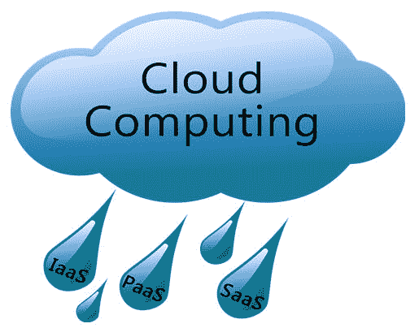
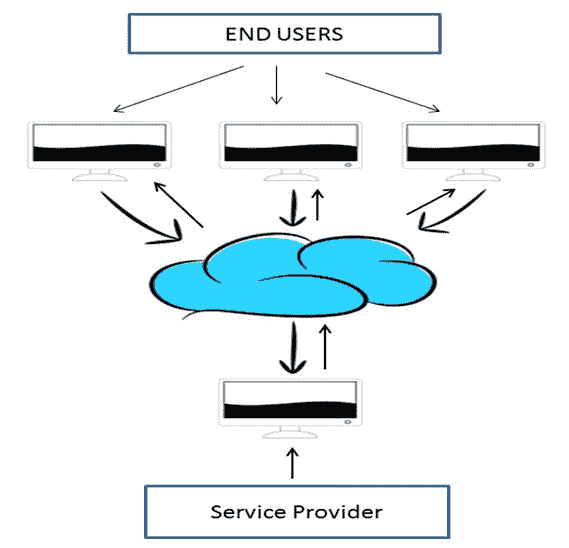
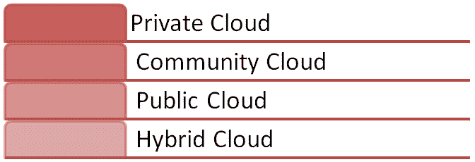
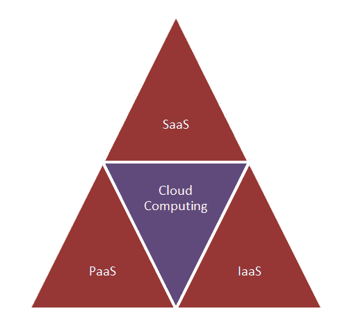
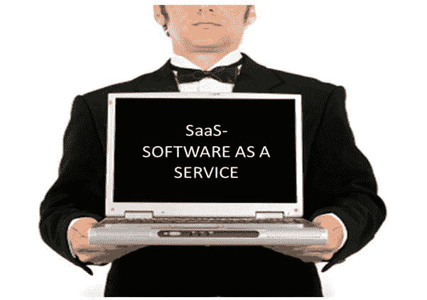
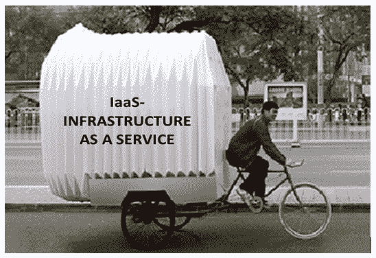
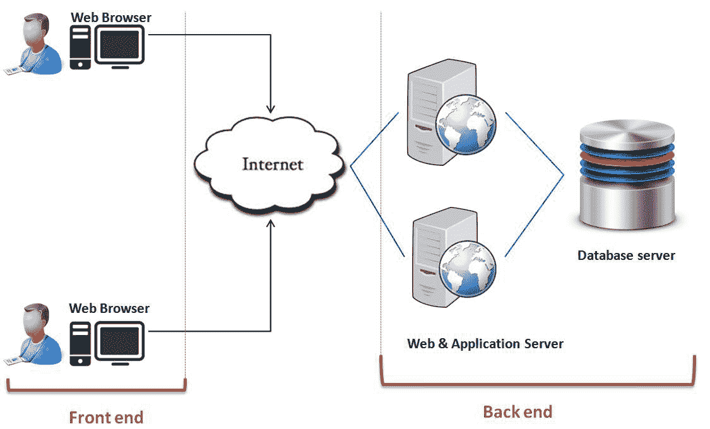
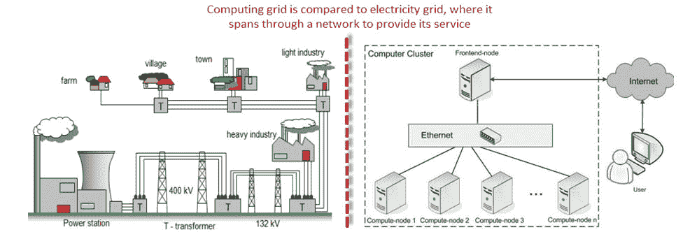
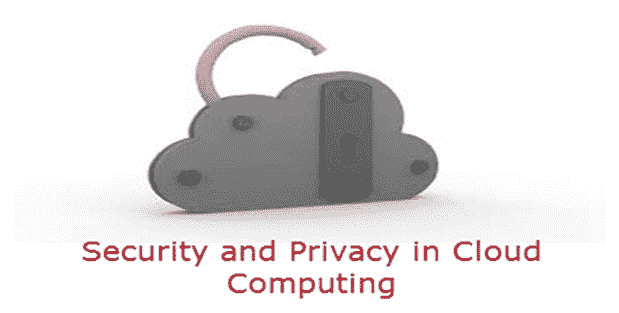

# 初学者云计算教程

> 原文： [https://www.guru99.com/cloud-computing-for-beginners.html](https://www.guru99.com/cloud-computing-for-beginners.html)

## 什么是云计算？

可以将云计算定义为通过网络（通常在 Internet 上）提供计算能力（CPU，RAM，网络速度，Storage OS 软件）服务，而不是在客户位置实际拥有计算资源。

**示例：** AWS，Azure，Google Cloud

让我们通过一个例子学习云计算-

每当您乘坐公共汽车或火车旅行时，您都需要购买前往目的地的门票，然后坐在座位上直到到达目的地。 同样，其他乘客也可以和您一起乘坐票和旅行，几乎不会打扰您去哪里。 当您到站时，您下车感谢驾驶员。 云计算就像该总线一样，为不同的用户承载数据和信息，并允许以最低的成本使用其服务。

**在本教程中，您将学习**

*   [云的类型](#1)
*   [云计算服务](#2)
*   [云计算架构](#3)
*   [虚拟化和云计算：](#4)
*   [网格计算与云计算](#5)
*   [网格计算和效用计算](#6)
*   [未来云计算的安全问题和建议的安全模型](#7)
*   [隐私问题](#8)
*   [云计算案例研究-皇家邮政](#9)

## 为什么要命名云？

术语“云”来自网络设计，网络工程师使用它来表示各种网络设备及其相互连接的位置。 这种网络设计的形状就像一片云。

## 为什么选择云计算？

随着计算机和移动用户的增加，数据存储已成为所有领域的优先事项。 如今，大型企业和小型企业都在依靠其数据&蓬勃发展，他们花费了大量的金钱来维护这些数据。 它需要强大的 IT 支持和存储中心。 并非所有企业都能负担得起内部 IT 基础架构和备份支持服务的高成本。 对他们来说，云计算是一种更便宜的解决方案。 也许它在存储数据，计算和减少维护成本方面的效率也成功地吸引了更大的企业。

云计算减少了用户方面的硬件和软件需求。 用户唯一必须能够运行的是云计算系统接口软件，该软件可以像 Web 浏览器一样简单，而云网络将负责其余的工作。 我们都在某个时刻经历了云计算，我们已经使用或仍在使用的一些流行的云服务是 gmail，hotmail 或 yahoo 等邮件服务。

在访问电子邮件服务时，我们的数据存储在云服务器上，而不是存储在我们的计算机上。 云背后的技术和基础架构是无形的。 云服务是基于用户友好性和功能性的，因此它是否基于 HTTP，XML，Ruby， [PHP](/php-tutorials.html) 或其他特定技术就显得不那么重要了。 单个用户可以从他/她自己的设备（例如台式机，笔记本电脑或移动设备）连接到云系统。

云计算有效利用资源有限的小型企业，它使小型企业可以访问以前无法获得的技术。 云计算可帮助小型企业将维护成本转化为利润。 让我们看看如何？

在内部 IT 服务器中，您必须特别注意并确保系统中没有缺陷，以便系统平稳运行。 如果出现任何技术故障，您将完全负责； 它将需要大量的注意力，时间和金钱进行维修。 而在云计算中，服务提供商要对复杂性和技术故障承担全部责任。

## 云计算的好处

节省成本的潜力是许多组织采用云服务的主要原因。 云计算让您可以根据需求自由使用服务，并且只为您使用的服务付费。 由于采用了云计算，因此无需大量内部资源即可将 IT 运营作为外包部门运行。

以下是云计算的好处：

1.  降低用户的 IT 基础架构和计算机成本
2.  性能提升
3.  更少的维护问题
4.  即时软件更新
5.  改进的操作系统之间的兼容性
6.  备份与还原
7.  性能和可伸缩性
8.  增加的存储容量
9.  提高数据安全性

## 云的类型

您可以根据业务需求订阅四种不同的云模型：

1.  **私有云：**这里**和**计算资源被部署到一个特定的组织。 此方法更多用于企业内部交互。 可以由同一组织控制，拥有和运营计算资源的地方。
2.  **社区云：**这里**和**计算资源提供给社区和组织。
3.  **公共云：**这种类型的云通常用于 B2C（企业对消费者）类型的交互。 在这里，计算资源由政府，学术机构或商业组织拥有，控制和运营。
4.  **混合云：**这种类型的云可用于两种类型的交互-B2B（企业对企业）或 B2C（企业对消费者）。 这种部署方法称为混合云，因为计算资源由不同的云绑定在一起。

## 云计算服务

三种主要的云计算产品是

*   **软件即服务（SaaS）**
*   **平台即服务（PaaS）**
*   **基础架构即服务（IaaS）**

不同的企业根据它们的需求使用其中的一些或全部。

## SaaS（软件即服务）

SaaS 或软件即服务是一种软件分发模型，其中应用程序由供应商或服务提供商托管，并通过网络（互联网）提供给客户。 作为支持**面向服务的体系结构（SOA）或 Web 服务**的基础技术，SaaS 正在成为越来越流行的交付模型。 通过互联网，该服务可用于世界任何地方的用户。

传统上，需要先购买软件应用程序&，然后将其安装到计算机上。 另一方面，SaaS 用户通常通过互联网按月购买，而不是购买软件来订阅。

任何需要访问特定软件的人都可以作为用户订阅，无论是一个人还是两个人，或者公司中每千名员工。 SaaS 与所有支持 Internet 的设备兼容。

使用 SaaS 可以执行许多重要任务，例如会计，销售，发票和计划。

## PaaS（平台即服务）

平台即服务，称为 PaaS，它提供了平台和环境，允许开发人员构建应用程序和服务。 该服务托管在云中，并且用户可以通过 Internet 访问。

为了简单地理解，让我们将其与绘画图片进行比较，您的学校老师会为您提供绘画颜色，不同的画笔和纸张，而您只需要使用这些工具绘制精美的图画即可。

PaaS 服务不断更新&添加了新功能。 软件开发人员，Web 开发人员和企业可以从 PaaS 中受益。 它提供了支持应用程序开发的平台。 它包括软件支持和管理服务，存储，网络，部署，测试，协作，托管和维护应用程序。

## IaaS（基础架构即服务）

IaaS（基础设施即服务）是与 PaaS（平台即服务）一起的云计算的基本服务模型之一。 它提供对 Internet 上虚拟环境“云”中计算资源的访问。 它提供了计算基础架构，例如虚拟服务器空间，网络连接，带宽，负载平衡器和 IP 地址。 硬件资源池是从通常分布在多个数据中心的多个服务器和网络中提取的。 这为 IaaS 提供了冗余和可靠性。

**IaaS（基础架构即服务）**是用于计算的完整软件包。 对于正在寻求削减 IT 基础结构成本的小型企业，IaaS 是解决方案之一。 每年花费大量资金用于维护和购买新组件，例如硬盘驱动器，网络连接，外部存储设备等，企业主可以通过使用 IaaS 节省其他费用。

## 什么是云计算架构？

让我们来看看云计算，看看云计算是由什么组成的。 云计算由前端和后端两个部分组成。 前端包括云计算系统的客户端部分。 它包含访问云计算平台所需的接口和应用程序。

后端是指云本身，但它包含云计算服务所需的资源。 它由虚拟机，服务器，数据存储，安全机制等组成。在提供者的控制之下。

云计算将文件系统分布在多个硬盘和计算机上。 数据永远不会仅存储在一个位置，万一一个单元发生故障，另一单元将自动接管。 用户磁盘空间是在分布式文件系统上分配的，而另一个重要的组件是资源分配的算法。 云计算是一个强大的分布式环境，它在很大程度上取决于强大的算法。

## 虚拟化和云计算

云计算的主要支持技术是虚拟化。 虚拟化是将单个物理服务器划分为多个逻辑服务器。 划分物理服务器后，每个逻辑服务器的行为都类似于物理服务器，并且可以独立运行操作系统和应用程序。 许多受欢迎的公司（例如 VmWare 和 Microsoft）都提供虚拟化服务，您无需使用个人 PC 进行存储和计算，而是使用其虚拟服务器。 它们速度快，成本效益高且耗时少。

对于软件开发人员和测试人员而言，虚拟化非常方便，因为它允许开发人员编写在许多不同环境中运行的代码，更重要的是测试该代码。

虚拟化主要用于三个主要目的 **1）网络虚拟化 2）服务器虚拟化 3）存储虚拟化**

网络虚拟化**：**这是一种通过将可用带宽分成多个通道来组合网络中可用资源的方法，每个通道彼此独立，每个通道彼此独立，可以分配给 实时的特定服务器或设备。

存储虚拟化：这是将物理存储从多个网络存储设备汇集到一个似乎是由中央控制台管理的单个存储设备中。 存储虚拟化通常用于存储区域网络（SAN）。

服务器虚拟化：服务器虚拟化是服务器用户对服务器资源（如处理器，RAM，操作系统等）的屏蔽。 服务器虚拟化的目的是增加资源共享并减少用户的负担和复杂性。

虚拟化是解锁云系统的关键，虚拟化对云如此重要的原因是，虚拟化将软件与硬件脱钩。 例如，PC 可以使用虚拟内存从硬盘借用额外的内存。 通常，硬盘比内存有更多的空间。 尽管虚拟磁盘的速度比实际内存慢，但如果管理得当，替代磁盘可以完美工作。 同样，有可以模仿整个计算机的软件，这意味着 1 台计算机可以执行等于 20 台计算机的功能。

## 网格计算与云计算

当我们打开风扇或任何电子设备时，我们不必担心电源来自何处以及如何产生。 我们在家中接收的电源或电通过一系列网络进行传输，包括发电厂，变压器，输电线和输电站。 这些组件共同构成了“电网”。 同样，“网格计算”是一种基础结构，用于链接计算资源，例如 PC，服务器，工作站和存储元素，并提供访问它们所需的机制。

网格计算是一种中间件，用于协调网络上不同的 IT 资源，从而使它们可以整体运行。 它更经常用于科学研究和大学中用于教育目的。 例如，一群从事不同项目的建筑师学生需要特定的设计工具和用于设计目的的软件，但是只有其中的一部分可以使用该设计工具，问题是他们如何使该工具可用于其余的设计工具。 学生们。 为了使其他学生可以使用，他们会将这个设计工具放到校园网络中，现在网格将连接校园网络中的所有这些计算机，并允许学生从任何地方使用其项目所需的设计工具。

云计算和网格计算经常会混淆，尽管那里的功能几乎是相似的，但那里的功能却有所不同。 让我们看看他们如何运作-

| 

云计算

 | 

网格计算

 |
| 

*   云计算作为利用计算机资源

的服务提供商而发挥更大作用 | 

*   网格计算使用可用资源和互连的计算机系统来实现共同目标

 |
| 

*   云计算是集中模型

 | 

*   网格计算是一种分散的模型，其中的计算可以在许多管理模型

上进行 |
| 

*   云是通常由单方拥有的计算机的集合。
*   ，

 | 

*   网格是计算机的集合，计算机由多个位置的多方拥有并连接在一起，以便用户可以共享资源的组合功率

 |
| 

*   云提供了更多的服务，其中包括网络托管，数据库（数据库）支持等所有大多数服务以及更多

 | 

*   网格提供有限的服务

 |
| 

*   通常在单个组织（例如：亚马逊）内提供云计算。

 | 

*   网格计算联合了位于不同组织内的资源。

 |

## 效用计算与云计算

在之前的“网格计算”对话中，我们看到了如何为房屋供电，我们也知道要保持电力供应，我们必须支付账单。 公用计算就是这样，我们根据需要在家里用电，并相应地支付账单，同样，您将使用这些服务进行计算，并按照称为“公用计算”的使用进行支付。 实用程序计算是小规模使用的良好来源，它可以在任何服务器环境中完成，并且需要云计算。

效用计算是通过按需按使用付费计费方法提供服务的过程。 客户或客户可以通过虚拟专用网络或 Internet 来访问几乎无限量的计算解决方案，这些解决方案可以在需要时采购和使用。 基于效用计算的概念，网格计算，云计算和托管 IT 服务是基础。

通过效用计算，预算有限的小型企业可以轻松使用 CRM（客户关系管理）之类的软件，而无需在基础架构上进行大量投资来维持其客户群。

| 

效用计算

 | 

云计算

 |
| 

*   效用计算是指对提供的服务收费并向客户收取确切使用费的能力

 | 

*   云计算也像效用计算一样工作，您只需为使用的东西付费，但是云计算可能会更便宜，因此基于云的应用程序可以在几天或几周内启动并运行。

 |
| 

*   实用程序计算用户希望控制基础结构的地理位置

 | 

*   在云计算中，提供商完全控制云计算服务和基础架构

 |
| 

*   当性能和选择基础架构至关重要时，效用计算会更有利

 | 

*   当选择的基础架构和性能不重要时，云计算功能强大且易于使用

 |
| 

*   实用程序计算是较少资源需求的不错选择

 | 

*   云计算是高资源需求的不错选择

 |
| 

*   效用计算是指业务模型

 | 

*   云计算是指基础 IT 架构

 |

## 云计算的安全问题

在使用云计算时，与用户有关的主要问题是其安全性。

一个问题是，云提供商本身可以访问客户的未加密数据，无论是在磁盘上，在内存中还是通过网络传输。

一些国家/地区的政府可能会决定搜索数据而不必通知数据所有者，这取决于数据所处的位置，这不被理解并且被视为侵犯隐私（美国示例 [Prism](http://en.wikipedia.org/wiki/PRISM_(surveillance_program)) 计划）。

为了提供系统安全性，网络和数据云计算服务提供商已与非盈利组织 TCG（Trusted Computing Group）携手合作，该组织定期发布一组规范以保护硬件，创建自加密驱动器并提高网络安全性。 它可以保护数据免受 root kit 和恶意软件的侵害。

随着计算已扩展到硬盘驱动器和移动电话等不同的设备，TCG 已将安全措施扩展到包括这些设备。 它提供了在所有云中创建统一数据保护策略的能力。

某些受信任的云服务包括 Amazon，Box.net，Gmail 等。

## 隐私问题&云计算

隐私为用户适应云计算系统提供了强大的障碍

有某些措施可以改善云计算中的隐私。

1.  理论上，云计算服务的管理人员可以在内存中存储的数据存储在磁盘上之前对其进行监视。为了保护数据的机密性，行政和法律控制应防止这种情况的发生。
2.  增加隐私的另一种方法是在云存储站点上对数据进行加密，以防止未经授权的 Internet 访问。 甚至云供应商也无法访问数据。

## 云计算案例研究-皇家邮政

*   **案例研究的主题：**使用云计算在员工之间进行有效的沟通。
*   **使用云计算的原因：**减少了 28,000 名员工通信后的成本，并为员工提供了电子邮件服务的高级功能和接口。

英国的邮政服务皇家邮政集团是英国唯一的政府机构，通过其 12000 个邮局和 3000 个单独的处理站点为超过 2400 万客户提供服务。 其全球物流系统和包裹处理能力每年处理约 4.04 亿个包裹。 为此，他们需要一种有效的沟通媒介。 他们已经认识到云计算的优势，并将其实施到他们的系统中。 它在互通方面表现出出色的性能。

在迁移到云系统之前，组织一直在使用过时的软件，因此，运行效率受到了损害。 一旦组织开始使用 Cloud System，就会为 28000 名员工提供新的协作套件，使他们可以使用即时消息传递和状态感知等工具。 员工拥有比本地服务器更多的存储空间。 员工的工作效率大大提高。

展望云计算在电子邮件服务和通信中的成功。RoyalMail Group 的第二个战略举措是从物理服务器迁移到虚拟服务器，最多可迁移 400 台服务器，以创建基于 Microsoft hyper V 的私有云。 为员工的桌面提供新鲜的外观和更多的空间，并提供最新的现代化交流环境。

RMG（皇家邮政集团）的 hyper V 项目估计将来可以为他们节省约 180 万英镑，并将提高该组织内部 IT 系统的效率。

[AWS 认证解决方案架构师-协理 2018](https://click.linksynergy.com/deeplink?id=bt30QTxEyjA&mid=39197&murl=https%3A%2F%2Fwww.udemy.com%2Fcourse%2Faws-certified-solutions-architect-associate%2F)