# Excel VLOOKUP 初学者教程：通过示例学习

> 原文： [https://www.guru99.com/excel-vlookup-tutorial.html](https://www.guru99.com/excel-vlookup-tutorial.html)

### 什么是 VLOOKUP？

Vlookup（V 代表“垂直”）是 excel 中的内置函数，允许在 excel 的不同列之间建立关系。 换句话说，它使您可以从一列数据中查找（查找）一个值，并从另一列中返回其相应或对应的值。

在此 VLOOKUP 指南中，我们将学习

*   [VLOOKUP 的用法：](#1)
*   [应用 VLOOKUP 功能的步骤](#2)
*   [近似匹配的 VLOOKUP（TRUE 关键字作为最后一个参数）](#3)
*   [在同一个工作簿中放置的 2 张不同图纸之间应用了 Vlookup 功能](#4)

## VLOOKUP 的用法：

当您需要在大型数据表中查找某些信息时，或者需要在整个电子表格中搜索相同类型的信息时，请使用 Vlookup 函数。

让我们以 Vlookup 的实例为例：

**公司薪资表**，由公司财务团队管理–在**公司薪资表**中，您从一条已知的信息开始（或 轻松检索）。 用作索引的信息。

因此，例如：

您从已经可用的信息开始：

（在这种情况下，为雇员的姓名）

要查找您不知道的信息：

（在这种情况下，我们要查找员工的薪水）

**适用于上述实例的 Excel 电子表格：**

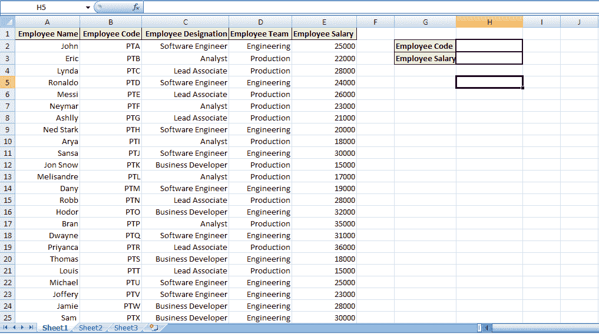

[下载上述 Excel 文件](https://drive.google.com/uc?export=download&id=0ByI5-ZLwpo25aV90VmRzTy16Ujg)

在上面的电子表格中，要找出我们不知道的员工薪水-

我们将输入已经可用的员工代码。

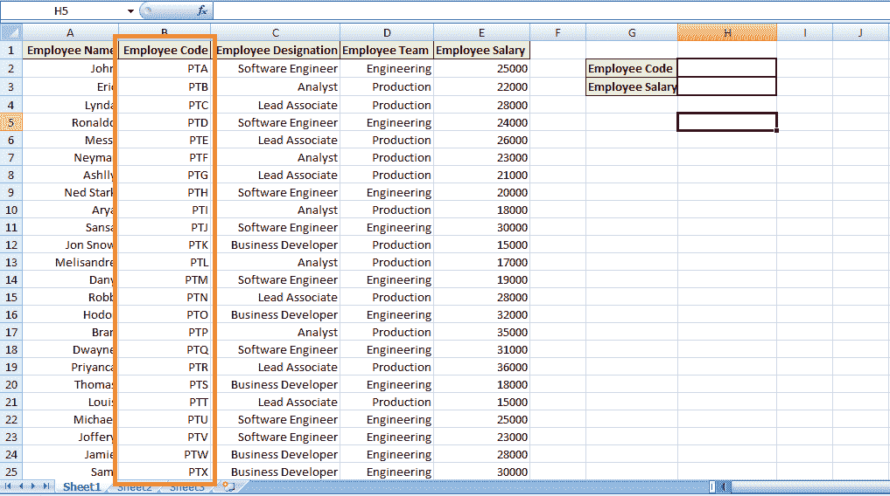

此外，通过应用 VLOOKUP 的**，将显示相应员工代码的**值（员工工资）。

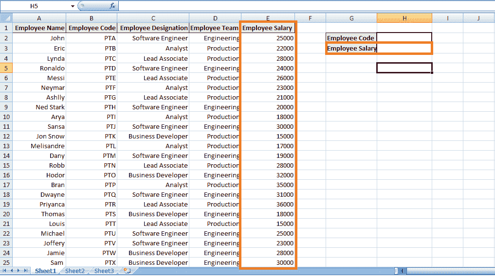

## 应用 VLOOKUP 功能的步骤

**步骤 1）**我们需要导航到要查看特定员工薪水的单元格。-（在这种情况下，单击索引为“ H3”的单元格）

**步骤 2）**在上述单元格中输入 VLOOKUP 功能：以**等号开头，表示已输入功能**，之后使用' **VLOOKUP'关键字** 描述 VLOOKUP 函数的等号 **= VLOOKUP（）**

 

括号将包含参数集（参数是函数执行所需的数据）。

**VLOOKUP 使用四个参数或数据段：**

**步骤 3）第一个参数：**第一个参数将是要搜索的值或查找值的单元格引用（作为占位符）。 查找值是指已经可用的数据或您知道的数据。 （在这种情况下，将员工代码视为查找值，因此第一个参数将为 H2，即，需要查找或搜索的值将出现在单元格引用“ H2”上）。

**步骤 4）第二个参数：**它是指需要搜索的值块。 在 Excel 中，此值块称为**表数组**或查找表。 在我们的实例中，**查找表**是从单元格引用 B2 到 E25 的**，即**，即要搜索相应值的完整块。

**注意：查找值或您知道的数据必须在查找表的左侧列中，即您的单元格范围。**

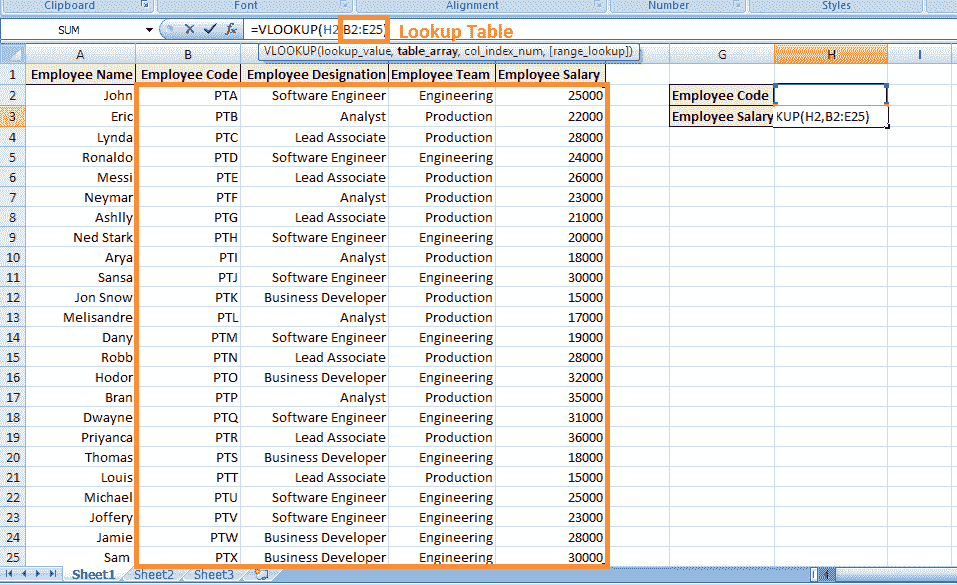

**步骤 5）第三个参数：**引用列引用。 换句话说，它通知 VLOOKUP 您希望在哪里找到想要查看的数据。 （列引用是应在该列的查找表中找到对应值的列索引。）在这种情况下，列引用将为 4，因为 Employee's Salary 列的查找表中索引为 4。

**步骤 6）第四个参数：**最后一个参数是范围查找。 它告诉 VLOOKUP 函数我们是否要对查找值进行近似匹配或精确匹配。 在这种情况下，我们需要完全匹配（“ FALSE”关键字）。

1.  **否：**表示完全匹配。
2.  **是：**表示近似匹配。  

**步骤 7）**按“ Enter”通知单元我们已完成该功能。 但是，由于未在单元格 H2i 中输入任何值，因此您收到以下错误消息。 未在“员工代码”中输入任何员工代码，以允许查找值。

但是，当您在 H2 中输入任何员工代码时，它将返回相应的值，即员工的薪水。

因此，简短地讲，通过 VLOOKUP 公式告诉单元格的是，我们知道的值出现在数据的左侧列中，即描述了“员工代码”列。 现在，您必须浏览我的查找表或单元格范围，并在该表右侧的第四列中找到同一行的值，即，相应雇员的同一行中的相应值（雇员薪金） 码。

上面的实例说明了 VLOOKUP 中的完全匹配，即 FALSE 关键字作为最后一个参数。

## VLOOKUP，用于近似匹配（TRUE 关键字作为最后一个参数）

考虑一种情况，在这种情况下，表为不希望购买数十或数百个商品的客户计算折扣。

如下所示，某些公司已对商品数量从 1 到 10,000 施加折扣：

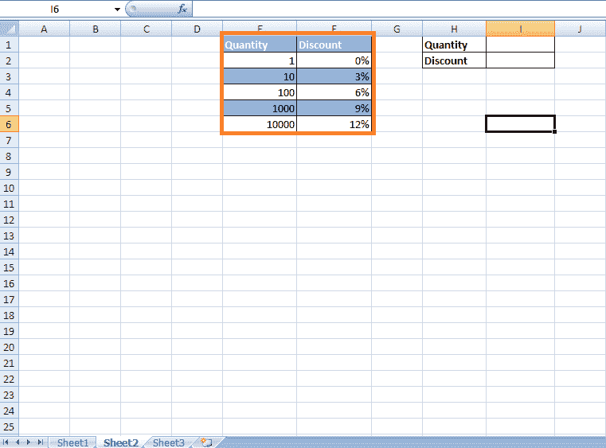

[下载上述 Excel 文件](https://drive.google.com/uc?export=download&id=0ByI5-ZLwpo25Um1iUkxzMW52aUU)

现在不确定客户是否购买了成百上千的商品。 在这种情况下，将根据 VLOOKUP 的近似匹配项应用折扣。 换句话说，我们不想将它们限制为仅查找列中存在的值为 1、10、100、1000、10000 的匹配项。这是步骤：

**步骤 1）单击单元格**，其中需要应用 VLOOKUP 功能的**，即单元格引用“ I2”** 。

**步骤 2）**在单元格中输入'= VLOOKUP（）'。 在括号**中，为上述实例输入参数集**。

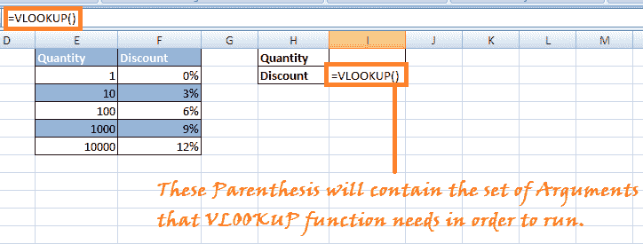

**步骤 3）**输入参数：

**参数 1：**输入要在查找表中查找存在的值以找到对应值的单元格的单元格引用。

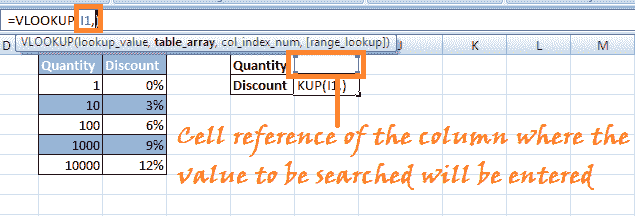

**步骤 4）参数 2：**选择要让 VLOOKUP 在其中搜索相应值的查找表或表数组。（在这种情况下，选择“数量”和“折扣”列）

**步骤 5）参数 3：**第三个参数是您要在查找表中搜索对应值的列索引。

[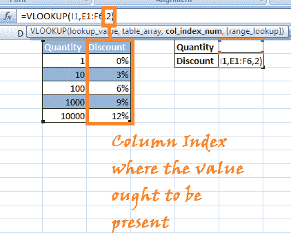 ](/images/2-2017/092917_0650_ExcelVLOOKU19.png) 

**步骤 5）参数 4：**最后一个参数是**近似匹配或完全匹配的条件。** 在这种情况下，我们特别要寻找近似匹配项**（TRUE 关键字）。**

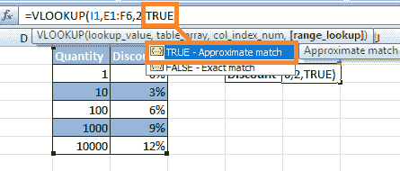

**步骤 6）**按“ Enter”。 Vlookup 公式将应用于上述单元格引用，并且在数量字段中输入任何数字时，它将显示基于 VLOOKUP 中**近似匹配项的折扣。**

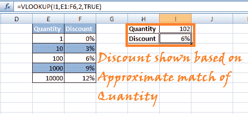

**注意：**如果要使用 TRUE 作为最后一个参数，可以将其保留为空白，并且默认情况下，它为近似匹配选择 TRUE。

## 在同一工作簿中放置的两张不同图纸之间应用的 Vlookup 函数

让我们看一个类似于上述案例的实例。 我们提供了一个包含两个不同工作表的工作簿。 在其中给出了员工代码以及员工姓名和员工名称的另一张纸上包含员工代码和相应的员工薪水（如下所示）。

**表格 1：**

[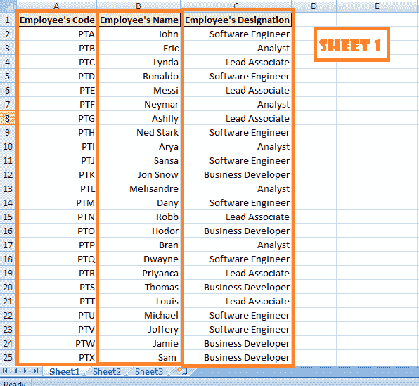 ](/images/2-2017/092917_0650_ExcelVLOOKU22.png) 

**表格 2：**

 

[下载上述 Excel 文件](https://drive.google.com/uc?export=download&id=0ByI5-ZLwpo25R1V4amktMTZzVUU)

现在的目标是在一页即下面的工作表 1 中查看所有数据：

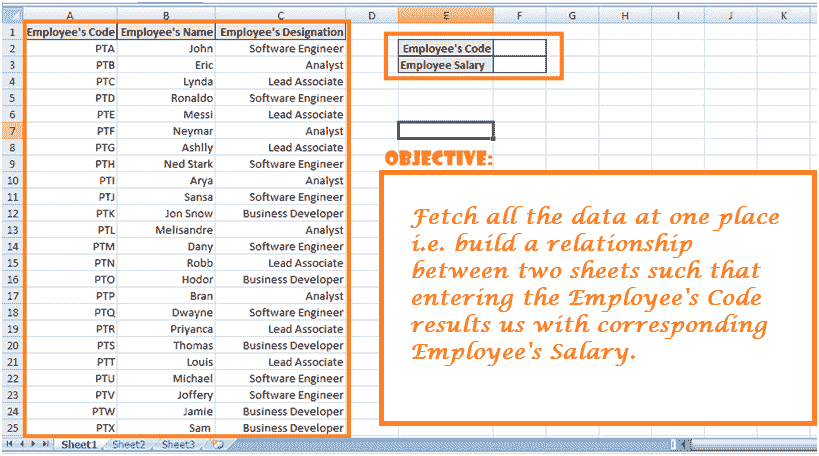

VLOOKUP 可以帮助我们汇总所有数据，以便我们可以在一个地方或一张纸上看到员工的代码，姓名和薪水。

我们将在工作表 2 上开始工作，因为该工作表为我们提供了 VLOOKUP 函数的两个参数，即–工作表 2 中列出了雇员的薪水，将由 VLOOKUP 搜索，并且**列索引的引用为 2（**）。

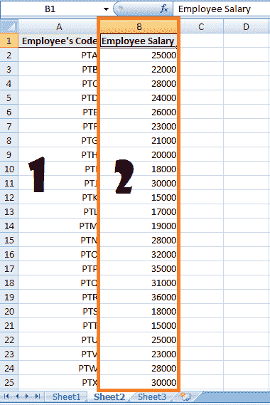

另外，我们知道我们想找到与《员工守则》相对应的员工薪水。

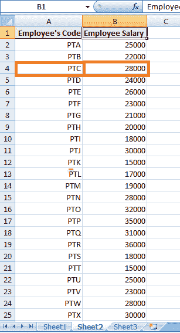

此外，该数据以 A2 开始，以 B25 结尾。 这就是我们的**查找表或表数组参数。**

**步骤 1）**导航到工作表 1 并输入相应的标题，如图所示。

**步骤 2）**单击要应用 VLOOKUP 功能的单元格。 在这种情况下，该单元格将与“员工工资”旁边的单元格合并为“ F3”。

输入 Vlookup 函数：= VLOOKUP（）。

**步骤 3）参数 1：**输入包含要在查找表中搜索的值的单元格引用。 在这种情况下，“ F2”是参考索引，其中将包含员工代码以与查找表中的相应员工薪水相匹配。

**步骤 4）参数 2：**在第二个参数中，我们输入查找表或表数组。 **但是，在这种情况下，我们将查找表放在同一工作簿的另一张工作表中。 因此，为了建立关系，我们需要将查找表的地址输入为 Sheet2！A2：B25-（A2：B25 指的是表 2 中的查找表）**

 

**步骤 5）自变量 3：**第三个自变量是指应该在其中存在值的查找表中存在的列的列索引。

[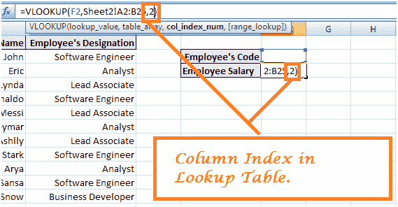 ](/images/2-2017/092917_0650_ExcelVLOOKU31.png) 

[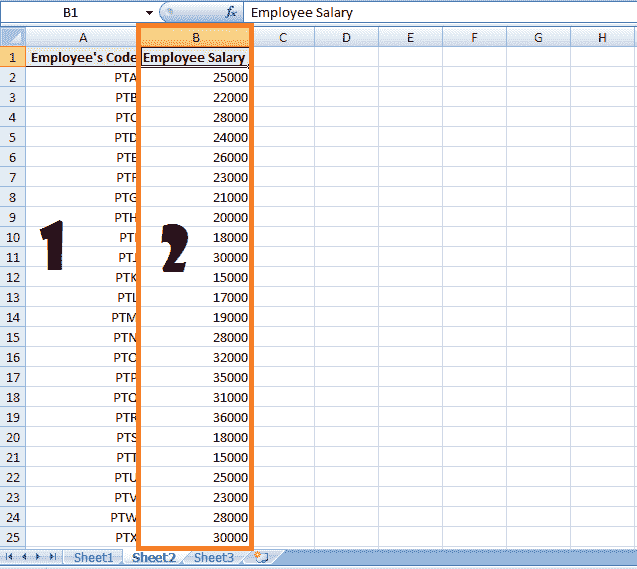 ](/images/2-2017/092917_0650_ExcelVLOOKU32.png) 

**步骤 6）参数 4：**最后一个参数指的是**完全匹配（FALSE）**或**近似匹配（TRUE）。** 在这种情况下，我们要检索员工薪水的确切匹配项。

**步骤 7）**按 Enter 键，然后在单元格中输入“员工代码”时，将返回该员工代码的相应员工薪水。

[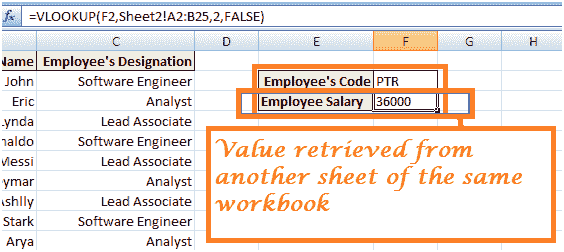 ](/images/2-2017/092917_0650_ExcelVLOOKU34.png) 

**结论**

以上 3 个场景说明了 VLOOKUP 函数的工作方式。 您可以使用更多实例进行游戏。 VLOOKUP 是 MS-Excel 中的一项重要功能，可让您更有效地管理数据。