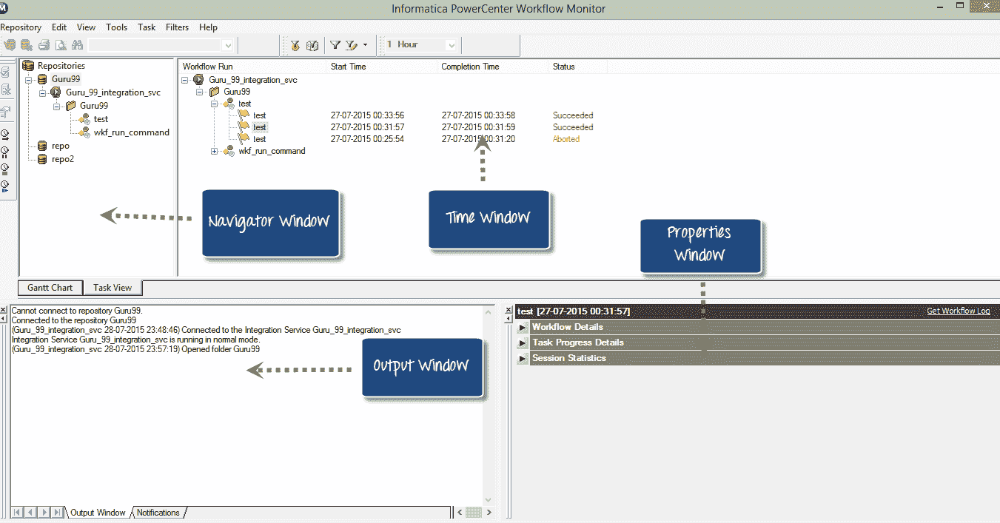
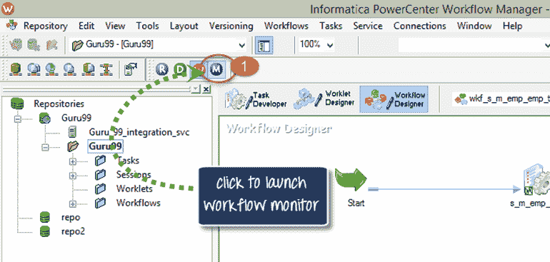
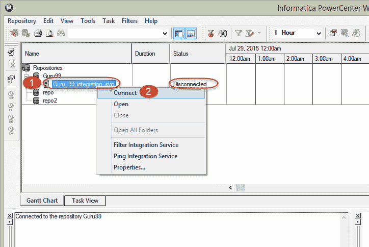
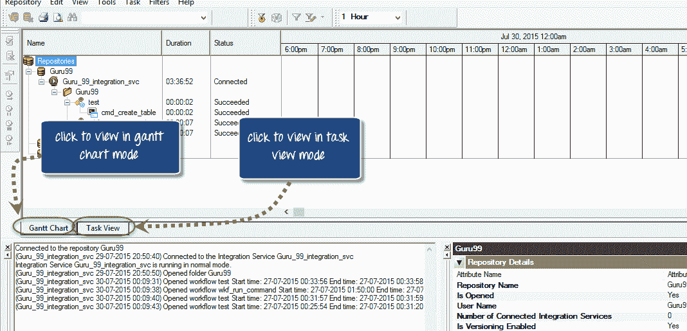
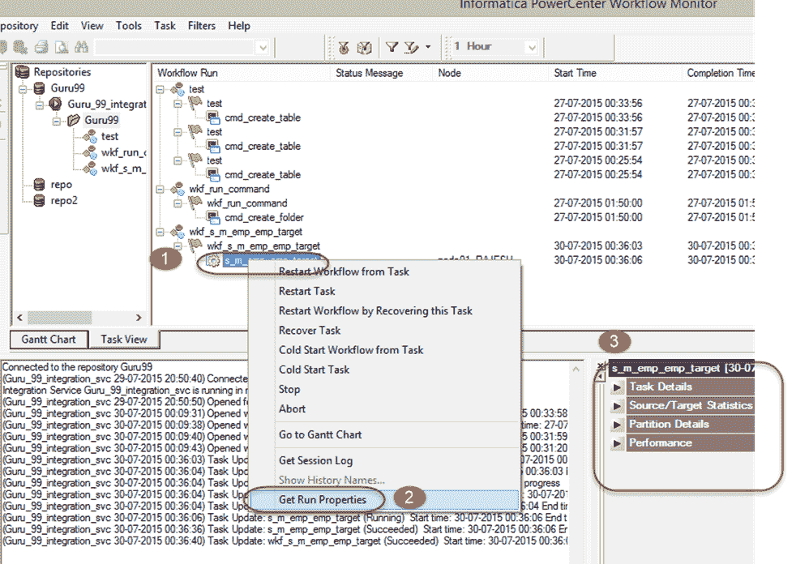
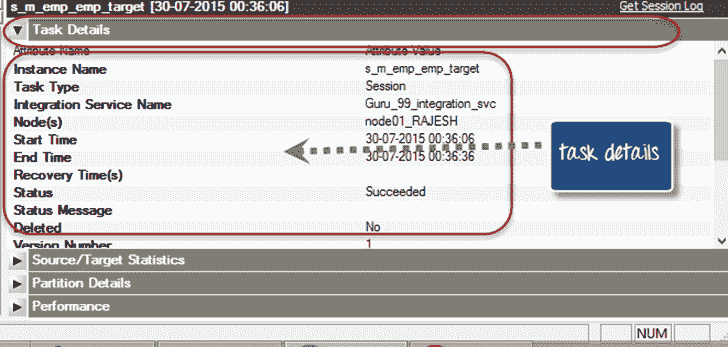
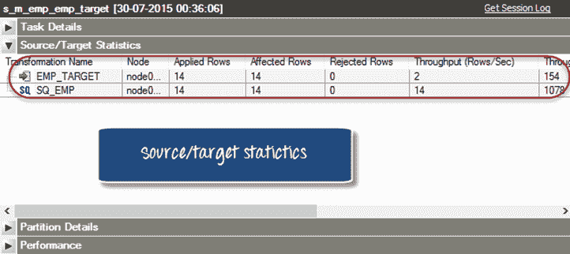

# Informatica 中的工作流监视器：任务&甘特图视图示例

> 原文： [https://www.guru99.com/workflow-monitor-informatica.html](https://www.guru99.com/workflow-monitor-informatica.html)

在上一教程中，我们讨论了工作流-就是一组对集成服务的命令或说明。 它定义了如何运行任务，例如命令任务，会话任务，电子邮件任务等。要跟踪所有内容的精简和按所需顺序执行，我们需要一个工作流监视器。

### 什么是工作流监视器？

工作流监视器是一个工具，您可以借助它来监视工作流的执行以及分配给该工作流的任务。

在工作流监控器中，您可以

*   查看执行细节
*   查看工作流程执行的历史记录
*   停止，中止或重新启动工作流程和任务
*   显示那些至少执行一次的工作流

在本教程中-您将学习

*   [如何打开工作流监视器](#1)
*   [任务视图](#2)
*   [甘特图视图](#3)
*   [示例-如何监视和查看详细信息](#4)

工作流监视器包含以下窗口–

*   导航器窗口-显示受监视的存储库，文件夹&集成服务
*   输出窗口–显示来自集成服务和存储库的消息
*   属性窗口–显示有关任务和工作流程的详细信息/属性
*   时间窗口–显示正在运行的任务&工作流程的进度以及时间详细信息。

现在，让我们看看在工作流监视器中可以做什么

## 如何打开工作流监视器

**步骤 1** –在 Informatica Designer 或工作流管理器工具箱中，单击工作流监视器图标

**步骤 2** –这将打开工作流监视器窗口

在工作流监视工具中，您将在左侧看到存储库和相关的集成服务。 在状态列下，您将看到您是否已连接到集成服务或已断开连接。 如果处于断开连接模式，则不会看到任何正在运行的工作流程。 有一个时间栏，可以帮助我们确定执行任务需要多长时间。

**步骤 3** –默认情况下，工作流监视器处于断开连接模式。 连接到集成服务。

1.  右键单击集成服务
2.  选择连接选项

连接后，显示器将显示连接状态。

**工作流监视器**中的视图

Informatica 工作流监视器提供两种视图类型

*   任务视图
*   甘特图

## **任务视图**

任务视图以报告格式显示工作流运行，并且按工作流运行进行组织。 它提供了一种比较工作流运行并过滤工作流运行详细信息的便捷方法。

任务视图显示以下详细信息

*   工作流程运行列表–显示工作流程运行的列表。 它包含文件夹，工作流，工作项和任务名称。 它按时间顺序显示工作流程运行，最新运行显示在顶部。 它按字母顺序显示文件夹和 Integration Services。
*   状态消息-来自 Integration Service 的有关任务或工作流状态的消息。
*   节点-Integration Service 的节点执行了任务。
*   开始时间-任务或工作流开始的时间。
*   完成时间–任务或工作流完成执行的时间。
*   状态-显示任务或工作流的状态，无论工作流是启动，成功，失败还是中止。

## **甘特图视图**

在甘特图视图中，您可以按时间顺序查看工作流运行。 甘特图显示以下信息。

*   任务名称–工作流中任务的名称
*   持续时间–执行任务所需的时间
*   状态–任务或工作流的最新状态

在甘特图和任务视图之间切换

要将屏幕从甘特图切换到任务视图，反之亦然，请单击屏幕快照中所示的相应按钮以更改模式。

## **示例-如何监视和查看详细信息**

在前面的示例中，我们创建了一个

*   **映射“ m_emp_emp_target”：**映射是一组有关如何修改数据和影响记录集的转换处理的指令。
*   **会话“ s_ m_emp_emp_target”** ：会话是指向映射的更高级别的对象，该映射指定执行的属性。 例如性能调整选项，源/目标的连接详细信息等。
*   **工作流程“ wkf_s_m_emp_emp_target”** ：工作流程是会话和其他对象的容器，它定义了任务执行的时间以及执行的依存关系或流程。

现在，我们将分析本主题中的执行细节。

**步骤 1** –重新启动工作流设计器，如上一主题所述

**步骤 2** –转到工作流程监视器，然后在监视器窗口中将看到如屏幕快照所示的详细信息，例如存储库，工作流程运行详细信息，节点详细信息，工作流程运行开始时间，工作流程运行完成时间和状态。

**步骤 3** –在这里您可以查看当前正在运行的工作流程，其状态为“正在运行”。

**步骤 4** –工作流执行完成后，其状态以及开始和结束时间详细信息将更改为成功/失败。

**步骤 5** –查看任务详细信息

1.  右键单击任务名称
2.  在弹出窗口中选择“获取运行属性”
3.  A properties window would appear with the task details

    

**步骤 6** –单击属性窗口的每个菜单以查看特定的详细信息。

在这里，我们选择“任务详细信息”进行查看。 它将显示所有详细信息，例如实例名称，任务类型，开始时间，集成服务名称等。

任务详细信息-

**源和目标统计信息**

源和目标统计信息提供了源和目标的详细信息。 例如，从源获取多少行，在目标中填充多少行当前吞吐量等

在下面的屏幕中，从源中获取了 14 条记录，所有 14 条记录都填充在目标表中。

*   **已应用的行**表示 Informatica 尝试更新或插入目标的记录数量
*   **受影响的行**表示实际成功应用了多少行。这里 14 条行均已成功加载到目标中，因此两者的计数相同。
*   **拒绝的行**表示由于目标约束或其他问题而删除了多少行。

在本教程中，您学习了如何使用工作流程监视器打开和监视工作流程和任务。