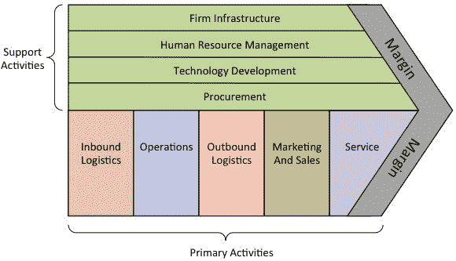
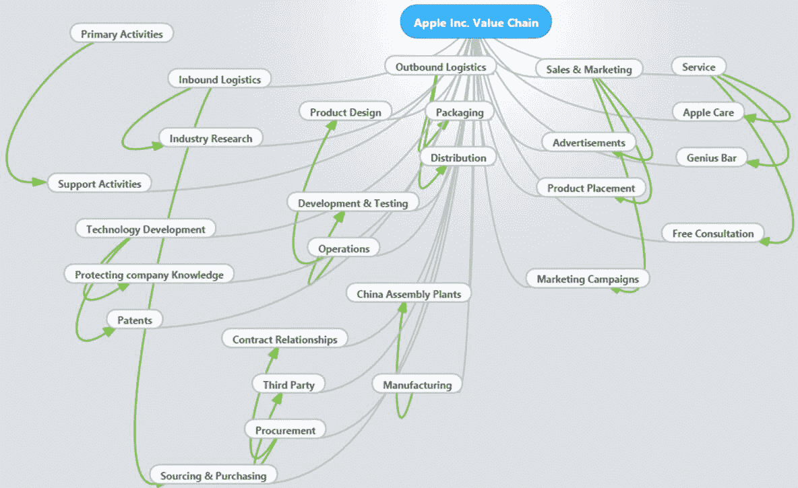

# 组件& MIS（管理信息系统）的作用

> 原文： [https://www.guru99.com/rol-component-mis.html](https://www.guru99.com/rol-component-mis.html)

Facebook 是世界上最赚钱的企业之一，它的整个存在取决于信息技术和信息系统的使用。

其他成功的公司，例如 Google，Amazon，eBay 和 Financial Institutions，它们的成功大部分归功于技术。

本教程将研究 MIS 在组织中的角色，以及组织如何利用 MIS 来获得竞争优势。

在本教程中，您将学习-

*   [数据和信息的定义以及良好信息的特征](#1)
*   [信息和 MIS 的竞争优势](#2)
*   [MIS 的组成部分及其关系](#3)
*   [波特的价值链](#4)
*   [IT 对组织目标的影响](#5)

## 数据和信息的定义以及良好信息的特征

数据指的是原始基本事实，即尚未处理的产品价格，购买的产品数量等。

例如，6 美元的价格和 10 的数量在销售点一直没有传达给客户任何意义。 信息应该是经过处理的数据，可以将信息传达给接收者。

例如，将$ 6 乘以 10 得到$ 60，这是客户应支付的总账单。

良好的信息应该及时并在需要时可用。

以下是良好信息的特征。

*   **准确的**-信息必须没有错误和错误。 这是通过遵循严格的标准将数据处理为信息来实现的。 例如，加$ 6 + 10 会给我们错误的信息。 本例中的准确信息是将$ 6 乘以 10。
*   **完整的** –做出正确决策所需的所有信息都必须可用。 什么都不会丢失。 如果 TAX 是用于计算客户应支付的总金额的应用程序，则也应将其包括在内。 撇开它可能会误导客户以为他们只在实际需要支付税款时才支付 60 美元。
*   **具有成本效益** –获取信息的成本不得超过以货币形式表示的信息收益。
*   **以用户为中心** –信息的显示方式必须能够满足目标用户的信息要求。 例如，运营经理需要非常详细的信息，在向运营经理介绍信息时应考虑到这一点。 相同的信息不适用于高级经理，因为他们将不得不再次对其进行处理。 对他们而言，这将是数据而不是信息。
*   **相关** –信息必须与收件人有关。 该信息必须与预期收件人所面临的问题直接相关。 如果 ICT 部门想要购买新服务器，则在这种情况下，有关笔记本电脑可享受 35％折扣的信息将不再适用。
*   **权威**-信息必须来自可靠的来源。 假设您有一个银行帐户，并且想将资金转移到另一个使用与您的货币不同的货币的银行帐户。 与直接从您的银行获取汇率相比，使用局兑换汇率不会被认为是权威的。
*   **及时发布** –信息在需要时应可用。 假设您的公司想与另一家公司合并。 合并之前必须提供评估您要与之合并的另一公司的信息，并且您必须有足够的时间来验证该信息。

## 信息和 MIS 的竞争优势

竞争优势是一种使企业比竞争对手更具利润的地位。 例如，以比您的竞争对手更低的成本生产产品可使您获得更大的利润。

信息系统有能力帮助组织达到这一位置。 他们通过以下方式这样做

**卓越运营** –卓越运营旨在改善业务运营。 让我们以零售商店为例。 一旦库存水平达到再订购限制，零售商店就可以使用信息系统自动向供应商下订单。 这确保了零售商店永远不会用完库存，客户总是可以依靠它来查找所需的东西。

**新的业务模型，产品和服务** –让我们继续以零售商店为例。 零售商店可以开发基于 Web 的订单系统或智能手机应用程序，客户可以在家里或任何地方舒适地购买商品。 订单系统可以链接到送货业务，并支持在线支付。 相较于通过网络或智能手机应用程序购物的客户，这是一种新的商业模式。

**改善的供应商和客户关系** –历史数据用于了解客户和供应商的需求。 然后，该数据将用于创建可满足需求的服务和产品。 这导致与客户和业务的长期关系，使组织处于更有利可图的位置。

**改进的决策**-决策时信息至关重要。 如果信息系统经过有效的设计和操作，则输出的信息将具有上一节中描述的良好信息的所有特征。 这使组织能够做出使组织受益的决策。

## MIS 的组成部分及其关系

管理信息系统由五个主要组件组成，即人员，业务流程，数据，硬件和软件。 所有这些组件都必须协同工作才能实现业务对象。

**人员** –这些是使用信息系统记录日常业务交易的用户。 用户通常是合格的专业人员，例如会计师，人力资源经理等。ICT 部门通常具有支持人员，以确保系统正常运行。

**业务流程** –商定了最佳做法，这些最佳做法可指导用户和所有其他组件有效地工作。 业务流程由人员（即用户，顾问等）开发。

**数据** –记录的日常业务交易。 对于银行，数据是从存款，取款等活动中收集的。

**硬件** –硬件由计算机，打印机，网络设备等组成。硬件提供用于处理数据的计算能力。 它还提供了联网和打印功能。 硬件加快了将数据处理成信息的速度。

**软件** –这些是在硬件上运行的程序。 该软件分为两大类，即系统软件和应用程序软件。 系统软件是指操作系统，例如 Windows，Mac OS 和 Ubuntu 等；应用程序软件是指用于完成业务任务的专用软件，例如[薪资](/sap-payroll.html)程序，银行系统，销售点系统等。

## 波特的价值链

想想像苹果公司这样的公司。他们为什么成功？ 为什么客户喜欢并购买 iPhone？ 这是因为 iPhone 为他们的生活增添了价值。 这就是 Apple Inc.是一家成功企业的原因。 价值链是指公司为为其客户创造价值而进行的活动。

价值链的概念是由迈克尔·波特（Michael Porter）提出的。 波特的价值链有两个活动：

*   **主要活动** –这些活动与创建产品/服务，营销和销售以及支持有关。 主要活动包括入库物流，运营，出库物流，市场营销和销售以及服务。
*   **支持活动** –这些是支持主要活动的活动。 支助活动包括采购（采购），人力资源管理，技术发展和基础设施。

下图描述了价值链

下图显示了苹果公司的价值链。

价值链的总体目标是帮助企业获得竞争优势。 竞争优势是企业在市场中的地位，这使其比直接竞争对手更具利润。

## IT 对组织目标的影响

组织目标是指组织的目标和使命，尤其是从长期来看。 无论组织从事哪种业务，总的目标都是如上一节所述为客户创造价值。

商业信息技术联盟涉及使用信息技术有效地实现商业目标。

组织提供价值的两种最常见方法是，以比竞争对手更低的价格或以更高的价格提供优质的产品，但其功能更多，可以为客户增加价值。

信息技术使企业能够以更便宜的成本并在尽可能短的时间内处理和分析大量数据。 这使组织能够以更便宜的价格提供优质的产品。

让我们以银行为例。 银行可以使用 ATM 来允许客户取款和其他自动方式进行存款。 可以将有疑问的客户定向到具有常见问题的网站。 如果个人和企业都订阅了网上银行，都可以在线查看对帐单。

上述 IT 业务实践可降低开展业务以及创建新产品和服务的成本。 降低的经商成本使银行可以减少银行费用，因此，可以以较低的价格提供优质的产品或服务。

**摘要**：

商业实体的存在是为了赚钱。 没有赢利性组织存在，就无法有效地提供优质的服务或产品。

无论组织类型如何，MIS 在实现目标中都可以发挥重要作用。

MIS 通过为决策者提供信息来使组织做出正确的决策。