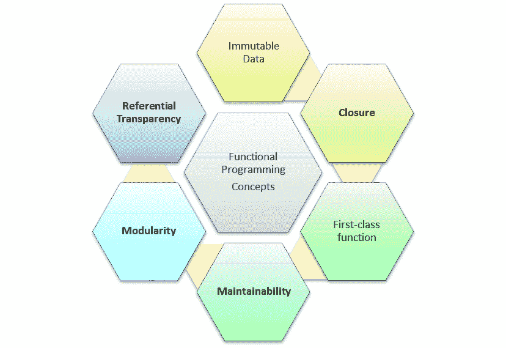

# 什么是函数式编程？ 实例教程

> 原文： [https://www.guru99.com/functional-programming-tutorial.html](https://www.guru99.com/functional-programming-tutorial.html)

### 什么是函数式编程？

函数式编程（也称为 FP）是通过创建纯函数来思考软件构造的一种方式。 它避免了在面向对象编程中观察到的共享状态，可变数据的概念。

功能性语言对表达式和声明而不是对语句的执行进行实验。 因此，与其他依赖于局部或全局状态的过程不同，FP 中的值输出仅取决于传递给函数的参数。

在本教程中，您将学习-

*   [什么是函数编程？](#1)
*   [功能编程的特征](#2)
*   [功能编程的历史](#3)
*   [功能编程语言](#4)
*   [基本功能编程术语和概念](#5)
*   [函数编程的好处](#6)
*   [功能编程的局限性](#7)
*   [函数式编程与面向对象的编程](#8)

### 功能编程的特征

*   函数式编程方法着重于结果，而不是过程
*   重点在于要计算的内容
*   数据是不可变的
*   函数式编程将问题分解为“函数”
*   它基于数学函数的概念，该数学函数使用条件表达式和递归来执行计算
*   它不支持循环语句之类的迭代和 If-Else 之类的条件语句

### 功能编程的历史

*   函数式编程的基础是 Lambda 微积分。 它于 1930 年代开发，用于功能应用，定义和递归
*   LISP 是第一种功能编程语言。 麦卡锡于 1960 年对其进行了设计
*   70 年代后期，爱丁堡大学的研究人员定义了 ML（元语言）
*   在 80 年代初期，Hope 语言为递归和方程式推理添加了代数数据类型
*   2004 年，功能语言“ Scala”创新。

### 功能编程语言

任何 FP 语言的目标都是模仿数学功能。 但是，计算的基本过程在功能编程中有所不同。

以下是一些最著名的函数式编程语言：

*   哈斯克尔
*   SML
*   Clojure
*   阶梯
*   Erlang
*   清洁
*   F＃
*   ML / OCaml Lisp /方案
*   XSLT
*   的 SQL
*   Mathematica

### 基本功能编程术语和概念



## 不变数据

不可变数据意味着您应该能够轻松地创建数据结构，而不是修改已经存在的数据结构。

### 参照透明

功能程序应该像第一次一样执行操作。 因此，您将知道在程序执行期间可能发生或未发生的事情及其副作用。 在 FP 中，这称为参照透明性。

### 模块化

模块化设计提高了生产率。 小型模块可以快速编码，并且有更大的重用机会，这无疑会导致程序的更快开发。 除此之外，可以单独测试模块，这有助于您减少在单元测试和调试上花费的时间。

### 可维护性

可维护性是一个简单的术语，这意味着 FP 编程更易于维护，因为您无需担心意外更改给定功能之外的任何内容。

一流的功能

“一流功能”是一个定义，归因于对编程语言实体的使用没有限制。 因此，一流的功能可以出现在程序中的任何地方。

### 关闭

闭包是一个内部函数，即使在父函数执行之后，它也可以访问父函数的变量。

### 高阶函数

高阶函数要么将其他函数作为参数，要么将其作为结果返回。

高阶函数允许部分应用程序或应用程序。 该技术一次将一个函数应用于其参数，因为每个应用程序都返回一个接受下一个参数的新函数。

### 纯功能

“纯函数”是一个函数，其输入被声明为输入，并且不应隐藏任何输入。 输出也声明为输出。

纯函数根据其参数起作用。 如果不返回任何内容，则效率不高。 而且，它为给定参数提供相同的输出

**示例**：

```
Function Pure(a,b)
{
	return a+b;
}

```

### 功能不纯

不纯函数恰好与纯函数相反。 它们具有隐藏的输入或输出； 这被称为不纯。 不纯函数具有依赖性，因此不能单独使用或测试。

**范例**

```
int z;
function notPure(){
	z = z+10;
}
```

### 功能组成

功能组合是将两个或多个功能组合为一个新功能。

### 共有国家

共享状态是 OOP 编程中的重要概念。 基本上，它是向对象添加属性。 例如，如果硬盘是对象，则可以将存储容量和磁盘大小添加为属性。

副作用

副作用是发生在调用函数外部的任何状态更改。 任何 FP 编程语言的最大目标是通过将副作用与其余软件代码分开来最大程度地减少副作用。 在 FP 编程中，至关重要的是要消除其余编程逻辑中的副作用。

### 函数式编程的好处

*   使您避免混淆代码中的问题和错误
*   易于测试和执行单元测试以及调试 FP 代码。
*   并行处理和并发
*   热代码部署和容错
*   通过较短的代码提供更好的模块化
*   提高开发人员的生产力
*   支持嵌套功能
*   惰性映射&列表等功能构造
*   允许有效使用 Lambda 微积分

### 功能编程的局限性

*   函数式编程范例并不容易，因此对于初学者来说很难理解
*   难以维护，因为在编码过程中会演化出许多对象
*   需要大量的模拟和广泛的环境设置
*   重用非常复杂，需要不断重构
*   对象可能无法正确表示问题

### 功能编程与面向对象编程

| 

**功能编程**

 | 

**OOP**

 |
| FP 使用不可变数据。 | OOP 使用可变数据。 |
| 遵循基于声明式编程的模型。 | 遵循命令式编程模型。 |
| 它关注的重点是：“您在程序中正在做什么。” | 它的重点是“如何进行编程”。 |
| 支持并行编程。 | 不支持并行编程。 |
| 它的功能没有副作用。 | 方法会产生很多副作用。 |
| 使用具有递归功能的&函数调用来执行流控制。 | 流控制过程是使用循环和条件语句进行的。 |
| 语句的执行顺序不是很重要。 | 语句的执行顺序很重要。 |
| 支持“基于数据的抽象”和“基于行为的抽象”。 | 仅支持“基于数据的抽象”。 |

**结论**

*   函数式编程或 FP 是一种基于一些基本定义原则的软件构造思考方式
*   函数式编程概念着重于结果，而不是过程
*   任何 FP 语言的目标都是模仿数学功能
*   一些最著名的函数式编程语言：1）Haskell 2）SM 3）Clojure 4）Scala 5）Erlang 6）干净
*   “纯函数”是一个函数，其输入被声明为输入，并且不应隐藏任何输入。 输出也声明为输出。
*   不可变数据意味着您应该能够轻松地创建数据结构，而不是修改已经存在的数据结构
*   使您避免混淆代码中的问题和错误
*   功能代码不容易，所以对于初学者来说很难理解
*   FP 使用不可变数据，而 OOP 使用可变数据