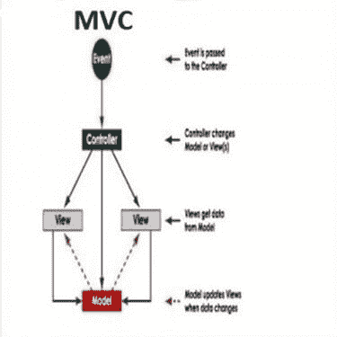

# MVC 面试的前 31 个问题&答案

> 原文： [https://www.guru99.com/mvc-interview-questions.html](https://www.guru99.com/mvc-interview-questions.html)

**1）解释什么是模型-视图-控制器？**

MVC 是用于开发 Web 应用程序的软件体系结构模式。 它由三个对象 Model-View-Controller 处理。

**2）提到在 MVC 应用程序中 Model-View-Controller 代表什么？**

在 MVC 模型中，

*   **模型**-代表应用程序数据域。 换句话说，应用程序业务逻辑包含在模型中，并负责维护数据
*   **视图**-代表最终用户与之通信的用户界面。 简而言之，所有用户界面逻辑都包含在 VIEW 中
*   **控制器**-响应用户操作的控制器。 基于用户动作，各个控制器在模型内做出响应，并选择一个视图来渲染显示用户界面。 用户输入逻辑包含在控制器中

**3）解释在哪个程序集中定义了 MVC 框架？**

MVC 框架在 System.Web.Mvc 中定义。

**4）列出几种不同的控制器动作方法返回类型？**

*   查看结果
*   Javascript 结果
*   重定向结果
*   杰森结果
*   内容结果

**5）提及向 We​​bform 应用程序和 MVC 应用程序添加路由之间的区别是什么？**

要将路由添加到 Webform 应用程序，我们可以使用 RouteCollection 类的 MapPageRoute（）方法，在路由添加到 MVC 应用程序的过程中，可以使用 MapRoute（）方法。

**6）提及向路线添加约束的两种方法是什么？**

向路线添加约束的两种方法是

*   使用正则表达式
*   使用实现 IRouteConstraint 接口的对象

**7）提到 MVC 有什么优势？**

*   MVC 将您的项目分为不同的部分，开发人员可以轻松进行
*   易于编辑或更改项目的某些部分，从而减少项目的开发和维护成本
*   MVC 使您的项目更加系统化

**8）提到控制器中的“ beforFilter（）”，“ beforeRender”和“ afterFilter”函数是做什么的？**

*   **beforeFilter（）**：该功能在控制器中的每个动作之前运行。 在这里检查活动会话或检查用户权限是正确的地方。
*   **beforeRender（）**：在控制器操作逻辑之后但在呈现视图之前调用此函数。 如果您在给定操作结束之前手动调用 render（），则该函数并不经常使用，但可能是必需的
*   **afterFilter（）**：在每个控制器操作之后以及渲染完成之后，将调用此函数。 这是最后运行的控制器方法

**9）解释组件表示，抽象和控制在 MVC 中的作用？**

*   **演示文稿**：它是应用程序中特定抽象的直观表示
*   **抽象**：它是应用程序中的业务领域功能
*   **控件**：这是一个组件，除了与系统内的其他控件进行通信外，还可以保持系统内抽象与向用户呈现之间的一致性。

**10）提到 MVC 模型的优缺点？**

| **优势** | **劣势** |
| 

*   代表业务逻辑和表示逻辑之间的清晰区分
*   每个 MVC 对象都有不同的职责
*   并行进行开发
*   易于管理和维护
*   所有类和对象彼此独立

 | 

*   模型模式很少复杂
*   数据访问效率低
*   使用现代用户界面，很难使用 MVC
*   您需要多个 并行开发的程序员
*   需要多种技术知识

 |

**11）解释“ ActionFilters”在 MVC 中的作用吗？**

在 MVC 中，“ ActionFilters”可帮助您在执行 MVC 动作或其执行期间执行逻辑。

**12）解释执行 MVC 项目的步骤是什么？**

执行 MVC 项目的步骤包括

*   收到申请的第一个请求
*   执行路由
*   创建 MVC 请求处理程序
*   创建控制器
*   执行控制器
*   调用动作
*   执行结果

**13）解释什么是路由？ 路由重要的三个部分是什么？**

路由可帮助您确定 URL 结构并使用 Controller 映射 URL。

对于路由而言，三个重要的部分是

*   控制器名称
*   动作方法名称
*   参数

**14）说明如何以 MVC 模式进行路由？**

有一组路由称为 RouteCollection，由应用程序中已注册的路由组成。 RegisterRoutes 方法在此集合中记录路由。 路由定义 URL 模式和如果请求与模式匹配则使用的处理程序。 MapRoute 方法的第一个参数是路由的名称。 第二个参数将是 URL 匹配的模式。 第三个参数可能是占位符的默认值（如果未确定）。

**15）使用超链接解释如何从一个视图导航到另一视图？**

通过使用“ ActionLink”方法，如下面的代码所示。 下面的代码将创建一个简单的 URL，该 URL 有助于导航到“ Home”控制器并调用“ GotoHome”动作。

折叠/复制代码

<％= Html.ActionLink（“ Home”，“ Gotohome”）％>

**16）提到如何在 MVC 中维护会话？**

可以通过 tempdata，viewdata 和 viewbag 三种方式在 MVC 中维护会话。

**17）提及临时数据，视图和视图包之间的区别是什么？**

*   临时数据：当您从一个控制器转移到另一控制器时，它有助于维护数据。
*   查看数据：当您从控制器移至视图时，它有助于维护数据
*   View Bag：这是围绕视图数据的动态包装

**18）什么是 MVC 中的局部视图？**

MVC 中的部分视图呈现视图内容的一部分。 这有助于减少代码重复。 简而言之，局部视图允许在父视图中渲染视图。

**19）说明如何在 MVC 中实现 Ajax？**

在 MVC 中，可以通过两种方式实现 Ajax

*   Ajax 库
*   jQuery 的

**20）提及“ ActionResult”和“ ViewResult”之间有什么区别？**

“ ActionResult”是一个抽象类，而“ ViewResult”是从“ AbstractResult”类派生的。 “ ActionResult”具有许多派生类，例如“ JsonResult”，“ FileStreamResult”和“ ViewResult”。

如果要动态派生不同类型的视图，则“ ActionResult”最好。

**21）说明如何在 MVC 中以 JSON 格式发送结果？**

为了以 MVC 格式将结果发送回 JSON，可以使用“ JSONRESULT”类。

**22）解释“视图”和“部分视图”之间的区别是什么？**

| **查看** | **部分视图** |
| 

*   它包含布局页面
*   呈现任何视图之前，呈现 viewstart 页面
*   视图可能具有诸如 body，html，head，title，meta 等标记标签。 与部分视图

相比，*   视图不轻巧 | 

*   它不包含布局页面。
*   部分视图未验证 viewstart.cshtml。 我们无法将局部视图的通用代码放入 viewStart.cshtml.page
*   局部视图是专门为在视图内呈现而设计的，仅因为它不包含任何标记
*   我们可以将常规视图传递给 RenderPartial 方法

 |

**23）列出 MVC 中结果的类型吗？**

在 MVC 中，MVC 中有十二种类型的结果，其中“ ActionResult”类是主要类，而 11 种是它们的子类型

*   查看结果
*   PartialViewResult
*   空结果
*   重定向结果
*   RedirectToRouteResult
*   JsonResult
*   JavaScriptResult
*   内容结果
*   FileContentResult
*   FileStreamResult
*   FilePathResult

**24）提及 NonActionAttribute 的重要性是什么？**

如果要阻止此默认方法，则将控制器类的所有公共方法都视为操作方法，然后必须为该公共方法分配 NonActionAttribute。

**25）提及默认路由{resource} .axd / {* pathinfo}的用途是什么？**

此默认路由可防止对 Web 资源文件（如 Webresource.axd 或 ScriptResource.axd）的请求传递到控制器。

**26）如果实现了多个过滤器，请提及执行过滤器的顺序？**

过滤顺序如下

*   授权过滤器
*   动作过滤器
*   响应过滤器
*   异常过滤器

**27）提到最后要执行哪些过滤器？**

最后执行“异常过滤器”。

**28）提到剃刀视图的文件扩展名是什么？**

对于 razor 视图，文件扩展名是

*   .cshtml：如果 C＃是编程语言
*   .vbhtml：如果 VB 是编程语言

**29）提及向路线添加约束的两种方法是什么？**

向路由添加约束的两种方法是

*   使用正则表达式
*   使用实现 IRouteConstraint 接口的对象

**30）提到两个未实现或不需要路由的实例吗？**

不需要路由的两个实例是

*   找到与 URL 模式匹配的物理文件
*   禁用 URL 模式的路由时

**31）提及使用 MVC 的主要好处是什么？**

使用 MVC 有两个主要好处

*   将代码移到单独的类文件后，您可以在很大程度上使用代码
*   由于将代码简单地移到了.NET 类，因此可以自动进行 UI 测试。 这为自动化手动测试和编写单元测试提供了机会。