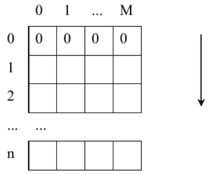
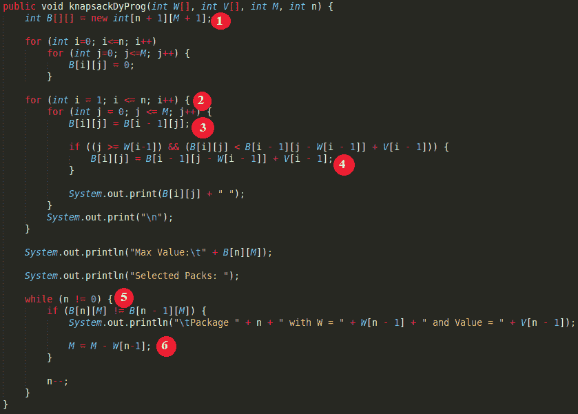

# 背包问题：动态编程示例

> 原文： [https://www.guru99.com/knapsack-problem-dynamic-programming.html](https://www.guru99.com/knapsack-problem-dynamic-programming.html)

## 什么是背包问题？

**背包问题**是组合学中非常有用的问题。 在超级市场中，有 n 个包裹（n≤100），包裹 i 的重量 W [i]≤100，值 V [i]≤100。小偷闯入超级市场，小偷不能携带超过 M 的重量（M≤100 ）。 这里要解决的问题是：小偷将带走哪些包装以获得最高价值？

输入：

*   最大重量 M 和包裹数 n。
*   权重 W [i]和对应值 V [i]的数组。

输出：

*   最大化价值和相应的容量。
*   小偷将带走哪些包裹。

背包问题可以进一步分为两种类型：

*   0/1 背包问题。 在这种类型的情况下，每个包裹都可以被取走或不被取走。 此外，小偷不能拿走一小部分的包裹，也不能多次拿走一个包裹。 这种类型可以通过动态编程方法解决。
*   小背包问题。 这种类型可以通过贪婪策略来解决。

在本教程中，您将学习：

*   [什么是背包问题？](#1)
*   [动态编程简介](#2)
*   [分析 0/1 背包问题](#3)
*   [计算 B [i] [j]](#4) 的公式
*   [动态编程的基础](#5)
*   [计算选项表](#6)
*   [迹线 5](#7)
*   [查找选项表以查找所选软件包的算法](#8)
*   [Java 代码](#9)

## 动态编程简介

在分而治之的策略中，您将要解决的问题分为多个子问题。 子问题进一步分为较小的子问题。 该任务将继续进行，直到您遇到可以轻松解决的子问题为止。 但是，在这种划分过程中，您可能会多次遇到相同的问题。

动态编程的基本思想是使用表格来存储已解决子问题的解决方案。 如果再次遇到子问题，则只需将表中的解决方案作为解决方案，而不必再次解决。 因此，通过动态编程设计的算法非常有效。


要通过动态编程解决问题，您需要执行以下任务：

*   查找最小子问题的解决方案。
*   找出公式（或规则），以通过甚至最小的子问题的解决方案来构建子问题的解决方案。
*   创建一个表来存储子问题的解决方案。 然后根据找到的公式计算子问题的解并保存到表中。
*   从已解决的子问题中，您可以找到原始问题的解决方案。

## 分析 0/1 背包问题

分析此类型时，您会发现一些值得注意的地方。 背包算法的价值取决于两个因素：

1.  正在考虑多少个包裹
2.  背包可以存放的剩余重量。

因此，您有两个可变数量。

通过动态编程，您可以获得有用的信息：

1.  目标函数将取决于两个变量
2.  选项表将是一个二维表。

如果通过选择权重限制为 j 的软件包{1、2，...，i}来调用 B [i] [j]是最大可能值。

*   在重量限制为 M 的 n 个包装中选择的最大值是 B [n] [M]。 换句话说：当有 i 个包裹可供选择时，B [i] [j]是背包的最大重量为 j 时的最佳重量。
*   最佳权重始终小于或等于最大权重：B [i] [j]≤j。

例如：B [4] [10] =8。这表示在最佳情况下，当有 4 个第一包装供您选择（第一至第四包装）时，所选包装的总重量为 8，最大重量为 背包的最大数量是 10。不必全部选择 4 个项目。

## 计算 B [i] [j]的公式

输入，您定义：

*   W [i]，V [i]依次是包装 i 的重量和值，其中 i [ ](/images/1/043019_0611_KnapsackPro4.png) {1，…，n}。
*   M 是背包的最大重量。

如果仅选择一个包。 您为每个 j 计算 B [1] [j]：这意味着背包的最大重量≥第一个包装的重量

```
B[1][j] = W[1]

```

在权重限制为 j 的情况下，程序包{1,2，...，i – 1，i}中具有最大值的最佳选择将有两种可能性：

*   如果未选择包装 i，则通过在重量限制为 j 的包装{1、2，...，i – 1}中进行选择，B [i] [j]是最大可能值。 你有：

```
B[i][j] = B[i – 1][j]

```

*   如果选择了程序包 i（当然，仅当 W [i]≤j 时才考虑这种情况），则 B [i] [j]等于程序包 i 的值 V [i]加最大值可以通过选择 包装{1、2，...，i – 1}，重量限制为（j – W [i]）。 也就是说，就您所拥有的价值而言：

```
B[i][j] = V[i] + B[i – 1][j – W[i]]

```

由于创建了 B [i] [j]（这是可能的最大值），因此 B [i] [j]将是上述 2 个值中的最大值。

## 动态编程的基础

因此，您必须考虑选择包 i 是否更好。 从那里，您具有如下的递归公式：

```
B[i][j]= max(B[i – 1][j], V[i]+B[i – 1][j – W[i]]

```

很容易看出 B [0] [j] =最大值，可以从 0 包= 0 中进行选择。

## 计算选项表

您基于上述递归公式构建一个选项表。 要检查结果是否正确（如果不完全正确，则重建目标函数 B [i] [j]）。 通过创建目标函数 B [i] [j]和选项表，可以确定跟踪的方向。

选项表 B 包含 n + 1 行，M + 1 列，

*   首先，填充动态编程的基础：第 0 行包含所有零。
*   使用递归公式，使用第 0 行计算第 1 行，使用第 1 行计算第 2 行，依此类推...直到计算出所有行。

<figure style="margin-left: auto;margin-right: auto;">



Table of Options


## 跟踪

在计算选项表时，您对 B [n] [M]感兴趣，B [n] [M]是在所有 n 个重量限制为 M 的包装中进行选择时获得的最大值。

*   如果 **B [n] [M] = B [n – 1] [M]** ，则未选择包 n，则跟踪 B [n – 1] [M]。
*   如果 **B [n] [M]≠B [n – 1] [M]** ，则您会注意到最佳选择具有包 n 和迹线 B [n – 1] [M – W [n] ]。

继续跟踪，直到到达选项表的第 0 行。

## 查找选项表以查找所选软件包的算法

注意：如果 B [i] [j] = B [i – 1] [j]，则不选择包 i。 B [n] [W]是放入背包的包裹的最佳总价值。

跟踪步骤：

*   **步骤 1** ：从 i = n，j = M 开始。
*   **步骤 2** ：从底部向上看 j 列，找到第 i 行，使得 B [i] [j] > B [i – 1] [j]。 标记选中的程序包 i：选择[i] = true；
*   **步骤 3** ：j = B [i] [j] – W [i]。 如果 j > 0，请转到步骤 2，否则请转到步骤 4
*   **步骤 4** ：基于选项表来打印选定的软件包。

## Java 代码

```
public void knapsackDyProg(int W[], int V[], int M, int n) {
	int B[][] = new int[n + 1][M + 1];

	for (int i=0; i<=n; i++)
		for (int j=0; j<=M; j++) {
			B[i][j] = 0;
		}

	for (int i = 1; i <= n; i++) {
		for (int j = 0; j <= M; j++) {
			B[i][j] = B[i - 1][j];

			if ((j >= W[i-1]) && (B[i][j] < B[i - 1][j - W[i - 1]] + V[i - 1])) {
				B[i][j] = B[i - 1][j - W[i - 1]] + V[i - 1]; 
			}

			System.out.print(B[i][j] + " ");
		}
		System.out.print("\n");
	}

	System.out.println("Max Value:\t" + B[n][M]);

	System.out.println("Selected Packs: ");

	while (n != 0) {
		if (B[n][M] != B[n - 1][M]) {
			System.out.println("\tPackage " + n + " with W = " + W[n - 1] + " and Value = " + V[n - 1]);

			M = M - W[n-1];
		}

		n--;
	}
}

```

<figure style="margin-left: auto;margin-right: auto;">



Function knapsackDyProg() in Java


**代码说明：**

1.  创建表 B [] []。 将每个单元格的默认值设置为 0。
2.  自底向上构建表 B [] []。 用检索公式计算选项表。
3.  计算 B [i] [j]。 如果不选择包 i。
4.  然后评估：如果选择包 i，则重置 B [i] [j]会更有利。
5.  跟踪表从第 n 行到第 0 行。
6.  如果选择包 n。 选择包装 n 后，只能增加重量 M-W [n-1]。

在本教程中，您有两个示例。 这是运行上述程序的 Java 代码，其中包含两个示例：

```
public void run() {
	/*
	 * Pack and Weight - Value
	 */
	//int W[] = new int[]{3, 4, 5, 9, 4};
	int W[] = new int[]{12, 2, 1, 1, 4};

	//int V[] = new int[]{3, 4, 4, 10, 4};
	int V[] = new int[]{4, 2, 1, 2, 10};

	/*
	 * Max Weight
	 */
	//int M = 11;
	int M = 15;
	int n = V.length;

	/*
	 * Run the algorithm
	 */
	knapsackDyProg(W, V, M, n);
}

```

您有输出：

*   第一个例子：

```
0 0 0 3 3 3 3 3 3 3 3 3 
0 0 0 3 4 4 4 7 7 7 7 7 
0 0 0 3 4 4 4 7 7 8 8 8 
0 0 0 3 4 4 4 7 7 10 10 10 
0 0 0 3 4 4 4 7 8 10 10 11 
Max Value:	11
Selected Packs: 
	Package 5 with W = 4 and Value = 4
	Package 2 with W = 4 and Value = 4
	Package 1 with W = 3 and Value = 3

```

*   第二个例子：

```
0 0 0 0 0 0 0 0 0 0 0 0 4 4 4 4 
0 0 2 2 2 2 2 2 2 2 2 2 4 4 6 6 
0 1 2 3 3 3 3 3 3 3 3 3 4 5 6 7 
0 2 3 4 5 5 5 5 5 5 5 5 5 6 7 8 
0 2 3 4 10 12 13 14 15 15 15 15 15 15 15 15
Max Value:	15
Selected Packs: 
	Package 5 with W = 4 and Value = 10
	Package 4 with W = 1 and Value = 2
	Package 3 with W = 1 and Value = 1
	Package 2 with W = 2 and Value = 2

```