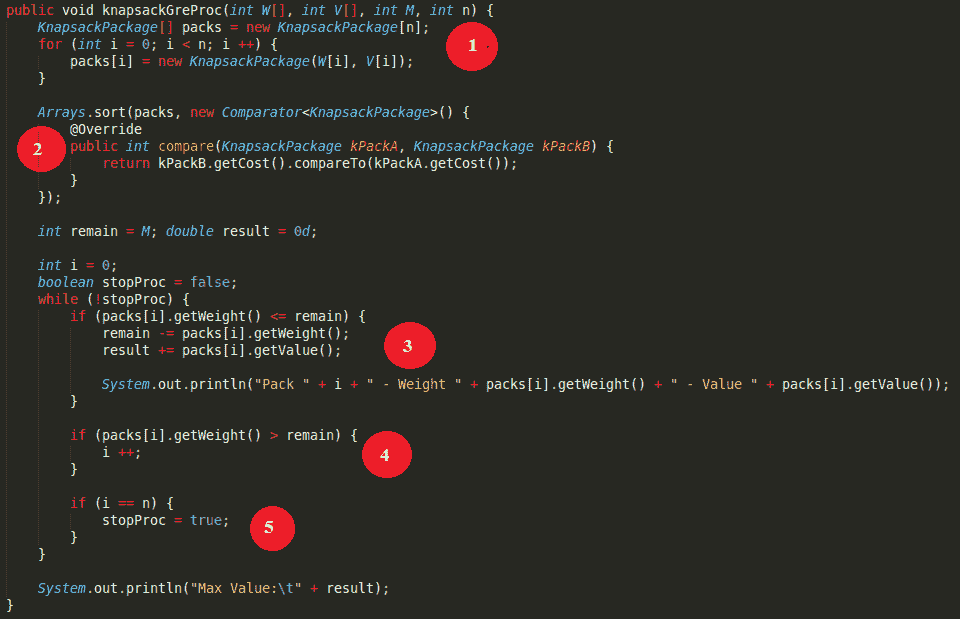
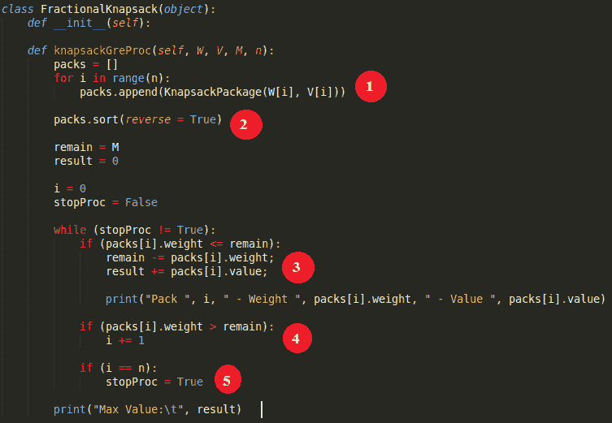

# 小背包问题：带有示例的贪婪算法

> 原文： [https://www.guru99.com/fractional-knapsack-problem-greedy.html](https://www.guru99.com/fractional-knapsack-problem-greedy.html)

## 什么是贪婪策略？

贪婪算法类似于动态编程算法，通常用于解决最佳问题（根据特定标准找到问题的最佳解决方案）。

贪婪算法执行最佳局部选择，希望这些选择将导致要解决的问题的最佳全局解决方案。 贪婪算法的设置通常不太难，快速（时间复杂度通常是线性函数或非常是二阶函数）。 此外，这些程序调试起来并不难，并且占用的内存更少。 但是结果并不总是最佳的解决方案。

贪婪策略通常用于通过构建选项 A 来解决组合优化问题。通过选择 A 的每个组件 Ai 直到完成（足够 n 个组件）来构造选项 A。 对于每个 Ai，可以最佳地选择 Ai。 这样，在最后一步，您可能没有其他选择，只能接受最后剩余的值。

贪婪的决定有两个关键组成部分：

1.  贪婪的选择方式。 您可以选择当前最合适的解决方案，然后解决最后一次选择所引起的子问题。 贪婪算法的选择可以取决于先前的选择。 但这不能取决于将来的选择或子问题的解决方案。 该算法以循环选择的方式发展，同时将给定问题缩小为较小的子问题。
2.  最佳子结构。 如果此问题的最佳解决方案包含其子问题的最佳解决方案，则可以为该问题执行最佳子结构。

贪婪算法具有五个组成部分：

1.  一组候选人，从中可以创建解决方案。
2.  选择功能，用于选择要添加到解决方案中的最佳候选者。
3.  可行函数用于确定是否可以使用候选对象来构建解决方案。
4.  一个目标函数，用于确定解决方案或不完整解决方案的价值。
5.  评估功能，指示何时找到完整的解决方案。

在本教程中，您将学习

*   [什么是贪婪策略？](#1)
*   [贪婪一号的想法](#2)
*   [贪婪二的构想](#3)
*   [贪婪三的想法](#4)
*   [贪婪三的 Java 代码](#5)
*   [贪婪三的 Python3 代码](#6)
*   [贪婪三的 C＃代码](#7)
*   [贪婪三的反例](#8)

## 贪婪的想法

有了第一个想法，您就可以执行“贪婪的一号”的以下步骤：

*   按值的非递增顺序排序。
*   反过来考虑订购的包裹，如果背包的剩余容量足以容纳背包，则将考虑的包裹放入背包（这意味着已放入背包的包裹的总重量和考虑的包裹的重量不超过 背包的容量）。

但是，这种贪婪算法并不总是能提供最佳解决方案。 这里有一个反例：

*   问题的参数为：n = 3; M = 19。
*   软件包：{i = 1; W [i] = 14； V [i] = 20}; {i = 2; W [i] = 6； V [i] = 16}; {i = 3; W [i] = 10； V [i] = 8} **->** 物有所值，但重量也很大。
*   该算法将选择总值为 20 的程序包 1，而选择总值为 24 的问题的最佳解决方案（程序包 2，程序包 3）。

## 贪婪二的想法

有了第二个想法，您可以执行“贪婪之二”的以下步骤：

*   按权重的非降序排序。
*   反过来考虑订购的包裹，如果背包的剩余容量足以容纳背包，则将考虑的包裹放入背包（这意味着已放入背包的包裹的总重量和考虑的包裹的重量不超过 背包的容量）。

However, this greedy algorithm does not always give the optimal solution. Here you have a counter-example:

*   问题的参数为：n = 3; M = 11。
*   软件包：{i = 1; W [i] = 5； V [i] = 10}; {i = 2; W [i] = 6； V [i] = 16}; {i = 3; W [i] = 10； V [i] = 28} **->** 重量轻，但该值也很轻。
*   该算法将选择（包 1，包 2）的总值为 26，而问题的最佳解决方案是（包 3）总值为 28。

## 贪婪三的想法

有了第三个想法，您就可以完成“贪婪三号”的以下步骤。 实际上，这是使用最广泛的算法。

*   按照不增加单位成本  的值的顺序对包进行排序。 你有：


*   反过来考虑订购的包裹，如果背包的剩余容量足以容纳背包，则将考虑的包裹放入背包（这意味着已放入背包的包裹的总重量和考虑的包裹的重量不超过 背包的容量）。

**想法**：这个问题的贪婪想法是计算每个  的  比。 然后按降序对这些比率进行排序。 您将选择最高的  包装，背包的容量可以容纳该包装（剩余> w <sub>i</sub> ）。 每次将包裹放入背包时，都会减少背包的容量。

选择包的方式：

*   考虑一下单位成本阵列。 您可以根据降低的单位成本选择包装。


*   假设您找到了一个部分解：（x <sub>1</sub> ，...，x <sub>i</sub> ）。
*   获得背包的值：


*   对应于已放入背包的包裹的重量：


*   因此，背包的剩余重量限制为：


### 算法步骤

您会看到这是找到最大数量的问题。 软件包列表按单位成本的降序排序，以考虑分支。

*   **步骤 1** ：节点根代表背包的初始状态，尚未选择任何包。
    *   TotalValue = 0。
    *   根节点的上限 UpperBound = M *最大单位成本。
*   **步骤 2** ：节点根将具有子节点，该子节点对应于选择具有最大单位成本的软件包的能力。 对于每个节点，您将重新计算参数：
    *   TotalValue = TotalValue（旧）+选定包的数量*每个包的值。
    *   M = M（旧）–选择的包裹数*每个包裹的重量。
    *   UpperBound = TotalValue + M（新）*接下来要考虑的包装的单位成本。
*   **步骤 3** ：在子节点中，您将优先考虑具有较大上限的节点的分支。 该节点的子级对应于选择具有较大单位成本的下一个软件包的能力。 对于每个节点，必须根据步骤 2 中提到的公式重新计算参数 TotalValue，M，UpperBound。
*   **步骤 4** ：重复第 3 步，并注意：对于具有上限的节点小于或等于找到的选项的临时最大成本，您不再需要为该节点分支。
*   **步骤 5** ：如果所有节点都被分支或切断，则最昂贵的选择是寻找的一种。

该算法的伪代码：

```
Fractional Knapsack (Array W, Array V, int M)
1\. for i <- 1 to size (V)
2\. 	calculate cost[i] <- V[i] / W[i]
3\. Sort-Descending (cost)
4\. i ← 1
5\. while (i <= size(V))
6\. 	if  W[i] <= M 
7.		M ← M – W[i]
8.		total ← total + V[i];
9\. 	if  W[i] > M
10\. 		i ← i+1

```

该算法的复杂性：

*   如果使用简单的排序算法（选择，冒泡…），则整个问题的复杂度为 O（n2）。
*   如果使用快速排序或合并排序，则整个问题的复杂度为 O（nlogn）。

## 贪婪三的 Java 代码

*   首先，定义类 KnapsackPackage。 该类的属性是：每个包装的重量，价值和相应的成本。 此类的属性成本用于主算法中的排序任务。 每个成本的价值是每个包装的  比率。

```
public class KnapsackPackage {

	private double weight;
	private double value;
	private Double cost;

	public KnapsackPackage(double weight, double value) {
		super();

		this.weight = weight;
		this.value = value;
		this.cost = new Double(value / weight);
	}

	public double getWeight() {
		return weight;
	}

	public double getValue() {
		return value;
	}

	public Double getCost() {
		return cost;
	}

}

```

*   然后，您创建一个函数来执行算法贪婪三。

```
public void knapsackGreProc(int W[], int V[], int M, int n) {
	KnapsackPackage[] packs = new KnapsackPackage[n];
	for (int i = 0; i < n; i ++) {
		packs[i] = new KnapsackPackage(W[i], V[i]);
	}

	Arrays.sort(packs, new Comparator<KnapsackPackage>() {
		@Override
		public int compare(KnapsackPackage kPackA, KnapsackPackage kPackB) {
			return kPackB.getCost().compareTo(kPackA.getCost());
		}
	});

	int remain = M;	
double result = 0d;

	int i = 0;
	boolean stopProc = false;
	while (!stopProc) {
		if (packs[i].getWeight() <= remain) {
			remain -= packs[i].getWeight();
			result += packs[i].getValue();

			System.out.println("Pack " + i + " - Weight " + packs[i].getWeight() + " - Value " + packs[i].getValue());
		}

		if (packs[i].getWeight() > remain) {
			i ++;
		}

		if (i == n) {
			stopProc = true;
		}
	}

	System.out.println("Max Value:\t" + result);
}

```

<figure style="margin-left: auto;margin-right: auto;">



Function knapsackGreProc() in Java


**代码说明：**

1.  初始化每个背包包装的重量和价值。
2.  按成本降序排列背包包装。
3.  如果选择包装 i。
4.  如果选择包裹数，我就足够了。
5.  浏览所有软件包时停止。

在本教程中，您有两个示例。 这是运行上述程序的 Java 代码，其中包含两个示例：

```
public void run() {
	/*
	 * Pack and Weight - Value
	 */
//int W[] = new int[]{15, 10, 2, 4};
	int W[] = new int[]{12, 2, 1, 1, 4};

//int V[] = new int[]{30, 25, 2, 6};
	int V[] = new int[]{4, 2, 1, 2, 10};

	/*
	 * Max Weight
	 */
//int M = 37;
	int M = 15;
	int n = V.length;

	/*
	 * Run the algorithm
	 */
	knapsackGreProc(W, V, M, n);
}

```

您有输出：

*   第一个例子：

```
Pack 0 - Weight 10.0 - Value 25.0
Pack 0 - Weight 10.0 - Value 25.0
Pack 0 - Weight 10.0 - Value 25.0
Pack 2 - Weight 4.0 - Value 6.0
Pack 3 - Weight 2.0 - Value 2.0
Max Value:	83.0

```

*   第二个例子：

```
Pack 0 - Weight 4.0 - Value 10.0
Pack 0 - Weight 4.0 - Value 10.0
Pack 0 - Weight 4.0 - Value 10.0
Pack 1 - Weight 1.0 - Value 2.0
Pack 1 - Weight 1.0 - Value 2.0
Pack 1 - Weight 1.0 - Value 2.0
Max Value:	36.0

```

分析第一个示例：

*   问题的参数为：n = 4; M = 37。
*   软件包：{i = 1; W [i] = 15； V [i] = 30; 费用= 2.0}； {i = 2; W [i] = 10； V [i] = 25; 费用= 2.5}； {i = 3; W [i] = 2; V [i] = 4； 费用= 1.0}； {i = 4; W [i] = 4； V [i] = 6； 费用= 1.5}。
*   您按不增加单位成本价值的顺序对包裹进行排序。 您有：{i = 2} **->** {i = 1} **->** {i = 4} **->** {i = 3}。

适用于第一个示例的算法的步骤：

*   定义 x1，x2，x3，x4 是每个选定软件包的编号，对应于软件包{i = 2} **->** {i = 1} **->** { i = 4} **->** {i = 3}。
*   节点根目录 N 表示您尚未选择任何程序包的状态。 然后：
    *   TotalValue = 0。
    *   M = 37（建议值）。
    *   UpperBound = 37 * 2.5 = 92.5，其中 37 是 M，2.5 是包装{i = 2}的单位成本。
*   对于包{i = 2}，您有 4 种可能性：选择 3 个包{i = 2}（x1 = 3）； 选择 2 个软件包{i = 2}（x1 = 2）； 选择 1 个程序包{i = 2}（x1 = 1），而不选择程序包{i = 2}（x1 = 0）。 根据这 4 种可能性，您将根节点 N 分支为 4 个子节点 N [1]，N [2]，N [3]和 N [4]。
*   对于子节点 N1，您具有：
    *   TotalValue = 0 + 3 * 25 = 75，其中 3 是所选软件包{i = 2}的数量，而 25 是每个软件包{i = 2}的值。
    *   M = 37 – 3 * 10 = 7，其中 37 是背包的初始数量，3 是包裹的数量{i = 2}，10 是每个包裹的重量{i = 2}。
    *   UpperBound = 75 + 7 * 2 = 89，其中 75 是 TotalValue，7 是背包的剩余重量，2 是包裹的单位成本{i = 1}。
*   同样，您可以计算节点 N [2]，N [3]和 N [4]的参数，其中上限分别为 84、79 和 74。
*   在节点 N [1]，N [2]，N [3]和 N [4]中，节点 N [1]具有最大的上限，因此您将首先分支节点 N [1]，希望会有一个 从这个方向好计划。
*   在节点 N [1]中，只有一个子节点 N [1-1]对应于 x2 = 0（由于背包的剩余重量为 7，而每个包裹{i = 1}的重量为 15） 。 确定 N [1-1]按钮的参数后，N [1-1]的上限为 85.5。
*   您继续分支节点 N [1-1]。 节点 N [1-1]有 2 个子节点 N [1-1-1]和 N [1-1-2]，分别对应 x3 = 1 和 x3 =0。确定了这两个节点的参数后，您会看到 N [1-1-1]的 UpperBoundary 为 84，而 N [1-1-2]的 UpperBoundary 为 82，因此您继续分支节点 N [1-1-1]。
*   节点 N [1-1-1]有两个子节点 N [1-1-1-1]和 N [1-1-1-2]，分别对应 x4 = 1 和 x4 =0。这是两个叶节点 （代表该选项），因为已为每个节点选择了软件包数量。 其中节点 N [1-1-1-1]表示选项 x1 = 3，x2 = 0，x3 = 1 和 x4 = 1 对于 83，而节点 N [1-1-1-2]表示选项 x1 = 3，x2 = 0，x3 = 1，x4 = 01，位于 81。因此，此处的临时最大值为 83。
*   回到节点 N [1-1-2]，您会看到 N [1-1-2]的上限是 82 < 83，因此您修剪了节点 N [1-1-2]。
*   回到节点 N2，您会看到 N2 的上限是 84 > 83，因此您继续分支节点 N2。 节点 N2 有两个子 N [2-1]和 N [2-2]，分别对应 x2 = 1 和 x2 =0。在计算了 N [2-1]和 N [2-2]的参数后，您会看到 N [2-1]的上限为 N [2-2]的上限为 75.25。 这些值都不大于 83，因此两个节点都被修剪。
*   最后，节点 N3 和 N4 也被修剪。
*   因此，树上的所有节点都被分支或修剪，因此最好的临时解决方案是寻找该解决方案。 因此，您需要选择 3 个包裹{i = 2}，1 个包裹{i = 4}和一个包裹{i = 3}，总价值为 83，总重量为 36。

与第二个示例的分析相同，您得到的结果是：选择程序包 4（3 次）和程序包 5（3 次）。

## 贪婪三的 Python3 代码

*   首先，定义类 KnapsackPackage。

```
class KnapsackPackage(object): 

    """ Knapsack Package Data Class """
    def __init__(self, weight, value): 
        self.weight = weight 
        self.value = value 
        self.cost = value / weight 

    def __lt__(self, other): 
        return self.cost < other.cost

```

*   然后，您创建一个函数来执行算法贪婪三。

```
class FractionalKnapsack(object):
    def __init__(self):

    def knapsackGreProc(self, W, V, M, n):
        packs = []
        for i in range(n): 
            packs.append(KnapsackPackage(W[i], V[i]))

        packs.sort(reverse = True)

        remain = M
        result = 0

        i = 0
        stopProc = False

        while (stopProc != True):
            if (packs[i].weight <= remain):
                remain -= packs[i].weight;
                result += packs[i].value;

                print("Pack ", i, " - Weight ", packs[i].weight, " - Value ", packs[i].value)

            if (packs[i].weight > remain):
                i += 1

            if (i == n):
                stopProc = True            

        print("Max Value:\t", result)   

```

<figure style="margin-left: auto;margin-right: auto;">



Function knapsackGreProc() in Python


**Explanation of code:**

1.  初始化每个背包包装的重量和价值。
2.  按成本降序排列背包包装。
3.  如果选择包装 i。
4.  如果选择包裹数，我就足够了。
5.  浏览所有软件包时停止。

这是使用第一个示例运行上述程序的 Python3 代码：

```
if __name__ == "__main__": 
    W = [15, 10, 2, 4] 
    V = [30, 25, 2, 6] 
    M = 37
    n = 4

    proc = FractionalKnapsack()
    proc.knapsackGreProc(W, V, M, n)

```

You have the output:

```
Pack  0  - Weight  10  - Value  25
Pack  0  - Weight  10  - Value  25
Pack  0  - Weight  10  - Value  25
Pack  2  - Weight  4  - Value  6
Pack  3  - Weight  2  - Value  2
Max Value:	 83

```

## 贪婪三的 C＃代码

*   首先，定义类 KnapsackPackage。

```
using System;
namespace KnapsackProblem
{
    public class KnapsackPackage
    {
        private double weight;
        private double value;
        private double cost;

        public KnapsackPackage(double weight, double value)
        {
            this.weight = weight;
            this.value = value;

            this.cost = (double) value / weight;
        }

        public double Weight
        {
            get { return weight; }
        }

        public double Value
        {
            get { return value; }
        }

        public double Cost
        {
            get { return cost; }
        }
    }
}

```

*   然后，您创建一个函数来执行算法贪婪三。

```
using System;
namespace KnapsackProblem
{
    public class FractionalKnapsack
    {
        public FractionalKnapsack()
        {
        }

        public void KnapsackGreProc(int[] W, int[] V, int M, int n)
        {
            KnapsackPackage[] packs = new KnapsackPackage[n];
            for (int k = 0; k < n; k++)
                packs[k] = new KnapsackPackage(W[k], V[k]);

            Array.Sort<KnapsackPackage>(packs, new Comparison<KnapsackPackage>(
                 (kPackA, kPackB) => kPackB.Cost.CompareTo(kPackA.Cost)));

            double remain = M;
            double result = 0d;

            int i = 0;
            bool stopProc = false;

            while (!stopProc)
            {
                if (packs[i].Weight <= remain)
                {
                    remain -= packs[i].Weight;
                    result += packs[i].Value;

                    Console.WriteLine("Pack " + i + " - Weight " + packs[i].Weight + " - Value " + packs[i].Value);
                }

                if (packs[i].Weight > remain)
                {
                    i++;
                }

                if (i == n)
                {
                    stopProc = true;
                }
            }

            Console.WriteLine("Max Value:\t" + result);
        }        
    }
}

```

<figure style="margin-left: auto;margin-right: auto;">


Function KnapsackGreProc() in C#


**Explanation of code:**

1.  初始化每个背包包装的重量和价值。
2.  按成本降序排列背包包装。
3.  如果选择包装 i。
4.  如果选择包裹数，我就足够了。
5.  浏览所有软件包时停止。

这是使用第一个示例运行上述程序的 C＃代码：

```
public void run()
{
    /*
     * Pack and Weight - Value
     */
    int[] W = new int[]{15, 10, 2, 4};
    //int[] W = new int[] { 12, 2, 1, 1, 4 };

    int[] V = new int[]{30, 25, 2, 6};
    //int[] V = new int[] { 4, 2, 1, 2, 10 };

    /*
     * Max Weight
     */
    int M = 37;
    //int M = 15;
    int n = V.Length;

    /*
     * Run the algorithm
     */
    KnapsackGreProc(W, V, M, n);
}

```

You have the output:

```
Pack 0 - Weight 10 - Value 25
Pack 0 - Weight 10 - Value 25
Pack 0 - Weight 10 - Value 25
Pack 2 - Weight 4 - Value 6
Pack 3 - Weight 2 - Value 2
Max Value:	83

```

## 贪婪三的反例

贪婪三号算法可以快速求解，并且在某些情况下也可以是最优的。 但是，在某些特殊情况下，它不能提供最佳解决方案。 这里有一个反例：

*   问题的参数为：n = 3; M = 10。
*   软件包：{i = 1; W [i] = 7; V [i] = 9; 费用= 9/7}； {i = 2; W [i] = 6； V [i] = 6； 费用= 1}； {i = 3; W [i] = 4； V [i] = 4； 费用= 1}。
*   该算法将选择（包 1）的总值为 9，而该问题的最佳解决方案是（包 2，包 3）的总值为 10。

这是带有反示例的运行上述程序的 Java 代码：

```
public void run() {
	/*
	 * Pack and Weight - Value
	 */
	int W[] = new int[]{7, 6, 4};

	int V[] = new int[]{9, 6, 4};

	/*
	 * Max Weight
	 */
	int M = 10;
	int n = V.length;

	/*
	 * Run the algorithm
	 */
	knapsackGreProc(W, V, M, n);
}

```

结果如下：

```
Pack 0 - Weight 7.0 - Value 9.0
Max Value:	9.0

```

这就是分数背包问题。