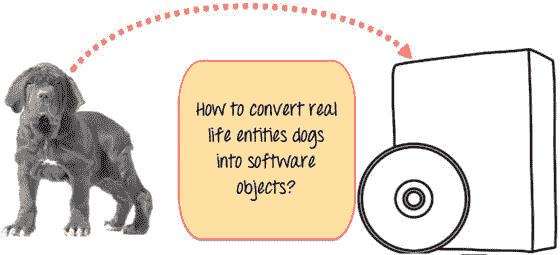
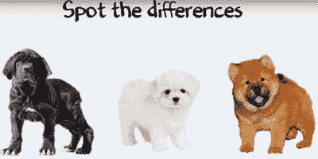
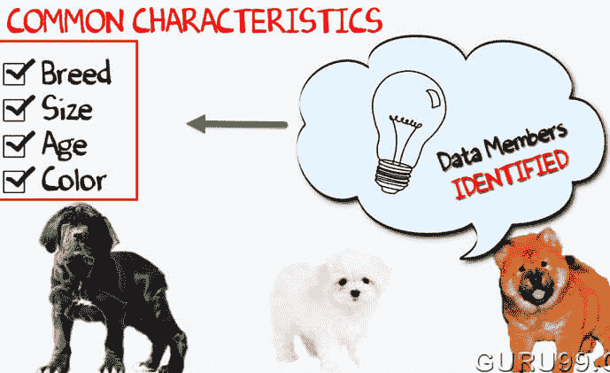
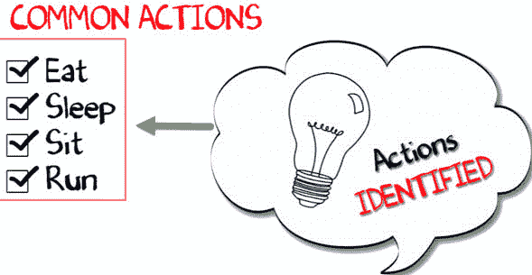
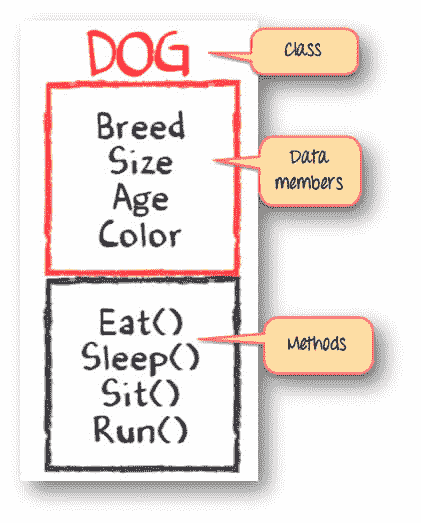
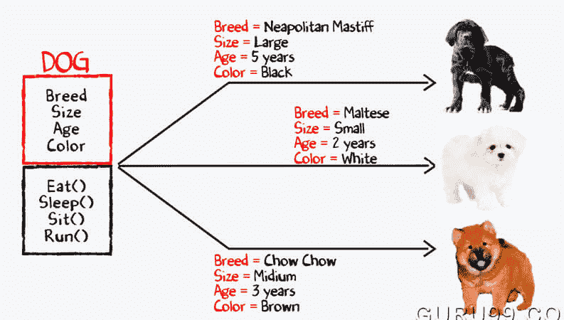

# 类和对象之间的区别

> 原文： [https://www.guru99.com/difference-between-object-and-class.html](https://www.guru99.com/difference-between-object-and-class.html)

## 什么是类？

类是一个实体，它确定对象的行为方式以及对象将包含的内容。 换句话说，构建特定类型的对象是一个蓝图或一组指令。 它提供成员变量和成员函数或方法的初始值。

在此差异教程中，您将学习：

*   [什么是课程？](#1)
*   [什么是对象？](#2)
*   [通过示例了解 Java 类和对象的概念。](#3)
*   [Java 中的类和对象](#4)
*   [等级 Vs。 对象](#5)
*   [类的类型](#6)
*   [类](#7)的使用
*   [对象](#8)的使用

## 什么是对象？

一个对象不过是一个独立的组件，它由使数据有用的方法和属性组成。 它可以帮助您确定类的行为。

例如，当您向对象发送消息时，您正在要求对象调用或执行其方法之一。

从编程的角度来看，对象可以是已分配内存位置的数据结构，变量或函数。 该对象被设计为类层次结构。

## 通过示例了解 Java 类和对象的概念。

让我们以开发专门用于狗的宠物管理系统为例。 您将需要有关狗的各种信息，例如不同品种的狗，年龄，大小等。

您需要将现实生活（即狗）建模为软件实体。



而且，百万美元的问题是，您如何设计这样的软件？ **这是解决方案-**

首先，让我们做一个练习。

您可以在下面看到三种不同品种的狗的图片。



现在就停在这里！ 列出它们之间的差异。

您可能列出的一些差异可能包括品种，年龄，大小，颜色等。如果您仔细考虑一下，这些差异也是这些狗所共有的一些共同特征。 这些特征（品种，年龄，大小，颜色）可以构成对象的数据成员。



接下来，列出这些狗的常见行为，例如睡眠，坐下，进食等。因此，这就是我们软件对象的行为。



到目前为止，我们已经定义了以下内容，

*   **类**：狗
*   **数据成员**或**对象**：大小，年龄，颜色，品种等。
*   **方法**：吃饭，睡觉，坐着奔跑。



现在，对于 Java 类中数据成员的不同值（品种大小，年龄和颜色），您将获得不同的 dog 对象。



您可以使用这种 OOPs 方法设计任何程序。

## Java 中的类和对象

在下面的程序中，我们声明了一个称为 Dog 的类。 我们使用新关键字定义了一个名为“马耳他”的对象。 在最后一条语句中 System.out.println（maltese.getInfo（））; 我们正在显示狗的信息，例如品种，大小，年龄，颜色等。

```
// Class Declaration
class Dog {
    // Instance Variables
    String breed;
    String size;
    int age;
    String color;

    // method 1
    public String getInfo() {
        return ("Breed is: "+breed+" Size is:"+size+" Age is:"+age+" color is: "+color);
    }
}
public class Execute{
    public static void main(String[] args) {
        Dog maltese = new Dog();
        maltese.breed="Maltese";
        maltese.size="Small";
        maltese.age=2;
        maltese.color="white";
        System.out.println(maltese.getInfo());
    }
}

```

**输出：**

品种是：马耳他大小是：小年龄是：2 颜色是：白色

## 等级 Vs。 目的


这是类和对象之间的重要区别：

| **类** | **对象** |
| 类是用于在程序中创建对象的模板。 | 该对象是类的实例。 |
| 类是逻辑实体 | 对象是物理实体 |
| 类创建时不分配内存空间。 | 每当创建对象时，对象就会分配内存空间。 |
| 您只能声明一次类。 | 您可以使用一个类创建多个对象。 |
| 例如：汽车。 | 示例：捷豹，宝马，特斯拉等 |
| 类生成对象 | 对象为课堂提供了生命。 |
| 由于类在内存中不可用，因此无法对其进行操作。 | 它们可以被操纵。 |
| 它没有与字段关联的任何值。 | 每个对象都有其自己的值，这些值与字段相关联。 |
| 您可以使用“ class”关键字创建类。 | 您可以在 Java 中使用“ new”关键字创建对象 |

## 类的类型

以下是重要的课程类型：

**派生类和继承**

派生类是从其他提醒类创建或派生的类。 它用于增加基类的功能。 这种类型的类从现有类派生并继承属性。 它还可以添加或共享/扩展自己的属性。

**超类：**

超类是可以从中派生许多子类的类。

**子类：**

子类是从超类派生的类。

**混合课程**

混合类是又一项功能，可以帮助您将一个类的属性继承到另一个。 它使用类功能的子集，而派生类使用完整的超类功能集。

## 类的使用

这是类的重要用途：

*   类用于保存数据变量和成员函数。
*   它使您可以创建用户定义对象。
*   类提供了一种组织有关数据的信息的方法。
*   您可以使用类继承其他类的属性。
*   类可用于利用构造函数或析构函数。
*   它可以用于大量数据和复杂的应用程序。

## 对象的使用

这是物体的重要用途

*   它可以帮助您了解接受的消息类型和返回的响应类型。
*   您可以使用对象引用对象的变量来访问内存。
*   它用于处理数据。
*   对象代表您正在寻找解决方案的实际问题。
*   它使数据成员和成员函数能够执行所需的任务。

## 关键区别：

*   类是用于在程序中创建对象的模板，而对象是类的实例。
*   类是逻辑实体，而对象是物理实体。
*   类不分配内存空间，而对象分配内存空间。
*   您只能声明一次类，但是可以使用一个类创建多个对象。
*   当对象可以被操纵时，类不能被操纵。
*   类没有任何值，而对象有其自己的值。
*   您可以使用“ class”关键字创建类，而在 Java 中可以使用“ new”关键字创建对象。