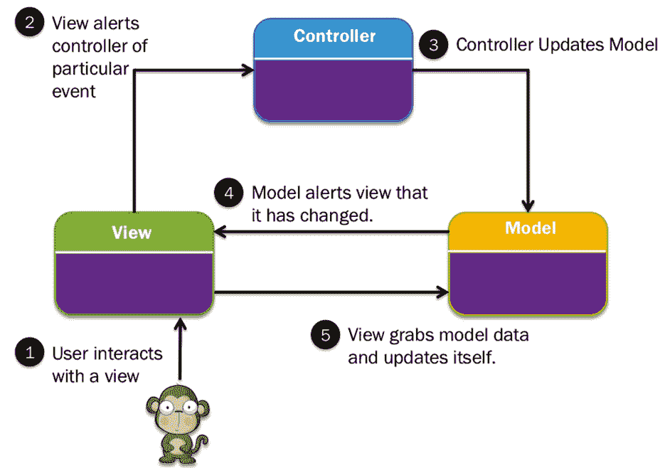
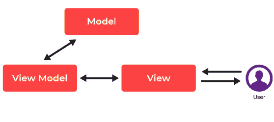

# MVC 与 MVVM：示例的主要区别

> 原文： [https://www.guru99.com/mvc-vs-mvvm.html](https://www.guru99.com/mvc-vs-mvvm.html)

## 什么是 MVC？

MVC 框架是一种架构模式，可将应用程序分为三个主要的逻辑组件：模型，视图和控制器。 因此缩写为 MVC。 完整的 MVC 是模型视图控制器。

在此体系结构中，构建了一个组件来处理应用程序的特定开发方面。 MVC 将业务逻辑层和表示层彼此分离。 这种体系结构模式主要用于桌面图形用户界面（GUI）。

在本教程中，您将学习：

*   [什么是 MVC？](#1)
*   [什么是 MVVM？](#2)
*   [MVC 模式](#3)
*   [MVVM 模式](#4)
*   [MVC 的功能](#5)
*   MVVM 的功能
*   [MVVM 和 MVC 之间的区别](#7)
*   [MVC](#8) 的优势
*   [MVVM 的优点](#9)
*   [MVC 的缺点](#10)
*   [MVVM 的缺点](#11)

## 什么是 MVVM？

MVVM 架构借助标记语言或 GUI 代码促进了图形用户界面的开发分离。 MVVM 的完整形式是 Model–View–ViewModel。

MVVM 的视图模型是一个值转换器，这意味着视图模型有责任以易于管理和呈现对象的方式从模型中公开数据对象。

## MVC 模式

MVC Architecture

三个重要的 MVC 组件是：

*   **型号**：它包含所有数据及其相关逻辑。
*   **视图**：向用户显示数据或处理用户交互。
*   **控制器**：模型和视图组件之间的接口。

让我们详细了解每个组件：

### 模型

模型组件存储数据和相关逻辑。 它表示在控制器组件或任何其他相关业务逻辑之间传输的数据。

例如，Controller 对象可帮助您从数据库中检索客户信息。 它处理数据并将其发送回数据库或使用它来呈现相同的数据。

### 视图

视图是应用程序中代表数据表示的部分。 视图是由从模型数据收集的数据创建的。 视图请求模型提供信息，以便其将输出重新发送给用户。

视图还表示来自图表，图表和表的数据。 例如，任何客户视图都将包括所有 UI 组件，例如文本框，下拉菜单等。

### 控制者

控制器是应用程序中处理用户交互的部分。 控制器解释用户的鼠标和键盘输入，通知“模型”和“视图”进行适当更改。

控制器向模型发送命令以更新其状态（例如，保存特定文档）。 控制器还将命令发送到其关联的视图以更改视图的显示方式（例如，滚动特定文档）。

## MVVM 模式

这是 MVVM 的模式：

MVVM Architecture

MVVM 体系结构提供了视图和视图模型之间的双向数据绑定。 它还可以帮助您自动将视图模型内部的修改传播到视图。 视图模型利用观察者模式来更改视图模型。

让我们详细了解一下此组件：

### Model

该模型存储数据和相关逻辑。 它表示在控制器组件或任何其他相关业务逻辑之间传输的数据。

例如，一个 Controller 对象将从学校数据库中检索学生信息。 它处理数据并将其发送回数据库或使用它来呈现相同的数据。

### 视图：

该视图代表 UI 组件，例如 HTML，CSS，jQuery 等。在 MVVC 模式中，视图负责负责显示从 Controller 接收到的数据作为结果。 此视图也将模型转换为用户界面（UI）。

### 查看模型：

视图模型负责呈现功能，命令，方法，以支持视图的状态。 还负责操作模型并激活视图中的事件。

## MVC 的功能

这是 MVC 的重要功能：

*   简便，无摩擦的可测试性。 高度可测试，可扩展和可插入的框架
*   您还可以利用 ASP.NET，Django，JSP 等提供的现有功能。
*   它提供了对 HTML 以及 URL 的完全控制。
*   它支持测试驱动开发（TDD）
*   这种架构提供了逻辑分离
*   允许路由 SEO 友好 URL。
*   提供映射以获取可理解和可搜索的 URL。

## MVVM 的功能

这里是 MVVM 体系结构的功能：

*   MVVM 是为具有数据绑定功能的桌面应用程序编写的-XAML 和 INotifyPropertyChanged 接口
*   如果要在视图模型中进行修改，则视图模型使用观察者模式。
*   MVVM 模式主要由 WPF，Silverlight，nRoute 等使用。

## MVVM 和 MVC 之间的区别

这是 MVVM 和 MVC 之间的重要区别

| **MVC** | **MVVM** |
| 控制器是应用程序的入口点。 | 该视图是应用程序的入口点。 |
| 控制器&视图之间的一对多关系。 | 视图&视图模型之间的一对多关系。 |
| 视图没有对控制器的引用 | 视图具有对视图模型的引用。 |
| MVC 是旧模型 | MVVM 是一个相对较新的模型。 |
| 难以阅读，更改，进行单元测试和重用此模型 | 当我们具有复杂的数据绑定时，调试过程将很复杂。 |
| MVC 模型组件可以与用户分开测试 | 易于进行单独的单元测试，并且代码是事件驱动的。 |

## MVC 的优势

这是 MVC 的优点/优点

*   对新型客户的支持更加轻松
*   各种组件的开发可以并行执行。
*   通过将应用程序划分为单独的（MVC）单元来避免复杂性
*   它仅使用前端控制器模式，该模式使用单个控制器处理 Web 应用程序请求。
*   为测试驱动的开发提供最佳支持
*   它适用于 Web 应用程序，Web 应用程序得到了大型 Web 设计人员和开发人员团队的支持。
*   它提供了清晰的关注点分离（SoC）。
*   所有的分类和对象彼此独立，因此您可以分别对其进行测试。
*   MVC 允许将控制器上相关动作的逻辑分组在一起。

## MVVM 的优势

这是 MVVM 的优点/好处

*   业务逻辑与 Ul 分离
*   易于维护和测试
*   易于重用的组件
*   松散耦合的体系结构：MWM 使您的应用程序体系结构松散耦合。
*   您可以为 viewmodel 和 Model 层编写单元测试用例，而无需引用 View。

## MVC 的缺点

这是 MVC 的缺点/缺点

*   业务逻辑与 Ul 混合
*   难以重用和实施测试
*   没有正式的验证支持
*   数据的复杂性和效率提高
*   在现代用户界面上使用 MVC 的困难
*   需要多个程序员进行并行编程。
*   需要具备多种技术知识。

## MVVM 的缺点

这是 MVVM 的缺点/缺点

*   维护控制器中的许多代码
*   有人认为，对于简单的 MVVM 体系结构 UI 可能会过大。
*   在视图和视图模型之间没有提供紧密的耦合

## 关键区别

*   MVC 框架是一种架构模式，可将应用程序分为三个主要的逻辑组件：模型，视图和控制器。 另一方面，MVVM 借助标记语言或 GUI 代码促进了图形用户界面的开发分离
*   在 MVC 中，控制器是应用程序的入口点，而在 MVVM 中，视图是应用程序的入口点。
*   MVC 模型组件可以与用户分开进行测试，而 MVVM 易于进行单独的单元测试，并且代码是事件驱动的。
*   MVC 体系结构在 Controller &视图之间具有“一对多”关系，而在 MVVC 体系结构中，View &视图模型之间具有“一对多”关系。