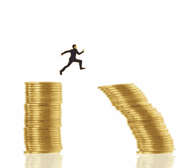

# 如何使用示例分析财务报表

> 原文： [https://www.guru99.com/decision-making.html](https://www.guru99.com/decision-making.html)

所以您可能会问自己，我们为什么要做所有这些事情？ 似乎仅需几次报告就需要付出很多努力。

好，这就是答案。

没有良好的信息，您就无法做出良好的业务决策。 有了这两个报告，我们现在可以获得关于我们的小面包店的准确，准备充分且易于理解的财务信息。 这就是我们现在所知道的：

1.  我们卖多少
2.  我们花了多少钱
3.  我们花在什么上
4.  我们赚多少钱
5.  我们的资产值多少
6.  我们欠别人多少钱
7.  公司欠我们多少​​钱
8.  现在，想象下明年我们准备下一组财务报告时。 那我们也会知道
9.  如果我们的利润在增加
10.  如果我们的支出在增加
11.  如果我们的资产价值在增加
12.  我们要花更多的钱
13.  我们花更少的钱
14.  如果我们的债务增加
15.  如果业务在更高的销售额，更高的利润和更高的净资产方面有所改善

这是我们准备财务信息的全部原因-查明我们业务的优缺点，并找出可以改进的地方。 每年，公司在会计师和顾问上花费数百万美元，以寻求有关如何提高利润的建议。 您能猜出这些会计师和顾问使用什么作为建议吗？ 财务报表！

对于受过良好教育的专业人员，一套财务报表可以告诉他们有关企业的大量信息。 仅损益表和资产负债表就足以产生大量的建议和想法。 现在，我要假装自己的面包店顾问。 让我们看看我能提出什么。

### 财务分析实例

| （NAME）面包店的损益表（截至今天（DATE）） |
| 收入 |   |   |
| 营业额 | $7,000 |   |
|   |   |   |
| **总收入** |   | $7,000 |
|   |   |   |
| 减：费用 |   |   |
|   |   |   |
| 蛋糕混合费用 | $3,000 |   |
| 电话费用 | $300 |   |
| 维修费用 | $50 |   |
| 利息花费 | $1,000 |   |
| 折旧费用 | $400 |   |
|   |   |   |
| **总费用** |   | $4,750 |
|   |   |   |
| 净利 |   | $2,250 |
| 减税（30％） |   | $675 |
| 税后净利润 |   | $1,575 |

| **（NAME）面包店（今天（DATE）DATE）的资产负债表** |
| **资产** |   |   | **负债** |   |   |
| 银行 | $21,650 |   | 贷款 | $9,000 |   |
| 电脑 | $1,500 |   | 约翰的汽车修理店 | $3,000 |   |
| 烤箱 | $2,000 |   | 应付税款 | $675 |   |
| 苹果手机 | $500 |   |   |   |   |
| 汽车减累计折旧 | $2,600 |   |   |   |   |
| **总资产** |   | **$ 28,250** | **总负债** |   | **$ 12,675** |
|   |   |   |   |   |   |
|   |   |   | **所有者权益** |   |   |
|   |   |   | 年初的所有者权益 | $15,000 |   |
|   |   |   | 减号：图纸 | $1,000 |   |
|   |   |   | 加：税后净利润 | $1,575 |   |
|   |   |   | **年终所有者权益** |   | **$ 15,575** |
|   |   |   |   |   |   |
| **总计** |   | **$28,250** | **Total** |   | **$28,250** |

**Observation 1:**
Enter the Account with Largest Expense<input id="Assets" name="Assets" size="25" type="text">Are you sure?<input class="ob" type="checkbox" value="1">Yes <input class="ob" type="checkbox" value="11">No
Corect! Your largest expense is your raw materials – cake mix. It is 63% of your total expenses. It is 42% of your sales. This is very high. Perhaps review supplier options.**Try again  (Hint:Check the cake mix expense)**
**Observation 2:**
Do you see advertising expense?<input class="obadd" type="checkbox" value="2">Yes<input class="obadd" type="checkbox" value="22">No
You are not spending any money on advertising. This could be the key to increasing your sales. A good way to begin advertising is to start with social media and then begin spending money on getting exposure in food magazines, websites and deal sites like Groupon.**Try again**
**Observation 3:**
Do you see any wages?<input class="obadd1" type="checkbox" value="1">Yes<input class="obadd1" type="checkbox" value="2">No
You are not spending any money on wages. Why don’t you have staff? A key action in increasing your sales might be to start training staff to do some of your jobs for you, such as cleaning and returning phone calls. This allows you to concentrate on running and expanding the business.**Try again**
**Observation 4:**
How much money is in bank?<input id="text1" name="text1" type="text">Are you sure?<input class="obadd2" type="checkbox" value="1">Yes <input class="obadd2" type="checkbox" value="2">No
You are paying interest on your loan, yet you have $21,650 sitting in the bank. You are paying interest for no reason. Had you paid the loan off and avoided your interest expense this year, your net profit would have increased by almost 50%. Pay off the loan, you have the cash.
There is no need to keep $21,650 in the bank when your annual expenses are less than $5,000\. You almost have 5 years’ worth of expenditure saved up. Not to mention you make a profit, which makes such large cash reserves even less necessary. Invest some of this cash in a savings account and start earning some interest revenue, or spend the cash on expansion. You could also pay a dividend or pay yourself an owner’s salary.**Try again**
**Observation 5:**
Do you see rent expense?<input class="obadd3" type="checkbox" value="1">Yes <input class="obadd3" type="checkbox" value="2">No
You aren’t paying rent. This means you’re working from home or on the move. You might find it beneficial to find a premises and start benefitting from foot traffic/walk in customers.**Try again**
**Observation 6:**
What is the car worth after depreciation?<input id="text2" name="text2" type="text">
Are you Sure?<input class="obadd4" type="checkbox" value="1">Yes <input class="obadd4" type="checkbox" value="2">No
Your most expensive asset is your delivery car, worth $2,600\. However, your sales are not high enough to warrant a delivery car yet. A vehicle is an expensive asset to have – you need to maintain it, repair it, insure it, put petrol in it, clean it and register it. You even need to find somewhere to park it each night! Consider using a shipping service to deliver your product at $10 a pop, and sell your car to put that $2,600 to better use**Hint (Depreciation amount is $400)**

现在，其中一些建议可能是有价值的，而有些则可能没有价值，但这是没有意义的。 此处的教训是，仅查看损益和资产负债表-一张纸上的两个报告，您可以获得有关您业务的如此丰富的信息。 您不仅可以确定钱的确切来源和去向，而且还可以提供足够的信息来列出有关关注和改进领域的想法和建议。 现在，试想一下，对于拥有几页财务信息的大型公司，例如 Toyota 或 McDonald's，可以提出什么样的有效顾问。

做出正确决策的关键是获得良好的信息-这就是会计的全部内容！

