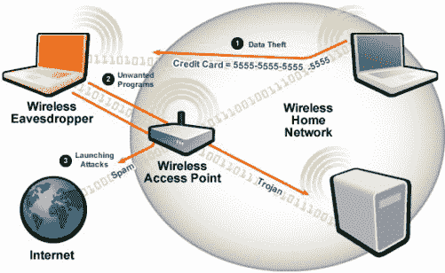
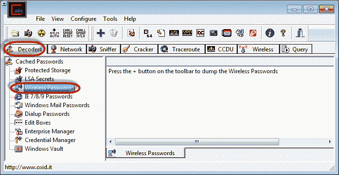
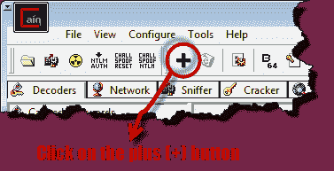

# 如何破解 WiFi（无线）网络

> 原文： [https://www.guru99.com/how-to-hack-wireless-networks.html](https://www.guru99.com/how-to-hack-wireless-networks.html)

**路由器传输半径内的任何人都可以访问无线网络。** 这使它们容易受到攻击。 热点可在机场，饭店，公园等公共场所使用。

在本教程中，我们将向您介绍用于**利用无线网络安全实现**中的弱点的常用技术。 我们还将研究您可以采取的一些针对此类攻击的对策。

## 本教程涵盖的主题

*   [什么是无线网络？](#1)
*   [如何访问无线网络？](#2)
*   [无线网络身份验证 WEP & WPA](#3)
*   [如何破解无线网络](#4)
*   [如何保护无线网络](#5)
*   [黑客活动：破解无线密码](#6)

## 什么是无线网络？

无线网络是使用无线电波将计算机和其他设备链接在一起的网络。 该实现是在 OSI 模型的第 1 层（物理层）完成的。

## 如何访问无线网络？

您将需要具有无线网络功能的设备，例如笔记本电脑，平板电脑，智能手机等。您还需要处于无线网络访问点的传输半径之内。 大多数设备（如果打开了无线网络选项）将为您提供可用网络的列表。 如果网络不受密码保护，则只需单击“连接”。 如果受密码保护，则需要密码才能访问。

## 无线网络身份验证

由于使用启用了无线网络的设备，每个人都可以轻松访问网络，因此大多数网络都受密码保护。 让我们看一些最常用的身份验证技术。

## WEP

WEP 是“有线等效保密”的缩写。 它是针对 IEEE 802.11 WLAN 标准开发的。 其目标是提供与有线网络相同的隐私。 WEP 通过对通过网络传输的数据进行加密来进行保护，以防止窃听。

**WEP 认证**

开放系统身份验证（OSA）–此方法授予对基于配置的访问策略请求的工作站身份验证的访问权限。

共享密钥验证（SKA）–此方法将加密的挑战发送到请求访问的站点。 站用其密钥加密质询，然后作出响应。 如果加密的质询与 AP 值匹配，则将授予访问权限。

**WEP 弱点**

WEP 具有重大的设计缺陷和漏洞。

*   **使用循环冗余校验（CRC32）检查数据包的完整性。** 捕获至少两个数据包可能会危及 CRC32 完整性检查。 攻击者可以修改加密流中的位和校验和，以便认证系统接受该数据包。 这导致未经授权的网络访问。
*   **WEP 使用 RC4 加密算法来创建流密码。** 流密码输入由一个初始值（IV）和一个秘密密钥组成。 **初始值（IV）的长度为 24 位，而秘密密钥可以为 40 位或 104 位**。 初始值和密钥的总长度可以是 64 位或 128 位。 **密钥的可能值越低，越容易破解**。
*   **弱的初始值组合不能充分加密**。 这使他们容易受到攻击。
*   **WEP 基于密码； 这使其容易受到字典攻击**的攻击。
*   **密钥管理实施不佳**。 特别是在大型网络上，更改密钥具有挑战性。 WEP 不提供集中式密钥管理系统。
*   **初始值可以重复使用**

由于存在这些安全漏洞，因此不赞成使用 WEP，而赞成使用 WPA

## WPA

**WPA 是 Wi-Fi 保护访问**的首字母缩写。 它是 Wi-Fi 联盟针对 WEP 中发现的弱点开发的安全协议。 它用于加密 802.11 WLAN 上的数据。 它使用较高的初始值 48 位，而不是 WEP 使用的 24 位。 它使用临时密钥对数据包进行加密。

**WPA 缺陷**

*   防撞实现可以被破坏
*   它容易受到拒绝服务攻击
*   预共享密钥使用密码短语。 弱口令容易受到字典攻击。

## 如何破解无线网络

**WEP 破解**

破解是利用无线网络中的安全漏洞并获得未经授权的访问的过程。 WEP 破解是指使用 WEP 实施安全控制的网络漏洞。 基本上有两种类型的裂缝：

*   **被动破解** –这种类型的破解在 WEP 安全性被破解之前不会对网络流量产生影响。 很难检测到。
*   **主动破解** –这种类型的攻击对网络流量的负载影响增加。 与被动裂纹相比，它易于检测。 与被动破解相比，它更有效。

## WEP 破解工具

*   **Aircrack** –网络嗅探器和 WEP 破解程序。 可以从 [http://www.aircrack-ng.org/下载](http://www.aircrack-ng.org/)
*   **WEPCrack** –这是一个用于破解 802.11 WEP 密钥的开源程序。 它是 FMS 攻击的一种实现。 [http://wepcrack.sourceforge.net/](http://wepcrack.sourceforge.net/)
*   **Kismet** -这可以包括可见和隐藏的检测器无线网络，嗅探器数据包并检测入侵。 [https://www.kismetwireless.net/](https://www.kismetwireless.net/)
*   **WebDecrypt** –该工具使用主动词典攻击来破解 WEP 密钥。 它具有自己的密钥生成器并实现包过滤器。 [http://wepdecrypt.sourceforge.net/](http://wepdecrypt.sourceforge.net/)

## WPA 破解

WPA 使用 256 个预共享密钥或密码短语进行身份验证。 短密码容易受到字典攻击和其他可用来破解密码的攻击。 以下工具可用于破解 WPA 密钥。

*   **CowPatty** –此工具用于使用蛮力攻击来破解预共享密钥（PSK）。 [http://wirelessdefence.org/Contents/coWPAttyMain.htm](http://sourceforge.net/projects/cowpatty/)
*   **Cain & Abel** –该工具可用于解码来自其他嗅探程序（例如 Wireshark）的捕获文件。 捕获文件可能包含 WEP 或 WPA-PSK 编码的帧。 [http://www.softpedia.com/get/Security/Decrypting-Decoding/Cain-and-Abel.shtml](http://www.softpedia.com/get/Security/Decrypting-Decoding/Cain-and-Abel.shtml)

## 一般攻击类型

*   **嗅探** –涉及拦截通过网络传输的数据包。 然后可以使用诸如 Cain & Abel 之类的工具对捕获的数据进行解码。
*   **中间人（MITM）攻击** –这涉及窃听网络并捕获敏感信息。
*   **拒绝服务攻击** –这种攻击的主要目的是拒绝合法用户的网络资源。 [FataJack](http://www.wi-foo.com/soft/attack/fata_jack.c) 可用于执行此类攻击。 [文章](/how-to-hack-web-server.html)中对此有更多介绍

## 破解无线网络 WEP / WPA 密钥

可能会破解用于访问无线网络的 WEP / WPA 密钥。 这样做需要软件和硬件资源以及耐心。 这种攻击的成功还取决于目标网络用户的活跃程度。

我们将为您提供可以帮助您入门的基本信息。 Backtrack 是基于 Linux 的安全操作系统。 它是在 Ubuntu 之上开发的。 Backtrack 附带了许多安全工具。 回溯可用于收集信息，评估漏洞和执行漏洞利用。

回溯的一些流行工具包括：

*   Metasploit
*   Wireshark
*   空袭
*   地图
*   ph 裂

破解无线网络密钥需要上面提到的耐心和资源。 **至少需要以下工具**

具有插入数据包的能力的**无线网络适配器（硬件）**

*   **Kali 操作系统**。 您可以从此处下载它 [https://www.kali.org/downloads/](https://www.kali.org/downloads/)
*   **在目标网络的半径**之内。 如果目标网络的用户正在积极使用并连接到目标网络，则破获它的机会将大大提高。
*   具有足够的基于 Linux 的操作系统的**知识，以及 Aircrack** 及其各种脚本的工作知识。
*   **耐心**，破解密钥可能需要一些时间，具体取决于许多因素，其中有些可能超出您的控制范围。 无法控制的因素包括目标网络的用户在嗅探数据包时主动使用它。

## 如何保护无线网络

在最大程度地减少无线网络攻击的过程中； 组织可以采用以下政策

*   **更改硬件随附的默认密码**
*   启用**认证机制**
*   **通过仅允许注册的 MAC 地址，可以限制对网络的访问**。
*   **使用强大的 WEP 和 WPA-PSK 密钥**，将符号，数字和字符组合在一起，可减少使用字典和蛮力攻击破解密钥的机会。
*   **防火墙**软件还可以帮助减少未经授权的访问。

## 黑客活动：破解无线密码

在这种实际情况下，我们将使用 Cain 和 Abel 来**解码 Windows** 中存储的无线网络密码。 我们还将提供**有用的信息，这些信息可用于破解无线网络**的 WEP 和 WPA 密钥。

### 解码 Windows 中存储的无线网络密码

*   从上面的链接下载该隐& Abel。
*   开该隐和亚伯

*   确保选择了解码器选项卡，然后从左侧的导航菜单中单击无线密码。
*   单击带有加号的按钮

*   假设您之前已连接到安全的无线网络，则将获得类似于以下所示的结果

*   解码器将向您显示加密类型，SSID 和使用的密码。

## 摘要

*   外界可以看到无线网络的传输波，这具有许多安全隐患。
*   WEP 是“有线等效保密”的缩写。 与其他安全实施相比，它具有安全缺陷，使其更易于破解。
*   WPA 是 Wi-Fi 保护访问的首字母缩写。 与 WEP 相比具有安全性
*   入侵检测系统可以帮助检测未经授权的访问
*   好的安全策略可以帮助保护网络。