# SAP 通讯教程：配置，生成，打印&电子邮件

> 原文： [https://www.guru99.com/accounts-receivable-sap.html](https://www.guru99.com/accounts-receivable-sap.html)

有各种标准的通信类型，如发票打印，对帐单等。也可以创建自定义通信类型。

可以在特定业务交易处理时或在以后的阶段为已创建的交易过帐创建对应关系。

信件可以以各种格式发送给客户/供应商，例如电子邮件和传真。 信件基本上是信件等，它们是从 SAP 发送到供应商/客户等的。

可以临时或通过自动批处理作业单独或共同创建信函。

在本教程中，您将学习-

*   [信件类型](#1)
*   [对应配置](#2)
*   [对应生成](#3)
*   [对应打印](#4)
*   [通过电子邮件通信](#5)

### 信件类型

以下是各种标准对应类型的示例列表，可以将其复制以创建特定的自定义表单，程序等。

| **通讯类型** | **对应描述** | **打印程序** | **必需数据** | **示例标准 SAP 脚本表单** |
| SAP01 | 付款须知 | RFKORD00 | 文件号码 | F140_PAY_CONF_01 |
| SAP06 | 帐户对帐单 | RFKORD10 | 帐号和日期 | F140_ACC_STAT_01 |
| SAP07 | 汇票收费表 | RFKORD20 | Document number | F140_BILL_CHA_01 |
| SAP09 | 内部文件 | RFKORD30 | Document number | F140_INT_DOCU_01 |
| SAP10 | 个别信件 | RFKORD40 | 账号 | F140_IND_TEXT_01 |
| 汁液 11 | 文件摘录 | RFKORD50 | Document number | F140_DOCU_EXC_01 |
| SAP13 | 客户声明 | RFKORD11 | 客户编号和日期 | F140_CUS_STAT_01 |

### 对应配置

可以在下面的以下步骤中进行 SAP 中的信函配置

**步骤 1）定义信函类型**

路径：-SPRO >财务会计（新）>应收帐款和应付帐款>客户帐户>订单项>信函>进行和检查信函设置>定义信函类型

交易代码：- **OB77**

这里有各种 SAP 标准对应类型。 您也可以创建自定义对应类型。 您可以指定生成对应关系所需的数据，例如 对于帐户对帐单，您可以指定对帐单需要客户/供应商主数据。 另外，您可以指定日期参数和用于日期选择的文本。

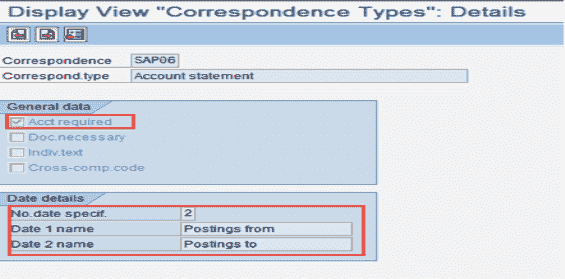

**步骤 2）将程序分配给通讯类型**

路径：-SPRO >财务会计（新）>应收帐款和应付帐款>客户帐户>订单项>信函>进行并检查信函设置>分配信函程序 种类

交易代码：- **OB78**

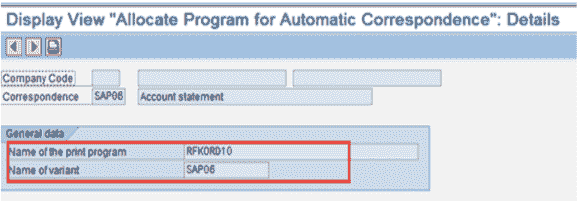

在这里，您需要将对应关系生成器程序链接到对应关系类型。 您也可以为不同的公司代码指定不同的程序。 （此外，您可以在此处指定要执行的程序的默认变体。可以从程序的事务 **SE38** / **SA38** 创建此类变体。）

您还可以创建自己的自定义程序作为标准程序的副本，并可以进行适当的更改以满足客户的任何特定需求。

**步骤 3）确定信函类型**的调用功能

路径：-SPRO >财务会计（新）>应收帐款和应付帐款>客户帐户>订单项>信函>进行并检查信函设置>确定呼叫 功能

交易代码：- **OB79**

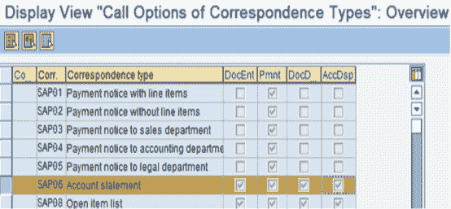

在这里，您需要指定可以在什么时间生成特定的通信类型。 您也可以为不同的公司代码指定不同的设置。 可用的各种选项是：

*   输入文档时（例如 FB50，FB60 等）
*   在付款时（例如 F-28，F-26 等）
*   在显示或更改文档时（例如 FB02，FB03 等）
*   在显示帐户时（例如 FBL1N，FBL5N 等）

**步骤 4）将信函表格分配给信函打印程序**

路径：-SPRO >财务会计（新）>应收帐款和应付帐款>客户帐户>订单项信函>进行信函检查和设置>定义信函的表格名称打印

交易代码：- **OB96**

在这里，您需要指定对应打印程序将使用哪种表格定义。 您也可以为不同的公司代码指定不同的设置。 （SAP Script 表单是使用事务 **SE71** 定义的，其中各种数据以输出格式进行排列以进行处理。此 SAP Script 表单定义了输出中的布局。）

您还可以使用两位数的表单 ID，通过它们您可以在同一公司代码中为不同的表单 ID 调用不同的表单。

可以在生成对应关系的打印程序的选择画面中给出该表格 ID。 您一次只能为一个信函类型选择一个表单 ID。 您可以创建多种通信类型，从而触发不同的表单 ID。

**步骤 5）定义对应的发件人详细信息**

路径：-SPRO >财务会计（新）>应收帐款和应付帐款>客户帐户>订单项>信件>进行和检查信件设置>定义发件人详细信息 通讯表格

交易代码：- **OBB1**

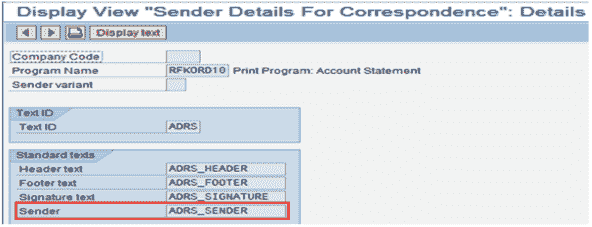

您可以在此处链接页眉，页脚，签名和发件人的详细信息。 使用上面链接的具有文本 ID 的事务 SO10 定义此文本（例如 ADRS）。 您还可以为不同的公司代码指定不同的设置（也可以定义两位数的发送方变体，您可以将其指定给打印程序的选择参数。这将在同一公司代码中启用不同的发送方详细信息。）

**步骤 6）定义对应的排序变体**

路径：-SPRO >财务会计（新）>应收帐款和应付帐款>客户帐户>订单项>信函>进行和检查信函设置>定义以下分类的变式 对应

交易代码：- **O7S4**

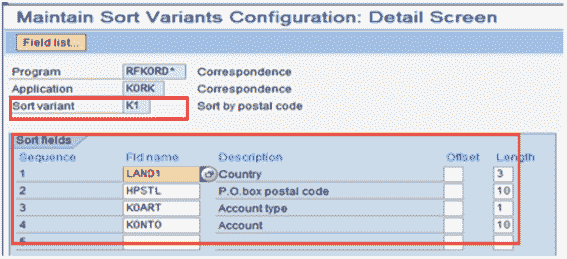

您可以在此处指定将以何种顺序生成对应字母。 例如。 如果要为多个供应商生成帐户对帐单，则将按此顺序对供应商进行排序，然后生成信函。 可以在生成对应关系的打印程序的选择屏幕中给出此分类变量。

**第 7 步）为对应项**定义订单项的排序变式

路径：-SPRO >财务会计（新）>应收帐款和应付帐款>客户帐户>订单项>信函>进行和检查信函设置>定义以下分类的变式 订单项

交易代码：- **O7S6**

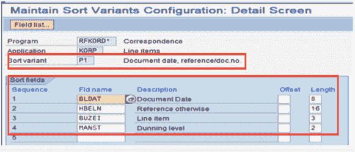

您可以在此处指定相应的订单项将以何种顺序显示在对应的字母中。 例如。 如果供应商帐户对帐单有多个发票，则将按此顺序对发票进行排序，然后生成信函。

可以在生成对应关系的打印程序的选择屏幕中给出此分类变量。

### 通讯生成

如前所述，在配置呼叫点时，可以在以下时间点生成对应关系：

1.  输入文档时（例如 FB50，FB60 等）
2.  在付款时（例如 F-28，F-26 等）
3.  在显示或更改文档时（例如 FB02，FB03 等）
4.  在显示帐户时（例如 FBL1N，FBL5N 等）

可以为特定文档或卖方/客户帐户生成信函。 随后的幻灯片将说明通过不同方式生成对应关系及其打印方式。

**对应生成（方法 A）：-**

可以在创建，更改或显示文档时生成对应关系。

为此，请转到环境>通讯并选择相关的通讯类型，例如 请参见 **FB70** 客户发票创建中的以下屏幕：-

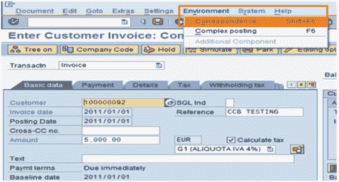

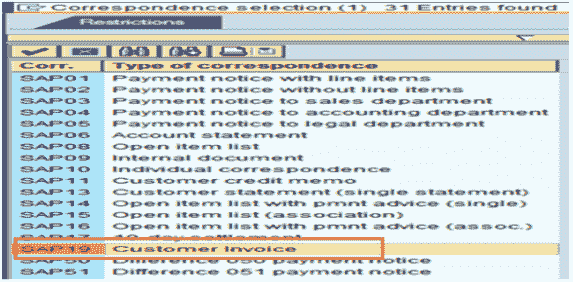

同样，您可以从文档显示/从事务更改创建对应关系，如 FB02 / FB03 / FBl1N / FLB5N 等。

**对应生成（方法 B）**

对于现有会计凭证，您可以使用交易代码 **FB12** 。

输入公司代码后，将询问对应的类型。 选择“信函类型”，它将要求您输入凭证编号/帐号。 根据对应类型设置等。 此后，请求对应。

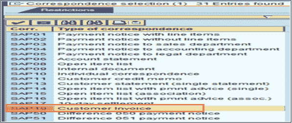

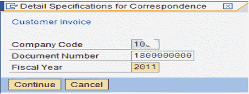

**对应生成（方法 C）**

从事务 F.27，您可以为供应商/客户生成对应关系（帐户对帐单）。

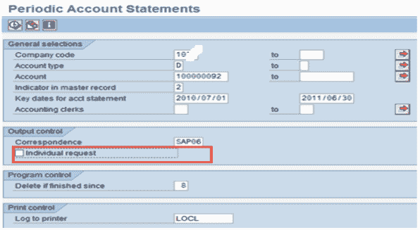

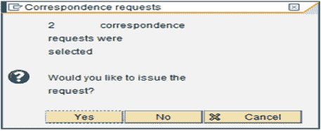

在此处的“主记录中的指示器”中，给出的值应与客户/供应商主数据>公司代码>对应中给出的值匹配。

如果选中“单个请求”复选框，则如果同一供应商/客户在多个公司代码中都有行项目，则将为每个公司代码生成一个单独的语句。

### 对应打印

**对应打印（方法 A）：-**

使用交易代码 **F.61** 打印已经生成的相关通信类型。 在执行时，它将仅打印对应关系（如果配置了电子邮件/传真等，则将以该格式生成输出）

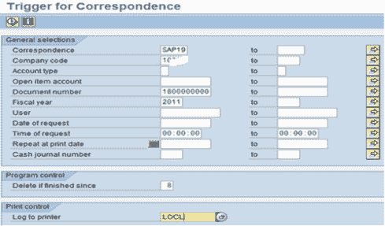

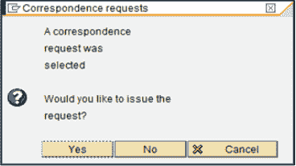

**对应打印（方法 B）：-**

从事务 **F.64** 中，您可以看到生成的对应字母（Spool）并可以打印它。 （与 F.61 的区别在于，在 F.64 中，您还可以对已经生成的通信请求执行其他操作（如删除，打印预览等）。）

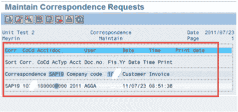

可以从事务 **SP02** 或系统>自己的假脱机请求中看到并打印生成的假脱机。

### 通过电子邮件通信

在客户/供应商主数据>常规数据>地址选项卡>通讯中的设置中保留电子邮件地址，然后选择通讯方式为电子邮件。

还要在客户/卖方主数据>公司代码数据>对应选项卡中维护电子邮件 ID。

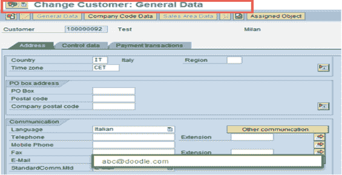

然后，将以电子邮件格式而不是打印输出生成该客户/供应商的对应关系（考虑到用户出口设置，以确定在下一张幻灯片中给出的用户出口中的通信方式）。

**（注：类似地，您可以通过将标准通信选择为 FAX 并保持传真号码来进行传真输出的设置。）**

***本文由 Manisha Singh 提供***