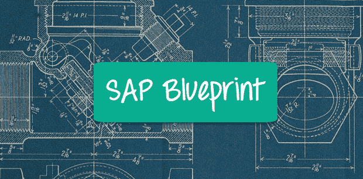

# SAP 业务蓝图：BBP 文档&模板

> 原文： [https://www.guru99.com/sap-business-blueprint.html](https://www.guru99.com/sap-business-blueprint.html)

## SAP 中的业务蓝图是什么？

SAP 蓝图是对公司业务流程和系统要求的详细描述。 这是一个关键的实施文件。 SAP 蓝图文档显示了所有重要的配置设置，以使 ERP 适应公司的需求。

定义明确的 SAP 蓝图是成功实施 SAP 系统的基础。 它包括活动，事件，里程碑和可交付成果的数量。

在本教程中，您将学习

*   [SAP 中的业务蓝图是什么？](#1)
*   [为什么选择 SAP 蓝图文档？](#2)
*   [创建 SAP 蓝图](#3)的过程
*   [商业蓝图的好处](#4)
*   [挑战& SAP 蓝图解决方案](#5)

## 为什么选择 SAP Blueprint 文档？

以北领地政府为例。 它实施了 SAP 来处理其资产管理系统。 原始成本为 720 万美元，而实际成本则升级为 7000 万美元。 该解决方案仅适合目标的 11％，修复成本将额外增加 1.2 亿美元。 因此，规划 ERP 实施非常重要。

SAP Business BluePrint（BPP）致力于了解，认证和记录项目范围，规格。 它还有助于在概念上和实践上定义其目标。

使用这种方法，您可以为系统用户创建调查表。 您可以将这些文件分发给业务流程&所有者。 他们将填写调查表并返回顾问。 此过程可帮助顾问了解如何完成业务以及如何通过实施 SAP 来实施最佳流程。

在此过程中，整个讨论集将作为 SAP 实施的基础。 在这里，所有与业务流程相关的映射细节都应反映在文档文件中。 此阶段的成功很大程度上取决于此时的有效关闭。

因此，实施团队在完成配置业务流程时应包括这些活动。

## 创建 SAP 蓝图的过程：

这是创建蓝图的分步过程

**1.制定流程清单：**

这是盘点所有类型过程的第一步。 此步骤可以帮助您开始考虑流程订单。 在这里，您可以计划如何实现当前系统。 在此阶段，您还需要确定对自定义表单，报表，附魔或工作流的开发需求。

**2.为构建业务蓝图奠定基础：**

此阶段有助于开发 SAP 项目的范围。 在这里，您需要先创建计划，然后才能开始使用新的软件系统。 收集系统安全授权和企业范围的培训要求。 范围定义文档可帮助您定义流程边界。 它还提供了有关给定过程的一些基本信息。

**3.创建蓝图**

创建蓝图需要了解两个部门之间职责发生变化的位置。 该步骤需要通过说明哪个部门或个人从头到尾为流程的哪个部分工作来应用信息。 在这里，您还需要通过重点关注关键集成点并支持组织活动来定义主数据。

**4.估计时间和成本**

在设定过程目标之前，进行基准测量至关重要。 在此阶段，您需要确定此过程的成本和时间。 此步骤还有助于您定义将用于为组织设置改进目标的参数。

**5.验证 SAP 蓝图：**

在此阶段，至关重要的是要从适当的同事那里获得反馈。 这使您可以确保创建的 SAP 业务蓝图应能够反映现实。 这个阶段还可以让您从所有利益相关者那里获得支持和建议。

**6.部署改进技术**

遵循有组织的方法来改进业务流程，方法是使用评估增值活动，消除冗余，减少处理时间以及尽可能使用自动化的方法。 这将帮助您创造业务价值。

**7.开发内部控制和指标：**

下一步是创建内部控制和指标，以帮助您进行跟踪以跟踪进度。 它还允许创建工具来提高实施 SAP 业务流程的效率和效率。

**8.进行试运行：**

进行试运行是必不可少的，因为它可以帮助您检查 SAP 系统而无需进行大量投资。 此步骤可帮助您解决错误，并确保该过程可以根据您的需求进行工作。

**9.实施更改：**

在 SAP Blueprint 的此步骤中，新设计的流程将推出。 此步骤使您可以将正确的信息传达给正确的人。 没有这一步骤，就很难取得成功。

**10.进行持续改进：**

在最后一个阶段，您需要遵循持续改进的概念。 此阶段的全部目的是建立一种用于实施业务流程改进的新方法。 但是，为此，您需要进行频繁评估以确保其有效性。

## 商业蓝图的好处

*   SAP 业务蓝图可帮助最终用户了解解决方案的外观
*   为支持组织变革和
*   帮助消除失去市场份额或声誉的风险
*   帮助您定义所有关键的成功因素和关键绩效指标
*   提供时间和预算的项目范围
*   实施经过测试的改进方法的好处
*   提供更好的项目交付
*   审查并讨论当前的业务流程。

## 挑战& SAP 蓝图解决方案

| 

**挑战**

 | 

**解决方案**

 |
| 公司管理层的承诺 | 严格一点 这将影响项目时间表&的预算 |
| 用户不熟悉计算机&系统进程。 他们可能会忘记一些稍后可能出现的业务流程。 | 顾问需要更具探索性，并广泛征求利益相关者的意见，以引发所有流程。 |
| 用户掌握 SAP 概念的能力 | 应该提供足够的培训。 |
| 顾问同时处理多个项目。 | 顾问应专注于一次处理一个项目。 为此，您可以聘请其他顾问。 |

## 结论：

*   SAP 蓝图是对公司业务流程和系统要求的详细描述
*   SAP 业务蓝图侧重于理解，认证和记录项目范围，规格。
*   确定开发需求，这可能导致需要表单，报告，附魔或工作流。
*   帮助您定义所有关键的成功因素和关键绩效指标
*   它还有助于消除失去市场份额或声誉的风险