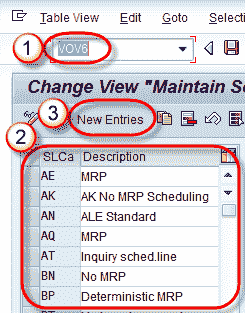
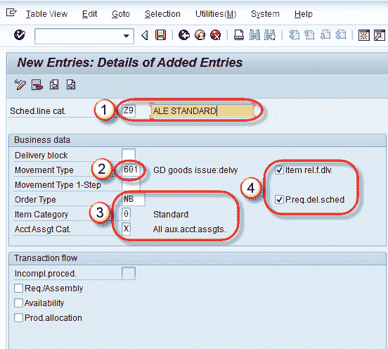

# 计划行类别确定教程：SAP VOV6

> 原文： [https://www.guru99.com/what-is-schedule-line-category-and-define-it.html](https://www.guru99.com/what-is-schedule-line-category-and-define-it.html)

**什么是时间表行类别？**

SAP System 仅复制那些具有计划行的销售单据项目。计划行包含所有与交货相关的信息，例如：交货日期和数量以及有关需求转移和库存管理的信息。

计划行类别有两个字母数字键。

**1）**密钥使用的第一个字符-

| **字符** | **使用** |
| --- | --- |
| 一个 | 查询 |
| 乙 | 报价单 |
| C | 销售订单 |
| d | 退货 |

**2）**密钥使用的第二个字符-

| **Char** | **Uses** |
| --- | --- |
| Ť | 没有库存管理，例如 服务 |
| X | 没有发货的库存管理 |
| ñ | 没有计划 |
| P | 物料需求计划 |
| V | 基于消费的计划 |

**不同销售凭证中的计划行类别。** **咨询：**

*   没有可用性检查。
*   与交付无关。
*   计划行仅供参考。

**报价：**

*   计划行与交付无关。
*   否移动类型（移动类型描述物料移动的类型）。

**订单：**

*   计划行与交货有关。
*   机芯类型是 601。

**返回：**

*   计划行与交货有关。
*   机芯类型是 651。

## 定义计划行类别

We can define our Schedule line category by three ways -

1.  复制现有的计划行类别并根据我们的要求进行更改。
2.  更改现有的计划行类别。
3.  创建一个新的计划行类别。

**步骤 1）**

1.  在命令字段中输入 T 代码 VOV6。
2.  显示的现有计划行类别列表。
3.  要创建新计划行类别，请单击新条目。  按钮。

**步骤 2）**

1.  输入计划订单项类别及其描述。
2.  输入移动类型（用于描述需要执行的物料移动的类型）。 例如收据，发货，转移，冲销。
3.  输入订单类型/项目类别/帐户。 Assgt 猫。
4.  检查项目 rel.f.dlv / Preq.del.sched。

**步骤 3）**单击保存  按钮。 显示一条消息“数据已保存”。

