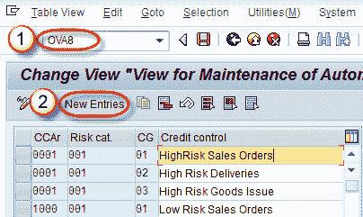
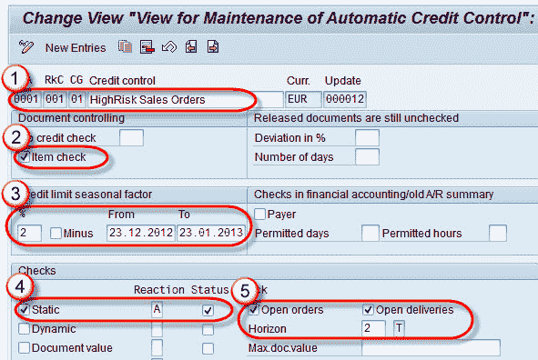

# SAP 信用管理教程：OVA8

> 原文： [https://www.guru99.com/guide-to-credit-management-in-sap-sd.html](https://www.guru99.com/guide-to-credit-management-in-sap-sd.html)

信用管理是公司以信用为基础向客户销售产品/服务的过程。 产品销售后，公司会在以后的时间从客户处收款。 公司为客户确定的信用额度称为**信用额度**。 客户可以在信用额度之内从公司购买产品，并且在超过信用额度时，系统将阻止订单。

**示例**-假设某公司为客户创建了 200,000 的信用额度。 客户可以以信用方式从公司购买产品，直到达到信用额度 200,000.Customer 发出金额为 100000 的订单＃1，再次提供金额为 1,50000 的订单 2。 现在，总未结订单超过客户的信用额度。由于达到信用额度，订单 2 被系统阻止。

在这里，客户总共订购了 Rs。 2,50,000，而客户信用额度为 Rs。 2,00,000。此处订单 2 已超过客户的信用额度。 因此订单 2 将被系统冻结。每个客户的信用额度可以不同。

**信用检查类型**：

1.  **简单信用检查**：？简单信用检查 **=** 所有未清项目的价值 **+** 当前销售订单的价值。 注意：未清项目是公司尚未收到付款的发票。

**2.自动信用检查**-自动信用检查使您可以根据客户的信用等级评估交易，并确保适当地进一步处理交易单据。 信用额度检查会在您保存文档时自动开始，也可以通过选择“检查信用”来开始。 自动信用检查分为 2 种类型-

1.  静态信用检查（根据未清销售订单的总价值+未开具发票的未清交货+未在会计中通过的未结开票凭证的开票价值检查信用额度）。
2.  动态信用检查（针对尚未交付的未清销售订单+未发票未清交付+未结帐单据的帐面价值未通过会计核算+已通过但未付的帐单金额检查信用额度）。

**步骤 1）设置信用检查**

1.  在命令字段中输入 T 代码 OVA8。
2.  单击“新条目”按钮。

**步骤 2）**

1.  输入信用控制。
2.  支票贷方支票选项。
3.  输入信用额度有效期。
4.  选中静态选项。
5.  检查未结订单和交货。

**步骤 3）**

点击保存按钮。