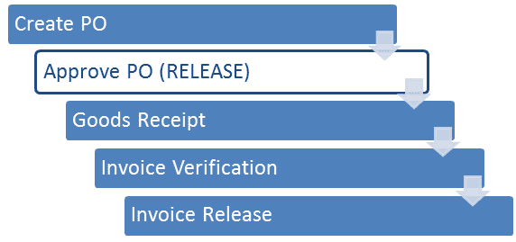
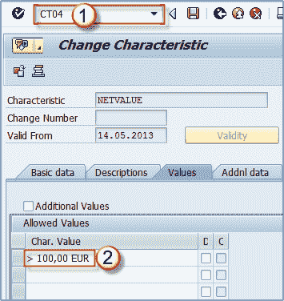
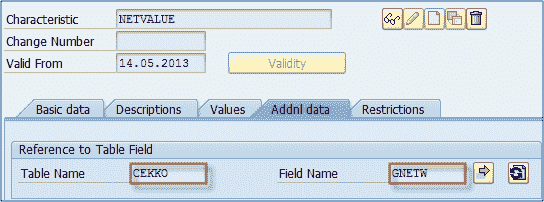
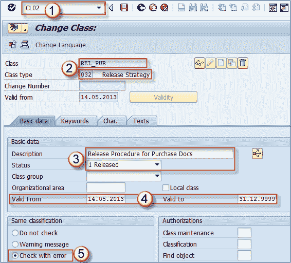
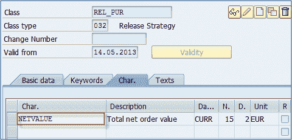
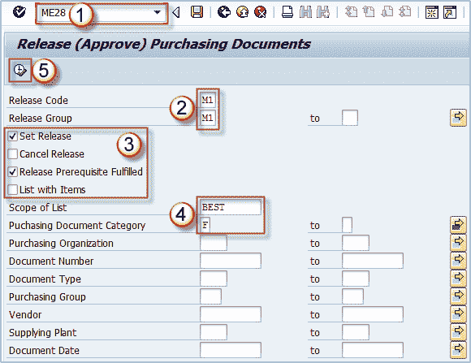
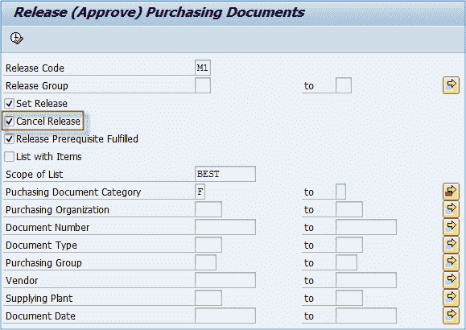

# 下达策略，SAP 中的采购订单流程：CT04，ME28，CL02

> 原文： [https://www.guru99.com/release-procedures-for-purchasing-documents.html](https://www.guru99.com/release-procedures-for-purchasing-documents.html)

发放采购单即表示批准。 为此，我们的 MM 顾问可以创建要使用的发布程序。 有很多选项可用于控制文档的发布。

要知道的重要信息是，采购单在发布后不能更改。 这意味着只应发布最终版本。 未发布的文档（RFQ –报价请求，PO –采购订单，计划协议，合同）无法进一步处理（将 RFQ 转换为报价，PO 转换为收货，发票验证）。 处理流程：

## 发布策略

对于不同的情况，我们可以有很多不同的策略。 例如，您可以定义依赖于文档类型的发布策略，也可以基于采购组织，采购组或采购文档的任何其他关键信息定义发布策略。

**在大多​​数情况下，最常用的发布策略之一是基于购买单据的价值。**

## 定义发布策略

**步骤 1）**让我们定义一个释放策略，以便仅要求购买价值大于 100 Eur 的单据手动释放。 例如，如果我们的 PO 值为 50 Eur，它将被自动释放（不需要进一步处理释放）。 超过 100 欧元的采购订单将需要下达。

为此，在后台需要指定一个特性。

1.  我们可以在 **CT04** 交易中执行此操作。**NETVALUE** 特性已定义。
2.  价值超过 100 欧元。

**步骤 2）**在附加数据选项卡上为特性分配字段。 我们将字段 CEKKO-GNETW 分配给特征，因为该字段是采购凭证值。

**步骤 3）**还需要指定一个保存特性的类。

1.  完成的 T 代码是 **CL02** 。
2.  对于此类，我们需要设置一个类名称，类类型，
3.  说明和状态，
4.  有效期，
5.  相同的分类。

**步骤 4）**为类别分配特征。 之后，我们可以将 **NETVALUE** 分配给名为 **REL_PUR** 的类。

**步骤 5）**在定制中需要完成以下步骤。

*   创建发布组（您为他们分配一个类，在我们的例子中为 REL_PUR）。
*   创建发布代码（为其分配发布组）。
*   创建发布指标（例如 1 阻止，2 释放）。
*   创建发布策略。
*   将发布组和发布代码分配给发布策略。
*   定义策略的发布状态（阻止和发布）。
*   保持分类（设置将应用发布策略的 NETVALUE 值-我们可以将其设置为> 100，这意味着所有价值大于 100 Eur 的采购单据都将受此发布策略的约束）。
*   您还可以执行发布策略模拟，以查看其是否正常运行（可选）。

然后，您的策略已准备就绪，可以进行实时系统试用。

**步骤 6）**我们可以看到我们创建的采购订单价值超过 100 欧元。 如果我们创建的 PO 少于 100 Eur，它将被自动发布。

1.  这两种状态表示我们的 PO 正在发布中（正在等待发布过程，表明在可能进行进一步处理之前应先对其进行批准）。 另一个指示当前状态– **被阻止**表示尚未释放。
2.  价值是 24,000 欧元，超过 100 欧元。

现在我们有一个采购订单，需要下达（批准）此订单才能有效进行进一步处理。

## 下达采购订单

对于采购文件的实际发布，我们可以使用 t 代码 **ME28** 。

**步骤 1）**

1.  执行交易代码。
2.  输入发布代码（必填）和发布组（可选）。
3.  选项–将其保留为默认设置，如以下屏幕所示。
4.  您可以选择清单和采购凭证类别的适当范围（如果我们只想查看可发布的采购订单，我们将选择“ **F** ”）。
5.  执行。

**步骤 2）**在下一个屏幕上，我们可以看到根据我们的条件选择的采购订单。

1.  通过单击选择要下达的采购订单。
2.  单击释放按钮。

采购订单的状态已更改为已下达。

**步骤 3）**您可以在 ME23N 或 ME22N 交易中看到我们的采购订单已更改状态。 现在，PO 标头数据中显示了**“发布完成”** 和“ **已发布”** 状态。

所有采购单据（RFQ，PR，报价等）的处理流程均相同。

## 取消发布

**步骤 1）**必须冲销采购单据才能更改已发行的单据。

*   您可以从同一事务 **ME28** 执行此操作。
*   选择**取消发布**复选框并执行交易。

**步骤 2）**您将看到可用于发布取消的购买文档清单。

1.  选择适当的文档。
2.  单击取消释放按钮。
3.  保存，您就完成了。

**如果您的发布策略不允许撤消发布，则无法取消发布**。 这是在发布指标和发布策略级别上维护的设置。

您可以通过单击以上屏幕上的“ **释放策略**”按钮来测试购买文档使用的释放策略。 您也可以使用“模拟释放”按钮模拟策略输出。

