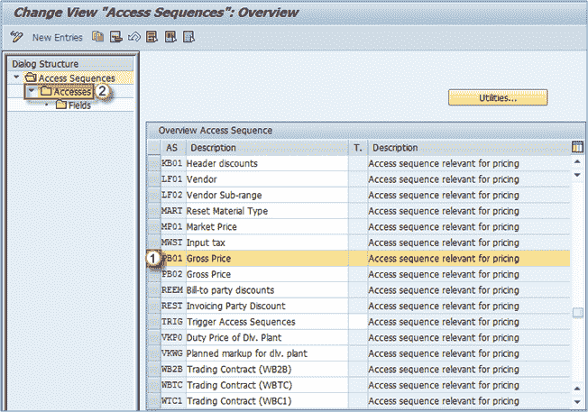
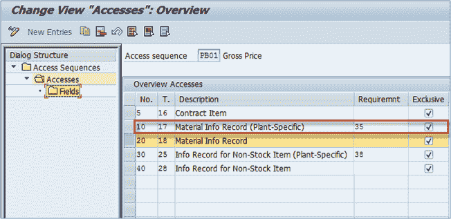
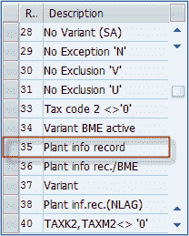
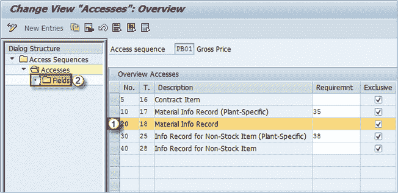
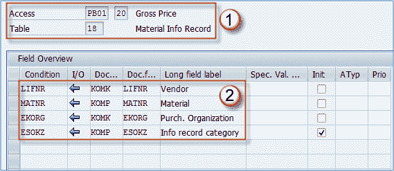
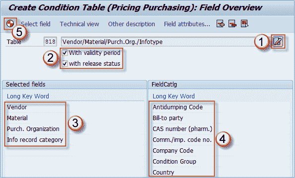
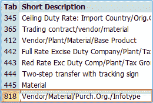

# 如何在 SAP V / 05，M / 03 中定义访问顺序&条件表

> 原文： [https://www.guru99.com/how-to-define-access-sequence-and-condition-table.html](https://www.guru99.com/how-to-define-access-sequence-and-condition-table.html)

## 定义访问顺序

要定义和维护访问顺序，您需要执行一些简单的步骤。

**步骤 1）**转到 SPRO >物料管理>采购>条件>定义价格确定过程>定义访问顺序。

如下所示，您将找到**访问序列**，**访问**和**字段**的对话框结构。

1.  选择您要维护的访问顺序（ **PB01** 总价格）。
2.  双击**进入对话框结构中的**文件夹。

**步骤 2）**在下一步中，定义访问顺序的访问方法。 您可以看到一个序列存在几种访问方法。

他们每个人都是独家的。 这意味着，如果在首次访问（合同项目）中找到一条记录，则意味着如果系统从合同项目中找到了可用的条件，则不会进一步搜索，并且将使用该值。 如果没有，系统将遵循其他访问权限以找到适当的条目。

您还可以设置要使用的访问方法的要求。 例如，分配了访问 **10** 的需求 35，该需求使用条件表 **17** -物料信息记录（特定于工厂）。

访问号 10 的要求是 35-工厂信息记录。 如果没有针对表 17 中的值组合的工厂信息记录，则将完全不使用访问权 10。

**步骤 3）**

1.  选择要修改的访问权限。
2.  在对话框结构的**字段**中选择最低级别的文件夹。

**步骤 4）**

1.  您可以看到我们位于访问屏幕 PB01，访问 20 和表 18 的详细信息屏幕上。
2.  条件访问中使用的条件表的关键字段如下所示。

条件表由为其分配了某些属性的条件字段组成。 当系统尝试访问条件记录时，它将使用这些属性。

*   **特殊值源**-该字段包含一个在访问时用作默认值的值（例如，对访问序列使用固定的信息记录类别）
*   **初始化** –如果选中此框，则系统在访问条件表时将允许该字段的初始值。 如果不是，系统将不处理条件表查找。
*   **Atyp** –访问中的处理类型。 如果该字段是自由键类型或固定键类型的一部分，则可以指定该字段是否与条件访问相关。 默认为空白（固定键类型）。
*   **Priority** -字段的优先级（特性），可以设置为 01 到 99。大多数情况下，此字段保留为空。

## 定义条件表

现在，当我们知道什么是条件表，其用途时，我们可以看到可以在哪里定义条件表，以及在创建条件表时可以使用的选项。

如您在上一个主题中所见，我们在示例中使用了表 18 –物料信息记录。

让我们看看在哪里以及如何定义它。

**步骤 1）**

1.  执行事务代码 **V / 05** ，然后在初始屏幕上输入我们的表号- **18** 。
2.  在第 2 节中，您可以看到我们的表定义，表编号，描述以及两个可以选择的选项。 第一种是使用有效期（始终建议使用），第二种是检查记录的发布状态。 如果选中，则在搜索条件时仅考虑已发布的信息记录。
3.  这是您在“定义访问顺序”主题中已经看到的字段列表。

您可以看到如何定义表以供以后自定义访问顺序时使用。

**V / 05** 事务用于显示条件表。

**V / 04** 事务用于更改条件表。

**V / 03** 事务用于创建条件表。

**现在，如果需要**，则可以定义一个新的条件表，以便在访问序列定义中使用它。 大多数情况下，由于有大量预定义的表，因此不需要新的访问表。

**Step 1)**

1.  输入 t 代码 M / 03 并执行它。
2.  选择新的表格号（必须不使用，例如 818）。
3.  如果要将现有表复制到新表中，可以在此处选择源表。 如果您的表与另一个现有表相似，并且只需要简单的更改即可满足要求，则此功能很有用。

**步骤 2）**在下一个屏幕上，您可以对条件表进行所有设置，并生成它。

1.  如果要编辑描述，请单击此按钮。
2.  选择您的表格是否应检查有效期和发布状态。
3.  当前字段列表。 您可以选择要删除的任何字段（单击它），然后选择删除图标（带有红色减号的列表图标）。
4.  您可以通过双击从字段目录中添加字段。
5.  您需要生成表格以便定价功能使用它。

您还可以使用右键单击来删除表中的字段或向表中添加字段，以及在屏幕右侧导航“字段”目录。 并非所有字段都可以在字段目录的单个页面中显示。

创建成功后，系统将提示您创建更改请求，然后，您将看到一个日志屏幕，如下图所示。

您已成功生成条件表，让我们看看是否可以在访问顺序维护屏幕中看到它。

在那里，所以现在我们可以使用此表创建访问。 我们将不对此进行详细介绍，因为这是非常简单的过程。

在访问序列的访问节点上，选择新建条目按钮。 您可以在以下屏幕中创建访问权限，以用于[测试](/software-testing.html)。

还应将字段分配给我们的访问 PB01 – 96，以使其正常工作