# SAP 库存盘点教程：MI01，MI02，MI04，MI07

> 原文： [https://www.guru99.com/all-about-physical-inventory.html](https://www.guru99.com/all-about-physical-inventory.html)

## 什么是库存盘点？

实物盘存是确定库存数量是否准确，或者确定实际存在的数量与 SAP 系统中提到的数量是否不同的过程。 基本上，完成实物库存后，您的系统和实物库存水平必须相同。

由于法律原因，它是强制性的，并且在大多数情况下，每年进行一次。

为了简化过程，请检查下图，这些是进行库存盘点的最常见步骤（不仅在 SAP ERP 中）。

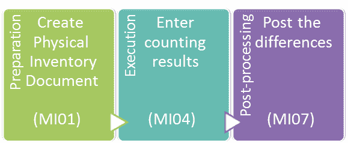

除了法律原因外，在系统中拥有与实际库存相匹配的正确库存数量也非常有帮助。 管理层可以获得有关库存物料价值的正确信息。 销售 ATP 是正确的。 使用正确的输入参数（物料库存数量）来完成 MRP。

系统中没有正确的库存水平意味着相反。 管理层对所拥有股票的财务状况有错误的了解。 ATP 使用了错误的数据（销售可能无法以库存形式实际销售但系统中不存在的商品，或者系统可能允许出售仓库中实际不存在的商品）。 MRP 不准确（生产计划和其他物料计划过程可能会遇到很大问题，因为需要根据库存水平和其他一些信息来计算生产/采购需求）。

现在您知道，对于公司中的许多流程而言，拥有清晰正确的库存水平至关重要。 现在您将看到如何在 MM 模块中完成库存盘点。

## 库存盘点类型

在 SAP 系统中可以使用以下库存盘点程序：

*   **定期库存**
*   **连续库存**
*   **周期计数**
*   **库存抽样**

**定期清单**大多数时候，公司使用这种清单。 在大多数情况下，此操作每年执行一次，这种清单称为年度实物清单。 这意味着材料库存每年计算一次。 多数时候是在年底或季节结束后（在季节性行业中）。

**连续库存**所有物料在一年中的某个时候进行盘点，但可以在指定的任何一天进行盘点。 因此，我们可以计算 2 月份的某些材料，4 月份的其他材料，依此类推。 可以在单个日期计算单个物料。 这种库存主要用于基于仓库管理的仓库，但也可以在库存管理中使用。

**周期盘点**这种存货类型使我们可以为物料级别的实际存货设置定期的周期。 因此，每年可以对快速移动的高价值材料进行四次计数，而对于缓慢移动的低价值材料则可以进行一年计数。 在工厂/库存地点 1 视图的物料主数据中，在字段中为此设置该指标

**CC phys。 Inv。 Ind** 。 **库存抽样**在资产负债表关键日期仅对一些随机选择的物料进行计数，如果这些物料显示出足够小的差异，则也可以认为其他物料具有正确的库存水平。 实际上并没有那么频繁地使用它，因为它本质上是一个近似值，但是在某些情况下，如果材料和仓库结构暗示这一点，则可以使用。

在以下主题中，我们将探讨最常见的年度库存选项。

## 创建库存盘点凭证

以下过程可用于创建和处理库存盘点凭证。

**步骤 1）**

1.  执行事务 **MI01** 。
2.  输入文件日期和计划日期进行计数（保留今天的默认值）。
3.  输入工厂/存储地点/特殊库存指示器。
4.  选择是否要过帐冻结（如果有可能在进行实物库存时有人进行过帐，请启用此–物料级别），冻结书本库存（当前书本库存余额将记录在实物库存文档中） （如果启用了此选项），以及是否要对带有删除标记的批次进行计数（不言自明）。 按 **ENTER** 。

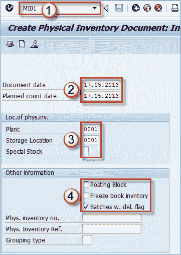

**步骤 2）**

1.  输入要包含在此库存清单文件中的物料编号。
2.  保存交易数据。

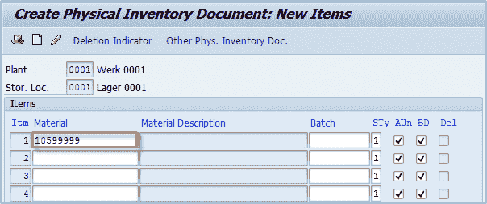

您将被告知新创建的实际库存凭证编号。

**步骤 3）**

可选步骤。

1.  执行事务 **MI02** 对文档进行更改（如果需要）。
2.  如果要检查计数是否已经完成，请双击该项目。
3.  如果需要删除文档，则可以设置删除指示符。

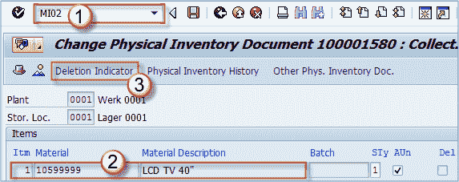

**步骤 4）**

Optional step.

1.  您可以在项目级别看到尚未计算我们的物料。

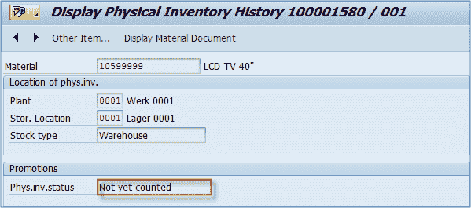

**步骤 5）**

Optional step.

1.  在抬头级别，您可以编辑在创建库存盘点凭证期间输入的数据。

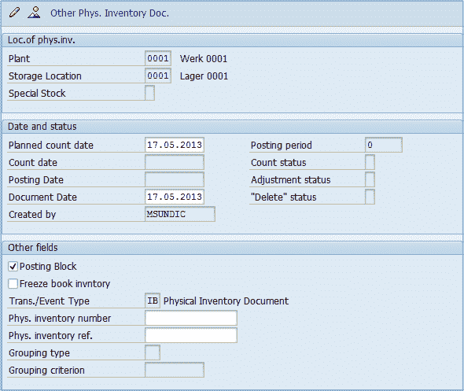

现在，您已完成创建（和更改库存清单文件）的工作。 您可以使用 **MI03** 事务代码显示凭证。

## 输入计数结果

在以下主题中，我将向您展示如何在盘点库存文档中输入盘点结果。

这个过程相当容易，但是需要准确地执行，因为输入盘点的错误会导致以后的存货差。 因此，非常需要计数过程和输入过程都准确。

**Step 1)**

1.  执行事务代码 MI04。
2.  输入实际凭证编号和会计年度。
3.  如果计数日期与建议的日期不同，请输入。
4.  输入方差百分比。 这意味着，如果在实际库存处理之前有 100 个库存，并且输入 107 件作为盘点结果，则会向您显示一条警告消息，通知您先前库存数量与盘点数量之间的差异。按 **ENTER** 。

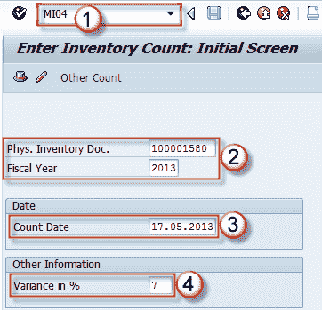

**Step 2)**

1.  输入为此物料计算的数量。
2.  按 ENTER。

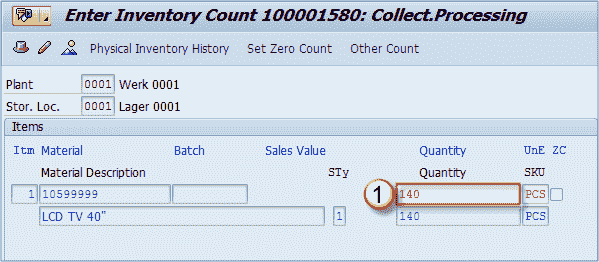

您将被告知数量相差 20 个，如果您在输入数量时没有记错的话，您可以按 ENTER 来绕过警告。 如果输入数量时输入有误，则可以更正输入内容（在我的情况下为 124 个），然后再次按 ENTER 键。

如果您收到警告消息，并且认为计数过程中可能有错误，则可以再次对项目进行重新计数并更正结果（查看 **MI05** 交易代码， **MI11** ）。

将条目更正为 124 个之后，我将**保存交易数据**。

## 过帐差异

在重新计算和重新输入有问题的物料的数量信息之后，可以使用事务 **MI07** 过帐差异。

**Step 1)**

1.  执行事务 **MI07** 。
2.  输入您的实际库存和会计年度。
3.  输入过帐日期。 货物过帐将根据该日期进行。 一些公司使用 31.12。 以年度实际库存为会计年度的最后一天。
4.  您可以使用阈值以本地货币输入允许的最大差异值。 如果您不希望有限制，请将此字段留空。 为了使它起作用，材料需要保持标准或可变价格。
5.  按 **ENTER** 。

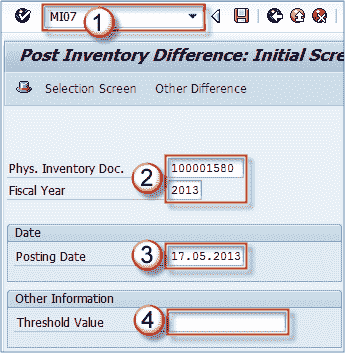

**Step 2)**

1.  您可以看到差异数量。 这意味着我们发现的数量比系统中先前指定的数量多 4 件。
2.  由于我们的控制/会计部门尚未发布此物料的价格，因此未显示价值。 **这需要在生产环境中完成。 您不能过帐 4 件差异分别为 0,00 Eur 的差额。**

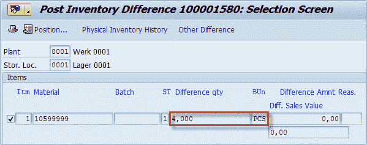

我们可以看到，通过创建结果物料文档 **4900547510** 完成了发布。

**Step 3)**

*可选。*

**我们可以在 **MB03** 中检查物料凭证。**

1.  我们可以在物料文档中看到 4 件的数量。
2.  用于从实际库存差异过帐中收货的移动类型为 701。

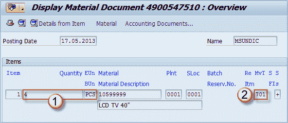

这意味着将 4 件添加到库存。

有关用于库存盘点的标准移动类型的参考，请参见下表。

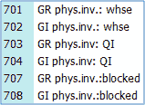

*   **701** -无限制库存的收货
*   **702** –非限制库存的发货
*   **703** –质量检验库存的收货
*   **704** –质量检验库存的发货
*   **707** –冻结库存的收货
*   **708** –冻结库存的发货

您完成了库存盘点。 现在，您可以继续进行常规的仓库活动。