# SAP 中的特殊库存&特殊采购

> 原文： [https://www.guru99.com/special-stock-and-special-procurement.html](https://www.guru99.com/special-stock-and-special-procurement.html)

在某些情况下，后勤流程需要使用特殊的采购类型：

*   寄售
*   分包
*   使用库存转储单进行库存转移
*   第三方处理
*   可回收运输包装
*   管道处理

就特殊采购类型而言，有特殊库存类型。

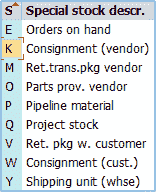

您可以在采购凭证中使用的物料类别。

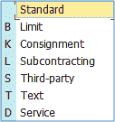

我们将看到在以下过程中如何使用这些特殊的采购类型和特殊的库存类型。

## 寄售

寄售意味着采购的货物仍归卖方所有，但我们公司将材料保留在库存中并能够直接出售。 只有在消费的情况下，商品才是我们公司的财产。

在下图中，您可以看到两种可能的寄售方案/流程。

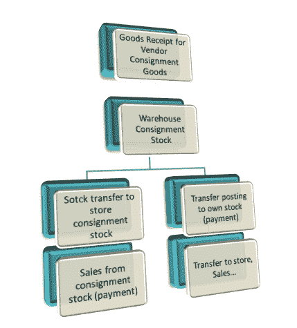

在这两种情况下，流程的基础都是卖方托运货物的收货。 之后，我们将在仓库中存放托运货物。 如果我们想从寄售库存中出售货物，我们可以进行从仓库到库存寄售库存的库存转移，并直接从寄售库存进行销售。

另一方面，如果我们选择不将货物保留为寄售库存，则可以过帐到自己的库存。 之后，我们可以将其发送到我们的商店并作为自有库存出售。

在寄售过程中，我们应该为供应商/物料组合创建购买信息记录，以便预先定义稍后在过程中使用的一些信息。

在该系统中，只需几个简单的步骤即可完成收货。 **接收寄售货物**

**步骤 1）**

使用 **ME21N** 事务创建物料的采购订单。

1.  输入物料类别 **K** -寄售货物。

**步骤 2）**

在 **MIGO** 事务中过帐收货。

1.  您可以看到移动类型为 **101** ，特殊库存指示器为 **K** -寄售库存（供应商）。
2.  选中项目，然后单击确定。

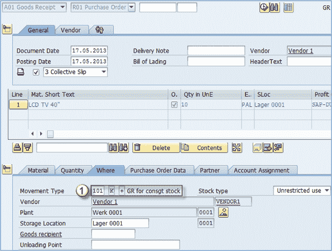

在过帐供应商寄售货物的收货后，您可以看到物料的库存概览已更改。

现在，“供应商寄售”行中有 120 件，不受限制。

**步骤 3）**

从流程图中分为两个不同的场景。

*   至此，我们可以通过 MIGO 交易创建到仓库存储地点的库存转移。 然后，我们可以从寄售库存中出售货物（在销售时产生付款义务）。
*   在第二种情况下，我们可以创建到自己的库存的转移过帐（此时付款义务）。 以后我们可以对商品做任何我们想做的事。

假设我们已经创建了一个转移过帐到货物到达时的库存。 我们可以通过将 **MB1B** 与特殊库存类型指标 **K** 和移动类型 **411** 结合使用来实现此目的。

之后我们可以看到我们的库存水平为 244 个，无限制 0001 个。 我们的 120 件已从寄售转移到自有库存。

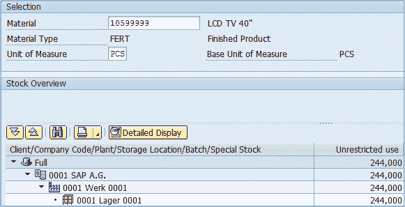

**步骤 4）**

我们不会使用 MIRO 交易创建托运货物的发票。 取而代之的是，在适当时期内通过 **MRKO** 交易清算负债。

1.  执行 **MRKO** 交易。
2.  输入**公司代码**和**供应商**。
3.  **输入日期范围**（您可以根据需要使用文档日期）。
4.  选择您要满足的特殊采购类型。 **寄售**。
5.  选择是要显示可用凭证还是要结算。 选择**显示**。
6.  仅显示未结算的**提款**或仅显示已结算的提款，或同时显示两者。您还可以按物料限制显示/结算的记录。 **执行**。

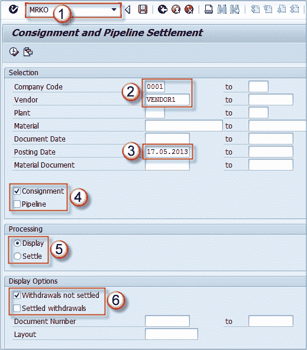

**步骤 5）**

*   首先，我们将选择显示可供选择的可用文档。
*   我们可以看到文档为**未结算**。

*   返回初始屏幕，然后选择**代替[显示]设置**。 **执行**。
*   现在，您会看到一条消息，说明已创建文档 5100000001。

*   返回并选择显示凭证，然后选择查看结算提款。
*   现在有一条记录符合您的要求。 您可以看到状态现在为**已结算**。

这就完成了寄售库存的过程。

## 库存运输单

在库存转移过程中，货物是在公司内部采购和供应的。 一个工厂从另一工厂订购货物（它们称为接收工厂/发货工厂）。

我们可以使用一种特殊类型的采购订单-库存运输订单。 交付过程可以在“库存管理”中或在物流执行的运输组件中完成。

**步骤 1）**使用 **ME21N** 创建采购订单。

1.  选择凭证类型 **UB-库存转储。 订购**。
2.  选择供应工厂– 001。
3.  选择收货工厂采购组织– 0002。
4.  采购组和公司代码。
5.  在项目概览屏幕中，输入物料编号和数量。
6.  选择接收工厂和存储地点。

保存文档。

**步骤 2）**使用 **MIGO** 交易从发卡工厂过帐发货。

1.  选择 **A07 –发货**。
2.  选择 **R01 –采购订单**。
3.  输入发出货物的存储位置。
4.  保存交易–过帐发货。

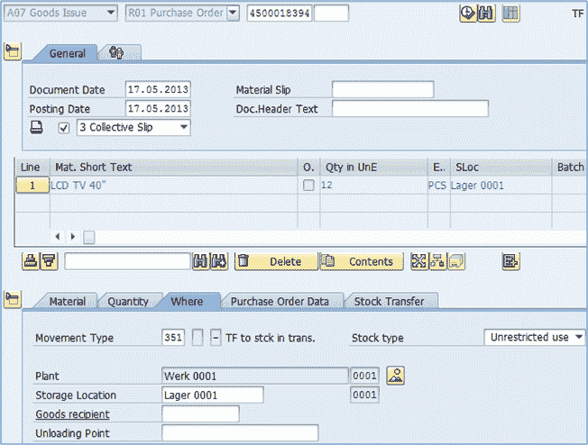

发布后，您将获得一个物料凭证。

**步骤 3）**到收货工厂进行库存调拨订单的收货-在 **MIGO** 中。

1.  选择 **A01 –收货**。
2.  选择 **R01 –采购订单**。过帐收货。

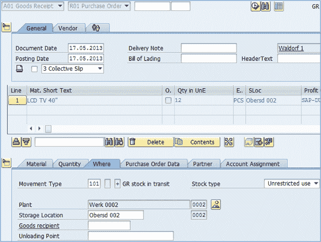

现在工厂之间的库存转移已完成。

您现在可以看到植物库存。 奥伯斯多夫工厂现在拥有 12 个物料 10599999。

也可以使用交货流程来完成库存运输订单。 您可以根据交易 **VL10B** 中的采购订单（库存运输订单）创建外向交货。 然后，您可以使用 **VL02N** 事务过帐发货（更改外向交货）。 最后，您可以执行 PGR（收货后）以从收货工厂交货。

## 分包

在转包中，您将组件交给生产产品的供应商。 然后，贵公司通过采购订单订购产品。 供应商制造订购产品所需的组件通过 BoM（物料清单）以采购订单的形式导入，并提供给供应商。 承包商生产完成品后，我们可以过帐收货。

**Step 1)**

为已维护 BOM 的物料创建标准采购订单。

1.  创建项目类别为 **L** 的采购订单。
2.  输入应在收货时将物料放入的存储位置。

**Step 2)**

在“材料数据”选项卡上，单击“组件”或“爆炸 BOM”图标。

在组件屏幕上，输入应从中发出组件的存储位置。

我已经为我们的材料创建了一个虚假的物料清单（我们肯定不能用称为半导体和塑料的两个组件来制造 40“的 LCD TV），但这足以达到目的（您可以在 **CS01** 中创建物料清单） 如果您没有测试材料，则进行交易）。

保存采购订单。

如果需要释放您的采购订单，请使用 **ME29N** 释放它。

**Step 3)**

在库存监视事务中，我们将为供应商提供组件。

1.  执行事务 ME2O。
2.  输入供应商。
3.  输入工厂。 **执行。**

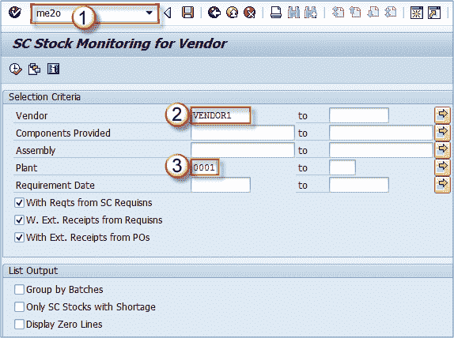

**Step 4)**

您将获得未清项目清单，以转移到供应商。 您可以从我们的采购订单中看到组件。

1.  选择组件（单击组件物料编号旁边的框）。
2.  过帐发货。

**Step 5)**

系统将提示您确认要进行 PGI 的项目。

只需确认正确的存储位置和数量即可。 对所有组件执行此操作。

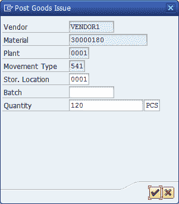

**步骤 6）**

您应该看到这种屏幕，确认您的 PGI 已成功完成 2 个项目。

**步骤 7）**

下一个屏幕应如下所示。

您可以看到存在物料的物料凭证，其移动类型为 541。

**步骤 8）**

您可以针对采购订单过帐收货，以从供应商处接收成品。

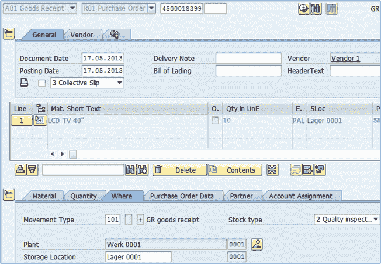

现在您已将组件发放给分包商，并收到了成品。

您还可以使用 ME2O 事务为组件创建外向交货，然后通过 VL02N 过帐发货。 大多数时候，此类处理都是在分包中完成的。