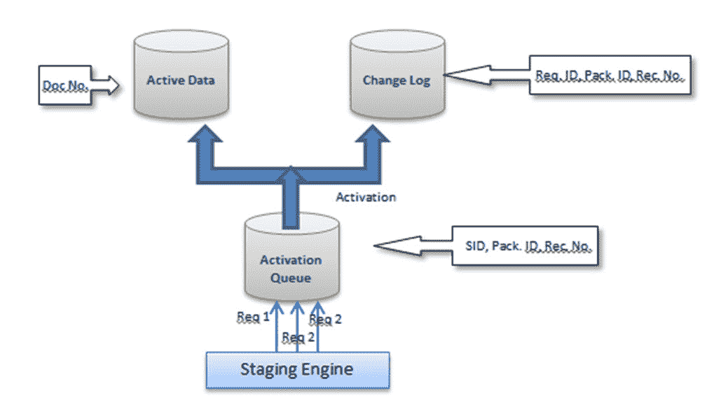
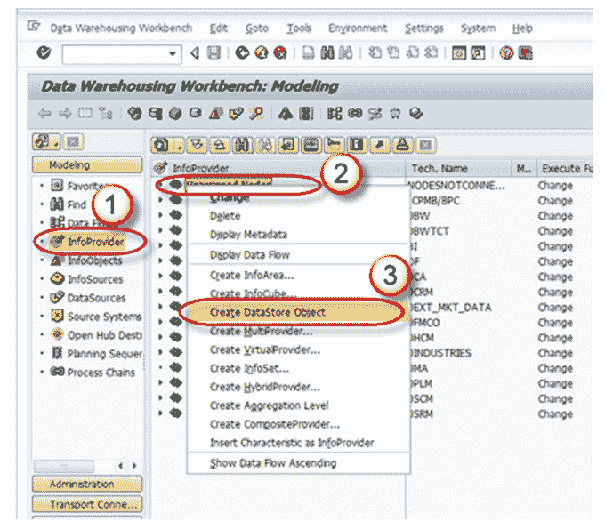
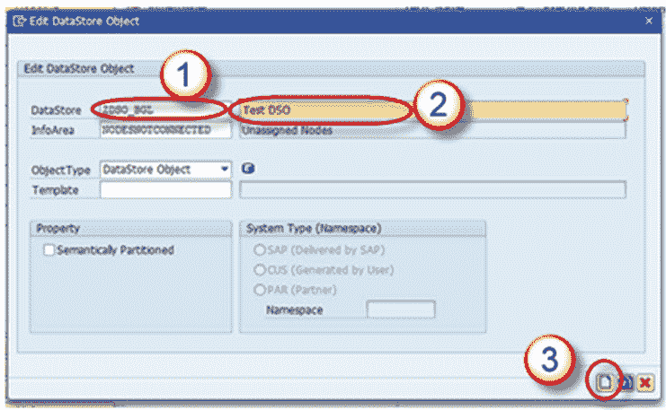
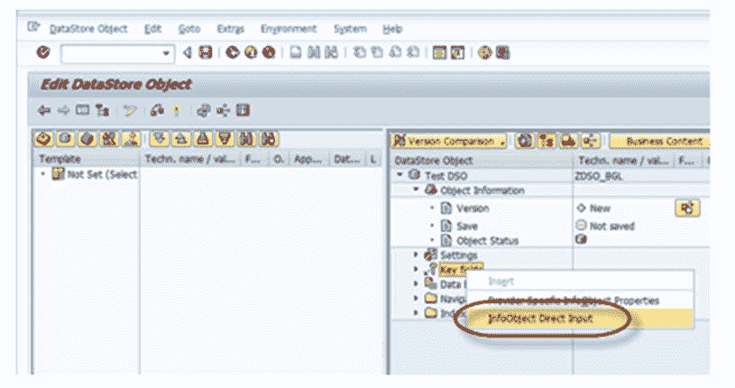
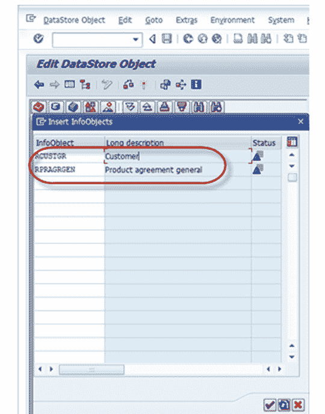
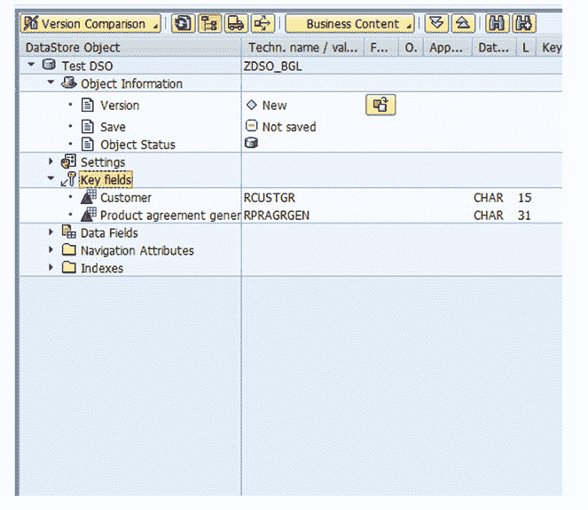
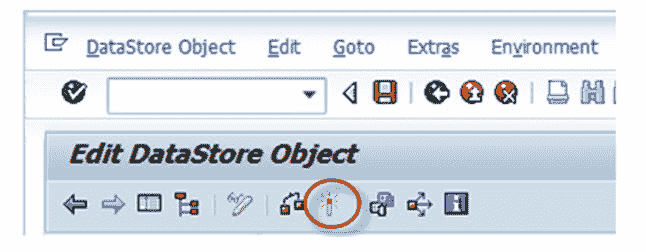

# SAP 中的标准 DSO 是什么？ 如何创建一个？

> 原文： [https://www.guru99.com/what-is-standard-dso-how-to-create-one.html](https://www.guru99.com/what-is-standard-dso-how-to-create-one.html)

标准 DSO 在数据库上具有三个透明表。

1.  **激活队列**：保留要更新但尚未激活的记录。
2.  **活动数据：**该表保存活动数据。
3.  **更改日志：**保留增量负载的更改历史记录。

**数据传输到 DSO 的过程**

*   首先将数据加载到激活队列（也称为“新数据表”）中。
*   Dataupon“激活”从新数据表转移到活动数据表
*   然后去更改日志表。 在更改日志表中，您可以拥有更改的数据或更正的数据。

注意：“更改日志”表中的数据是冗余存储的，可以在激活记录后将其删除。

**创建标准 DSO：**

**步骤 1）**

1.  转到交易代码 RSA1
2.  单击确定按钮。

**步骤 2）**

1.  导航到“建模”选项卡-> InfoProvider。
2.  右键单击 InfoArea。
3.  从上下文菜单中单击“创建数据存储对象”。

**步骤 3）**

1.  输入技术名称。
2.  输入说明。
3.  点击“创建”按钮。

DSO 中的**设置：**

1.  数据存储对象的类型：此选项可用于更改 DSO 的类型。 默认情况下，将选择标准 DSO。 可以将其更改为“写优化”或“直接更新 DSO”。
2.  激活时生成 SID：选中此选项后，将为每个主数据值生成代理 ID（SID）。
3.  唯一数据记录：当 DSO 永远不会保存重复值时，可以使用此选项。
4.  自动将质量状态设置为“ OK”：此项设置在数据加载完成后设置质量状态。
5.  自动激活数据：使用此设置可自动激活 DSO。
6.  自动更新数据：使用此设置可以将 DSO 中加载的数据自动加载到目标对象。

**在 DSO 中包括关键字段和数据字段：**

DSO 包含 2 种字段

1.  关键领域
2.  资料栏位

关键字段用于使记录唯一。 其他字段可以作为数据字段包含在 DSO 中，

**Step 1)**

右键单击“关键字段”，然后选择“ InfoObject 直接输入”选项。

**Step 2)**

将打开以下弹出窗口。 在这里，您可以输入必须包含的 InfoObject 的技术名称，然后按 Enter。

下面显示的是 DSO 中添加的关键字段。

**Step 3)**

默认情况下，将在 DSO 中查看导航属性，但是如果要在报表中使用它，则必须选中“打开/关闭导航”复选框。

**步骤 4）**

DSO 结构设计已完成。 通过单击“激活”按钮来激活 DSO。

