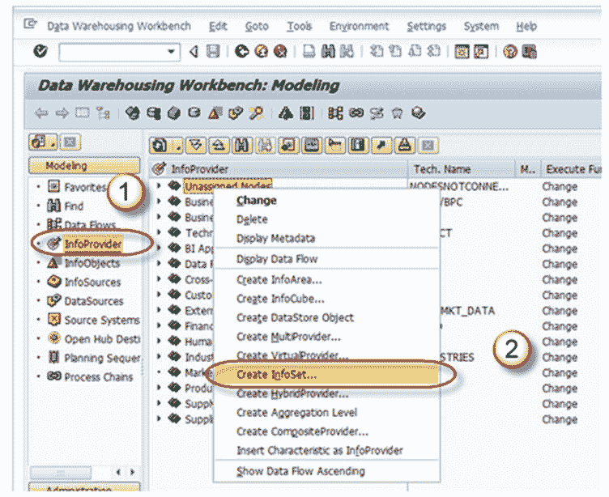
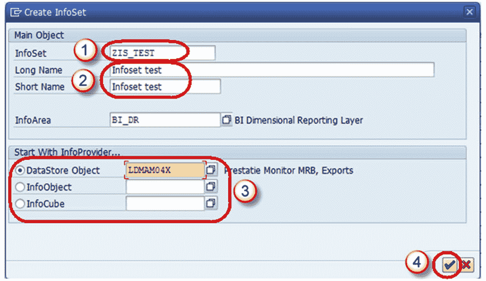
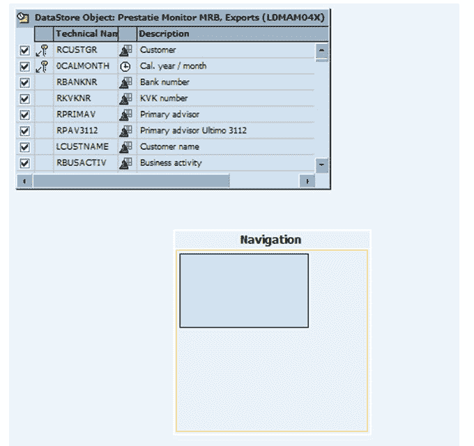
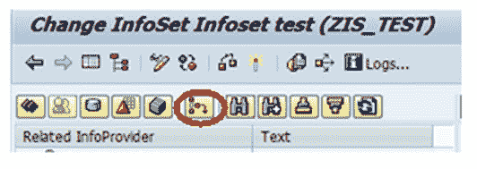
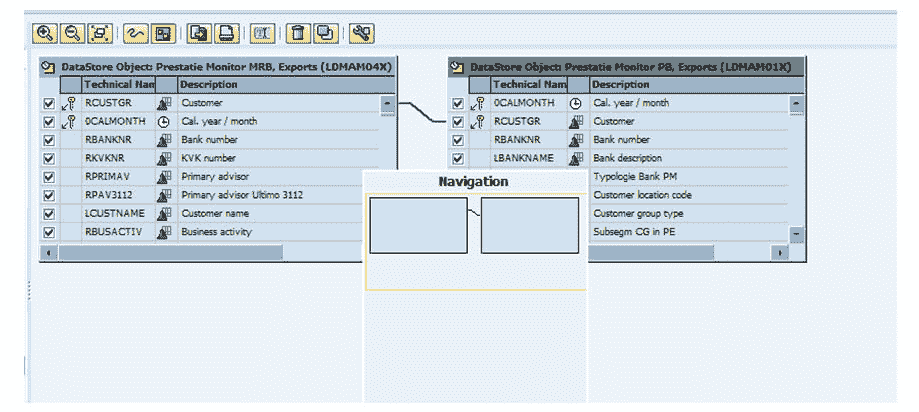

# SAP InfoSet 教程：什么是创建，联接

> 原文： [https://www.guru99.com/what-is-infoset.html](https://www.guru99.com/what-is-infoset.html)

Infoset 是一种特殊的 Infoprovider，它不物理存储数据。 换句话说，Infoset 是逻辑上联接数据并为 BI 查询提供此数据的 InfoProvider。 Infoset 从用于构建数据的 InfoProvider 的表中收集数据。 Infoset 描述了数据源，这些数据源被定义为对 Datastore 对象，Info 对象或标准 InfoCube 进行联接的规则。

## 何时使用信息集？

*   从基本 InfoProvider 联接所需的数据
*   允许在不打开“ BEx 报告”指示器的情况下对 DataStore 对象进行 BEx 报告
*   评估时间依赖性
*   创建自联接和左外联接

## 什么是 InfoSet 联接？

DSO（数据存储对象）和/或 InfoObject（具有主数据的特征）使用联接条件连接到 InfoSet 中。 来自 InfoSet 的联接数据可从 Business Explorer 查询中访问。 通过 InfoSet，您可以报告多个 Info-Provider（Infocubes，数据存储对象，主数据 InfoObject），但是它们不包含任何数据。 使用激活的信息集，您可以在 BI 套件中定义查询。

**联接分为四类**：

1.  内部联接
2.  左外连接
3.  临时加入
4.  自我加入

**内部联接**：仅在两个联接表中都有条目的情况下，记录才能位于所选结果集中。

如果表 2 具有表 1 的对应记录，则通过比较键字段（在下面的示例中为 EMPNO），只有那些记录才是结果集的一部分。 结果集将使用相应的字段填充表 1 和表 2 的字段。

例：

**左表（表 1）**

| 恩普诺 | 姓 |
| 000020 | 汤普森 |
| 000250 | 史密斯 |
| 000100 | 喷头 |

**右表（表 2）**

| EMPNO | 普罗诺 |
| 000020 | AD3112 |
| 000100 | OP2010 |
| 000150 | PL2100 |

**内部加入结果**

| EMPNO | LASTNAME | PROJNO |
| 000020 | THOMPSON | AD3112  |
| 000100 | SPENSER | OP2010 |

**左外部联接**：如果表 2 具有表 1 的对应记录，则通过比较键字段（下例中为 EMPNO），这些记录将成为结果集的一部分。 结果集将使用相应的字段填充表 1 和表 2 的字段。

如果表 2 与表 1 相比没有对应的记录，则表 1 的那些记录也是结果集的一部分（属于表 2 的字段将具有初始值）。 在下面的示例中显示。

**Left Table(Table 1)**

| EMPNO | LASTNAME |
| 000020 | THOMPSON |
| 000250 | SMITH |
| 000100 | SPENSER |

**Right Table(Table 2)**

| EMPNO | PROJNO |
| 000020 | AD3112  |
| 000100 | OP2010 |
| 000150 | PL2100 |

**左外部联接结果**

| EMPNO | LASTNAME | PROJNO |
| 000020 | THOMPSON | AD3112  |
| 000250 | SMITH |   |
| 000100 | SPENSER | OP2010
 |

**临时联接**：如果至少一个成员与时间相关，则联接称为临时联接。

**自连接**：将同一对象连接在一起。

## 如何创建信息集？

**步骤 1）**

1.  转到交易代码 RSA1
2.  点击“确定”按钮

**步骤 2）**

1.  浏览到选项卡“ InfoProvider”
2.  右键单击信息区域，然后从上下文菜单中选择选项“创建信息集”。

事务 RSISET 也可以直接用于创建 InfoSet。

首次调用信息集生成器时，以下两个显示模式选项为

1.  网络（数据流控制）
2.  树（树控件）。

网络显示更清晰。

屏幕显示可以通过屏幕阅读器读取，并且适合视觉障碍的用户。

您可以随时使用菜单路径“设置->显示”来更改此设置。

**步骤 3）**

1.  输入技术名称
2.  描述
3.  在*从信息提供者开始*部分中，确定要用于开始定义信息集的信息提供者。 选择系统为您提供的一种对象类型：

*   数据存储对象
*   信息对象
*   标准信息立方体
*   选择一个对象。

如果要选择一个信息对象，则它必须是具有主数据的特征。 系统为您提供相应的输入帮助。

4.  选择继续按钮。

**步骤 4）**

出现*更改信息集*屏幕。

 

**步骤 5）**

选择下面显示的插入信息提供者按钮，以选择要与之关联数据的信息提供者。

**步骤 6）**

1.  输入 DSO 的名称。
2.  单击继续按钮。

出现以下屏幕，并选择了 2 个信息提供者。

**步骤 7）**

通过单击激活按钮来激活信息集。

