# SAP BEx 查询设计器教程&查询元素

> 原文： [https://www.guru99.com/introduction-to-bex-query-designer-and-query-elements.html](https://www.guru99.com/introduction-to-bex-query-designer-and-query-elements.html)

1.  做出明智决策的关键是在正确的时间，正确的位置放置正确的数据。 高管和直属经理依靠商业智能（BI）和报告工具为运营和战略决策提供及时准确和相关的数据。
2.  业务浏览器（BEx）是 SAP BI 的组件，它提供了灵活的报告和分析工具，我们可以将其用于战略分析和支持组织中的决策过程。 这些工具包括查询，报告和分析功能。
3.  SAP NetWeaver 7.0 提供以下工具：

*   BEx 查询设计器
*   BEx Web 应用程序设计器
*   BEx 广播公司
*   BEx 分析仪

4.  BEx 工具可用于显示过去和现在的数据，这些数据的详细程度和角度不同。
5.  它可用于使用 BI 集成计划创建计划预测。
6.  BEx 信息广播可用于通过电子邮件将商业情报内容分发为带有历史数据的预先计算的文档，或者作为具有实时数据的链接。

**查询设计器**：

顾名思义，它用于定义查询以从 SAP BW 检索数据。 查询设计器充当 SAP BW InfoProvider 和报表前端工具（SAP BW / SAP BO）之间的桥梁。 它限制了根据其要求显示的字段列表。 它还定义了这些报表对象在报表查询设计器中的默认位置，并通过允许用户定义 InfoProvider 中不可用的过滤器，选择屏幕变量（也称为“提示”），计算，单位转换等来增加价值。

## 访问查询设计器：

要访问 BEx 查询设计器，请执行以下步骤。

**步骤 1）**

1.  导航至“开始->所有程序”。
2.  在文件夹“ Business Explorer”下，“查询设计器”可用。 点击“查询设计器”。

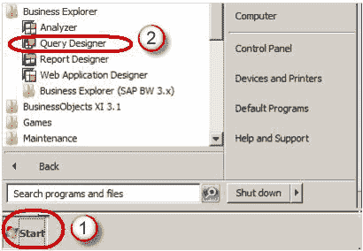

**步骤 2）**

1.  选择所需的 BW 系统
2.  单击确定按钮

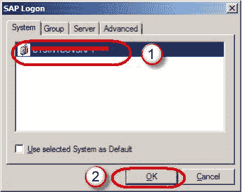

1.  输入客户
2.  用户名
3.  密码
4.  登录语言
5.  单击确定按钮

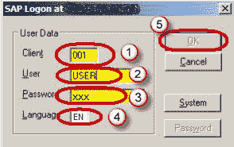

## 查询面板：

1.  可在此处获取 InfoProvider 的详细信息。
2.  用于查看各种报告组件的选项卡。
3.  “属性”框显示查询中所选的每个组件的属性。
4.  在此处显示系统消息，例如查询检查期间的任何错误或警告消息。
5.  显示在查询中选择的任何组件的“使用位置”列表。

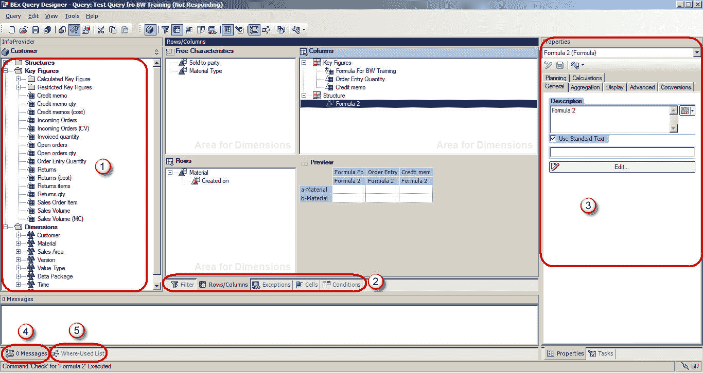

## 查询面板–标准工具栏：

查询设计器中的“标准”工具栏具有以下按钮。

1.  创建新查询
2.  打开查询
3.  保存查询
4.  保存全部
5.  在网络上发布
6.  查询查询
7.  查询属性
8.  切
9.  复制
10.  糊
11.  切换过滤器和行/列的选项卡
12.  细胞
13.  条件
14.  例外情况
15.  物产
16.  任务
17.  留言内容
18.  在哪里使用
19.  文件资料
20.  技术名称

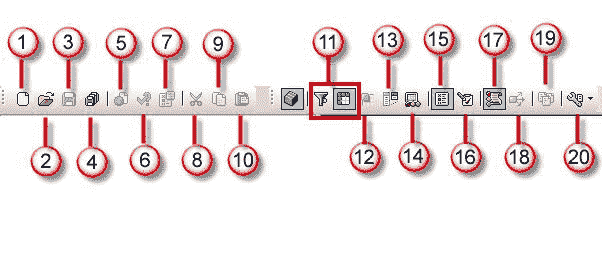

## 查询元素：

1.  **关键指标**：关键指标代表数字数据或 KPI（关键绩效指标）。 它们进一步分为计算关键指标（CKF）和受限关键指标（RKF）。
2.  **特性**：特性提供根据分类对象的标准。 例如 物料，期间，位置等
3.  导航属性在查询设计器中显示为特征。

## 其他查询元素：

1.  **尺寸**：相似的特征在一个尺寸中分组在一起。 例如 时间维度包括年，月，周等。
2.  **属性**：属性定义特征的附加属性。 例如。 材料可以具有大小，长度或宽度。 除非将相关特征也添加到查询中，否则无法将显示属性添加到查询中。 但是，可以将特征的属性设置为“不显示”。

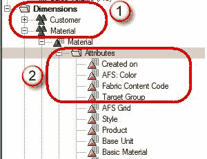

## 查询属性：

1.  选择选项卡“变量序列”。 选项卡“变量序列”用于控制向用户显示选择屏幕变量的顺序。
2.  列出查询中使用的变量。 这里可以有多个变量。 这些变量可以根据我们的需要进行排序。

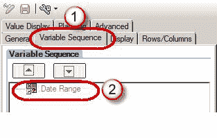

3.  选择“显示”标签。
4.  复选框“隐藏重复的键值”控制特征是否在每一行中重复。
5.  选项“显示关键指标的比例因子”控制是否在相应列的顶部报告比例因子。

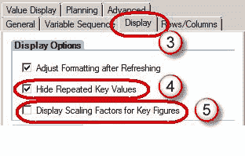

6.  选择“ **高级**”标签。 从 BO 角度来看，“高级”选项卡是最重要的。 它控制查询对 BO 是否可见。 必须选中该选项以允许查询访问 BO。
7.  如果要从 BO 使用此查询，则应选中“允许外部访问此查询”复选框

。 [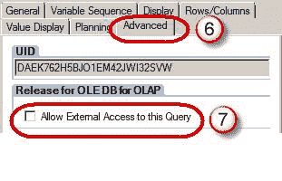 ](/images/sap/SAP_BI/sap_bi_21_11.jpg) 

8.  选择“行/列”选项卡。
9.  “结果位置”部分下的选项决定小计的位置（在 BW 世界中也称为结果），位于特征的下方/上方或右侧/左侧。
10.  “抑制零”部分下的选项决定对查询应用零抑制。

## 筛选条件：

过滤器用于限制查询检索的数据。 过滤器本质上可以是动态的或静态的。 输入为静态过滤器的值不能在运行时被用户覆盖，而动态过滤器或变量可以在查询执行期间由用户/系统覆盖。

在查询中应用过滤器的步骤

1.  选择“过滤器”标签。
2.  可以在“特征限制”部分中应用过滤器。
3.  可以在“默认值”部分中应用过滤器。

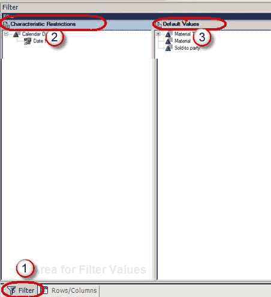

特征限制在数据获取操作之前应用，而默认值将导致查询提取整个数据。 该限制仅适用于报表前端。 如果在 WAD /分析仪中应用了“清除所有过滤器”选项，则默认值中的过滤器将从前端删除，但通过特征限制应用的过滤器仍然有效。 在对 BO Universe 使用 BW 查询时，建议至少具有一个或两个特征限制。

## **变量**：

变量是我们在查询设计器中定义的查询参数，仅在执行查询时才用值填充。 变量是可重用的对象。 在查询设计器中定义的变量在所有 InfoProvider 中都可用。 它们不依赖于 InfoProvider，而是依赖于为其创建的 InfoObject。

变量类型

*   特征值
*   层次结构
*   层次结构节点
*   课文
*   公式元素

创建变量的步骤：

**Step 1)**

1.  要创建变量，请浏览至相应特征下的“特征值变量”文件夹。
2.  右键单击该文件夹，然后选择“新变量”选项。

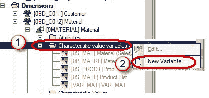

**Step 2)**

1.  在随后的窗口中，输入描述。
2.  输入技术名称。
3.  可变处理类型
4.  在参考特征下，可以基于相同的参考特征将变量分配给特定的 InfoObject 或所有 Info-Object。

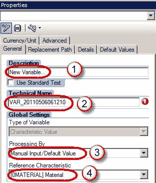

1.  在“详细信息”标签下，我们可以指定变量是否接受：
2.  单值/多值/范围
3.  选择选项（在运行时允许上述任何一项，BW-BO 不支持）

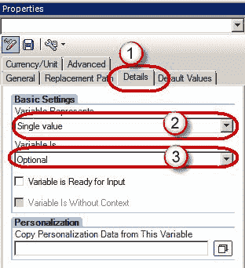

**步骤 3）**

1.  点击“默认值”标签。
2.  我们可以指定应用于报表的默认过滤器。 用户可以在运行时覆盖此值。

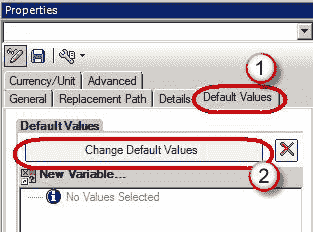

## **条件&例外**：

条件充当关键指标的筛选器。 例如 前 10 名客户，利润率最低 10％的产品等

异常类似于 MS excel 中的“条件突出显示”。 它们用于突出显示 KPI 值高于或低于特定阈值的行/列/单元格。 由于这些没有导入到 BO Universe，因此在本教程中我们将不对其进行详细讨论。