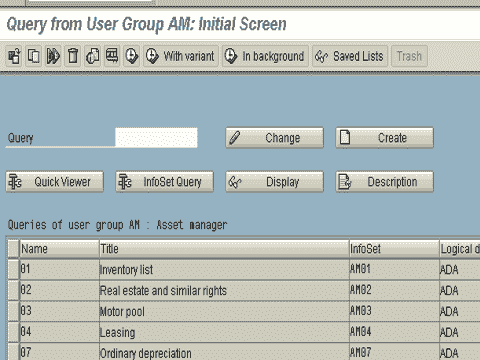
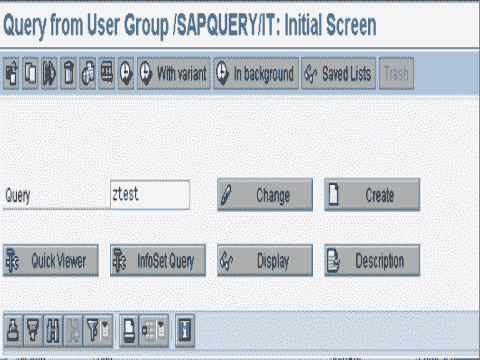
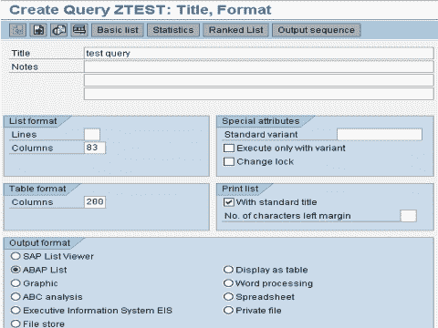
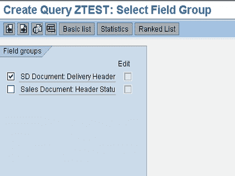
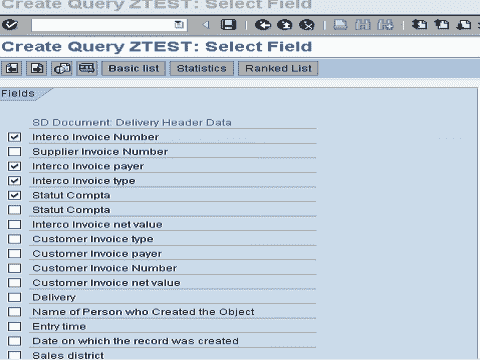
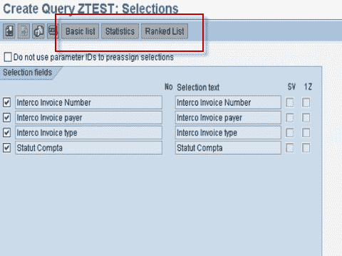
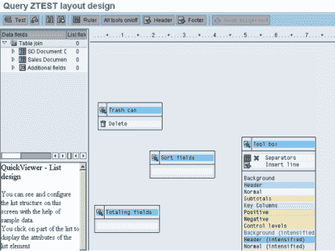
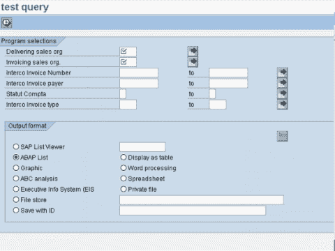

# SAP 中的 ABAP 查询教程：SQ01，SQ02，SQ03

> 原文： [https://www.guru99.com/all-about-abap-query.html](https://www.guru99.com/all-about-abap-query.html)

ABAP 查询应用程序用于**创建 SAP 系统中尚不存在的报告**。 它是为几乎不了解 ABAP 编程的用户而设计的。 ABAP Query 为用户提供了广泛的方法来定义报告和创建不同类型的报告，例如基本列表，统计信息和排名列表。
ABAP 查询包含四个组件：

1.  **查询**
2.  **信息集**
3.  **个用户组**
4.  **查询**的翻译

让我们详细研究一下：

## 查询

The Queriescomponent is used by end users to maintain queries. One can create queries,change queries and execute queries. Transaction **SQ01**

## 信息集

信息集是数据源的特殊视图。 信息集描述了可以在查询中报告数据源的哪些字段。 可以将一个 InfoSet 分配给多个角色或用户组。

**优势**-

*   通过创建信息集并将其分配给角色或用户组，系统管理员可以确定各个应用程序部门或最终用户能够使用 SAP 查询生成的报告范围。
*   最终用户只能使用与他们特定区域相关的那些 InfoSet，这些 InfoSet 由分配给他们的角色或用户组指定。

## 用户组

用户组组件用于维护用户组（从安全角度考虑）。

将在同一应用程序中工作的用户分配给同一用户组。实际上，谁在用户组中定义了查询都没有关系。 分配给用户组的每个用户都可以执行查询。

用户组中的用户必须具有**必要的授权**，然后才能更改或重新定义查询。 系统中的每个用户都可以分配给多个用户组。

## 翻译/查询组件

定义查询，信息集和用户组时会生成许多文本。 这些文本将以我们登录 SAP 系统时选择的语言显示。我们可以使用此组件比较文本/语言。

## 查询中的数据处理

可以通过 3 种方式处理和显示数据：

1.  **基本列表**-按功能区定义的顺序显示数据（支持排序和求和）。
2.  **STATISTIC** -显示根据基本数据计算出的统计数字。
3.  **排名列表**-排名列表是统计的一种特殊形式。 E.x. 旅行社的十大客户。

一个查询可以具有一个基本列表，最多 9 个统计信息和最多 9 个排名列表。

## 创建查询

**步骤 1。**转到 SQ01。 为查询命名，然后单击“创建”按钮。

 

**步骤 2。**在下一个屏幕中给出查询的描述。 指定输出长度，然后从“其他处理选项”框中选择处理选项。 数据可以以各种格式显示，例如表格，下载到文件以及在 Word 中显示。

 

**步骤 3\.** 。在下一个屏幕上，选择要使用的字段组。

 

**步骤 4。**单击下一个屏幕，选择要显示的字段

 

**步骤 5。**在下一个屏幕上，选择选择字段，然后选择一种输出类型（基本，统计，排名）。
在每个列表中，您可以选择各种选项（例如，字段的排序顺序，更改输出长度，列颜色，总计，页面标题，页面页脚等）。

 

 

**步骤 6。**提供上述所有选项后，您可以保存查询并执行它。

> **注意**：
> 
> 创建/维护信息集的事务- **SQ02**
> 创建/维护用户组的事务- **SQ03**