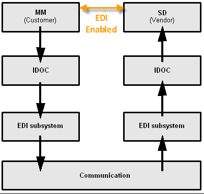

# ALE，EDI & IDocs 简介&差异：SAP 教程

> 原文： [https://www.guru99.com/what-is-edi-ale-and-idoc.html](https://www.guru99.com/what-is-edi-ale-and-idoc.html)

EDI, stands for Electronic Data Interchange, is the electronic exchange of structured business data between different applications.**EDI Architecture**

EDI Architecture consists of -

1.  **支持 EDI 的应用程序**：它们支持自动处理业务交易。
2.  **IDoc 接口：**设计为开放接口。 IDoc 接口由 IDoc 类型和功能模块组成，这些类型和功能模块构成了到应用程序的接口。
3.  **EDI 子系统**：这将 IDoc 类型转换为 EDI 消息类型，反之亦然。 EDI 体系结构的此组件不是 SAP 提供的。

**Advantages of EDI process**

*   减少数据输入错误
*   减少处理周期时间
*   数据电子表格的可用性
*   减少文书工作
*   降低成本
*   减少库存并更好地计划
*   交流的标准方式
*   更好的业务流程
*   竞争优势

## 什么是 ALE？

ALE supports the distribution of the business functions and process across loosely coupled SAP R/3 systems (different versions of SAP R/3). Connections from R/2 and non SAP systems is also supported.ALE supports-

*   在不同版本的 R / 3 系统之间分配应用程序
*   版本升级后，无需特殊维护即可继续进行数据交换
*   客户特定的扩展。
*   允许连接到非 SAP 系统的通信接口。
*   R / 3 和 R / 2 系统的耦合。

## ALE 和 EDI 之间的区别？

ALE is used to support distributed yet integrated processes across several SAP systems whereas EDI is used for the exchange of business documents between the systems of business partners (could be non-SAP systems)**ALE is SAP's technology for supporting a distributed environment whereas EDI is a process used for exchange of business documents which now have been given a standard format**Both ALE and EDI require data exchange. **An Idoc is a data container which is used for data exchange by both EDI and ALE processes.**

## 什么是 IDOC？

IDOC is **simply a data container** used to exchange information between any two processes that can understand the syntax and semantics of the data.In simple words , an idoc is like a data file with a specified format which is exchanged between 2 systems which know how to interpret that data.IDOC stands for " **Intermediate Document"**When we execute an **outbound** ALE or EDI Process, an IDOC is created.In an **inbound** ALE or EDI process, an IDOC serves as input to create an application document.In the SAP System, IDOCs are stored in database.Every IDOC has an **unique number**(within a client).IDOCs are based on EDI standards, ANSI ASC X12 and **EDIFACT**. In case of any conflict in data size, it adopts one with greater length. IDOCs are **independent of the direction of data exchange** e.g. ORDERS01 : Purchasing module : Inbound and Outbound.IDOCs can be viewed in a **text editor**. Data is stored in character format instead of binary format.IDOCs are **independent of the sending and receiving systems**.(SAP-to-SAP as well as Non-SAP)