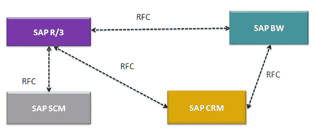
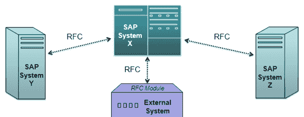
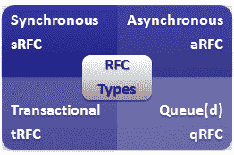
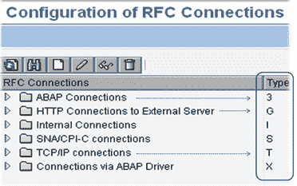
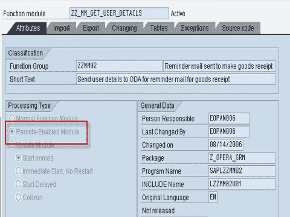
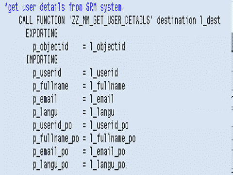
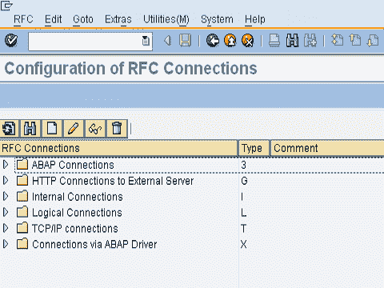

# SAP 教程中的远程功能调用（RFC）

> 原文： [https://www.guru99.com/rfc-remote-function-call.html](https://www.guru99.com/rfc-remote-function-call.html)

## 什么是 RFC？

RFC 是一种机制，允许业务应用程序与其他系统进行通信和交换信息（以预定义的格式）。 RFC 代表**'远程功能调用'**

RFC 由两个接口组成：

1.  ABAP 程序的调用接口
2.  非 SAP 程序的调用接口。

任何 ABAP 程序都可以使用 **CALL FUNCTION ... DESTINATION** 语句来调用远程功能。 **DESTINATION** 参数告诉 SAP 系统，被调用函数在调用方以外的系统中运行。
**语法-**

```
CALL FUNCTION 'remotefunction'

DESTINATION dest

EXPORTING f1 =

IMPORTING f2 =

TABLES t1 =

EXCEPTIONS
```

逻辑目标是通过事务 **SM59** 定义的，并存储在表 **RFCDES**

***中 RFC 接口的功能***

*   将所有参数数据转换为远程系统所需的表示形式
*   调用与远程系统对话所需的通信例程。
*   处理通讯错误，并在需要时通知呼叫者（使用 CALL FUNCTION 的 EXCEPTIONS 参数）。

 

RFC 是一种 SAP 协议，用于处理系统之间的通信以简化相关的编程。 这是一个调用功能模块的过程，该模块位于与调用程序不同的计算机上。 RFC 也可以用于在同一台机器上调用不同的程序，但是通常，当“ *调用*”和“ *称为*”功能模块/程序分别运行时使用 RFC。 机器。

 

在 SAP 中，RFC 接口系统用于在不同 SAP 系统之间以及 SAP 与外部（非 SAP）系统之间建立 RFC 连接。

## 必须了解有关 RFC 的详细信息

*   SAP 使用 CPIC（通信通用编程接口）协议在系统之间传输数据。 这是 SAP 特定协议。 远程功能调用（RFC）是基于 CPI-C 的通信接口，但具有更多功能，更易于应用程序程序员使用
*   RFC 库函数支持 C 编程语言和 Visual Basic（在 Windows 平台上）
*   RFC 连接始终可以在整个系统中使用。这意味着您可以在客户端 100 中使用在客户端 000 中定义的 RFC 连接（没有任何区别）。
*   RFC 是用于通过网络调用特殊子例程（*功能模块*）的协议。 功能模块可与 C 函数或 PASCAL 过程相媲美。 它们具有定义的接口，通过该接口可以交换数据，表和返回码。 功能模块在 R / 3 系统中通过自己的功能库（称为功能生成器）进行管理。
*   Function Builder（事务 SE37）为应用程序程序员提供了一个有用的环境，用于编程，文档编制和测试功能模块，这些功能模块可以在本地或远程调用。 R / 3 系统会自动生成远程调用所需的附加代码（RFC 存根）。
*   您可以使用事务 SM59 维护 RFC 连接的参数。 R / 3 系统还随 RFC-SDK（软件开发工具包）一起提供，该工具使用广泛的 C 库来允许将外部程序连接到 R / 3 系统。
*   功能模块对另一台服务器的远程调用与本地调用之间的唯一区别是特殊参数（目标），该参数指定要在其上执行程序的目标服务器。

## RFC 的优点：

RFC 通过使程序员避免在远程系统上重新开发模块和方法来帮助减少程序员的工作量。 它有能力：

*   将数据转换为远程（目标）系统可以理解的格式。
*   将数据转换为远程（目标）系统可以理解的格式。
*   调用某些例程，这些例程是开始与远程系统进行通信所必需的。
*   处理在通讯过程中可能发生的错误。

## RFC 的类型：

 

## 同步

要求在通信或数据传输时两个系统（客户端和服务器）都可用。 它是最常见的类型，在执行 sRFC 之后立即需要结果时才需要。

sRFC 是需要确认的系统之间的一种通信方式。 源系统的资源在目标系统上等待，并确保它们使用 ACKD 传递消息/数据。 数据是一致和可靠的通信。

问题是，如果目标系统不可用，则源系统资源将等到目标系统可用为止。 这可能导致源系统的进程在目标系统上进入睡眠/ RFC / CPIC 模式，从而阻塞了这些资源。

**用于**

*   用于系统之间的通信
*   用于 SAP Web Application Server 与 SAP GUI 之间的通信

## 异步

It is communication between systems where acknowledgments are not required (it is similar to postcard delivery).It doesn't require both the systems to be available at the time of execution and the result is not immediately required to be sent back to the calling system.

源系统资源不等待目标系统，因为它们在不等待任何确认的情况下传递消息/数据。 通信不可靠，因为如果目标系统不可用，数据可能会丢失。 **用于-**

*   用于系统之间的通信
*   用于并行处理

## 交易性

 It is a special form of aRFC. Transactional RFC ensures transaction-like handling of processing steps that were originally autonomous.

事务性 RFC 是一种异步通信方法，即使由于某些网络问题多次发送数据，该方法也只能在 RFC 服务器中执行一次被调用的功能模块。 当 RFC 客户端程序执行 tRFC 时，远程系统不需要可用。 tRFC 组件在唯一事务 ID（TID）下将被调用的 RFC 函数以及相应的数据存储在 SAP 数据库中。 tRFC 与 aRFC 相似，因为它不在目标系统上等待（类似于已注册的帖子）。 如果系统不可用，它将使用事务 ID（SM58）将数据写入 RFC 表中，该 ID 由调度程序 RSARFCSE（每 60 秒运行一次）选择。 **用于-**

*   异步 RFC 的扩展
*   用于系统之间的安全通信

## 排队

Queued RFC is an extension of tRFC. It also ensures that individual steps are processed in sequence.

确保按应用程序指定的顺序处理多个 LUW（逻辑工作单元/事务）。 可以使用队列（入站和出站队列）对 tRFC 进行序列化。 因此，该名称排队 RFC（qRFC）。 用于-

*   *事务 RFC* 的扩展
*   *用于定义的处理序列*
*   如果要保证以预定义的顺序处理多个事务，建议实施 qRFC。

## RFC 连接的类型

 

**类型 3** -条目指定 ABAP 系统之间的连接。 在这里，我们必须指定主机名/ IP 地址。 但是，可以根据需要指定登录信息。 这既适用于 ABAP 系统之间的 RFC 类型，也适用于对 ABAP 系统的外部调用
**类型 I-**条目指定连接到与当前系统相同数据库的 ABAP 系统。 这些条目是预定义的，无法修改。 条目名称示例：ws0015_K18_24

*   ws0015 =主机名
*   K18 =系统名称（数据库名称）
*   24 = TCP 服务名称

**类型 T** -目标是到使用 RFC API 接收 RFC 的外部程序的连接。 激活类型可以是 *Start* 或 *Registration* 。 如果是*启动*，则必须指定要启动的程序的主机名和路径名。

## 如何编码 RFC？

**1\.** 在功能模块属性选项卡（事务代码 SE37）中，将处理类型设置为启用远程的模块以创建远程功能模块。

 

**2\.** 编写功能模块的代码。

 

**3\.** 在调用远程功能的 RFC 客户端系统中定义 RFC 服务器的目的地（通过 SM59 事务）。

 

**4.声明参数**：必须将远程功能模块的所有参数字段定义为参考字段，即 ABAP 词典字段。
**5.例外**：系统在内部引发 COMMUNICATION_FAILURE 和 SYSTEM_FAILURE。 您可以像在本地调用的函数中一样在远程函数中引发异常。

## 调试远程功能调用

*   **无法调试对另一个系统的远程功能调用**。
*   但是，在测试 ABAP 到 ABAP 的 RFC 调用时，可以使用 ABAP 调试器来监视远程系统中 RFC 功能的执行。
*   通过远程调用，ABAP 调试器（包括调试接口）在本地系统上运行。 远程功能的数据值和其他运行信息从远程系统传入。