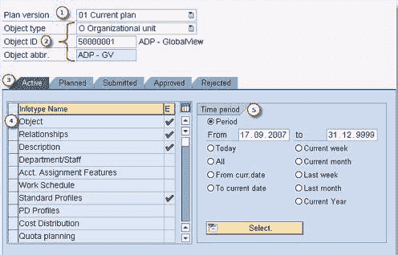
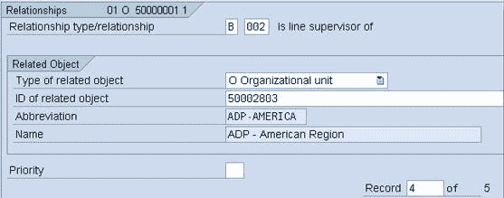

# SAP PP01：如何维护 OM 信息类型

> 原文： [https://www.guru99.com/sap-hr-organizational-management-tutorial-part-3.html](https://www.guru99.com/sap-hr-organizational-management-tutorial-part-3.html)

创建了不同的 OM 对象后，您将需要维护与其相关的信息类型。

让我们研究一下 SAP-HR OM 信息类型维护-

有两种维护 SAP 的方法-组织管理信息类型
1.使用[组织和人员事务](/intoduction-to-organization-and-staffing-transaction.html)

2.使用**专家模式**。

在本教程中，我们将研究专家模式

**专家模式**是维护细节的理想界面。 使用对象管理器选择单个对象。 现在可以维护该特定对象的信息类型。

事务代码 **PP01** 可用于维护所有对象类型。 由于授权限制，您可能无权访问 PP01。 相反，您将必须使用以下事务之一，这些事务将访问权限限制为一种特定的对象类型：

*   **PO10** 组织单位
*   **PO03** 职位
*   **PO13** 位置
*   **PO01** 工作中心

PP01 屏幕如下所示。 PO10，PO03，PO13 & PO01 的屏幕非常相似

1.  **计划版本：**重要的是确保始终使用正确的计划版本（为此，您还可以在用户参数中默认计划版本
2.  **对象信息**：显示对象类型，ID 和缩写，以便用户可以确保正在编辑正确的对象。
3.  **状态**：使用选项卡页选择要维护的信息类型的状态（选择状态为 1 的活动的）。
4.  **信息类型**：选择要维护的信息类型。
5.  **有效期**：开始日期和结束日期指定对象存在于所选计划版本中的时间段。

### 重要的 OM 信息类型

1\. **IT1000-描述**：给出对象的缩写和名称

2\. **IT1001-关系**：

*   您可以在对象类型之间创建许多不同的关系类型
*   每个单独的关系代表“关系”信息类型（IT1001）的子类型。
*   并非所有关系都适用于每个对象。
*   关系记录可以使用专家模式界面手动创建，但在使用其他界面（例如组织和人员配备，简单维护）时也会自动创建。
*   创建关系时，逆关系通常由系统自动创建。