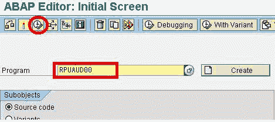
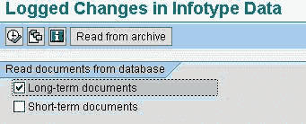
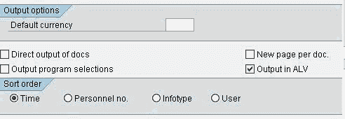
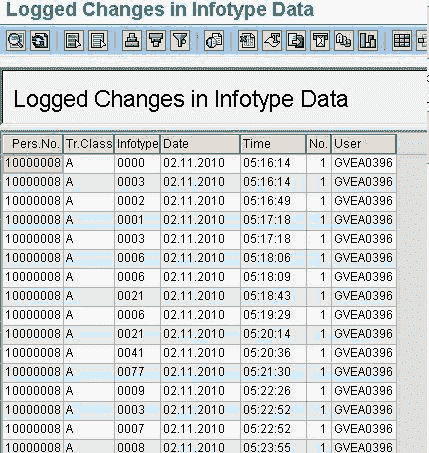

# 如何在 SAP 中审核工资单：RPUAUD00

> 原文： [https://www.guru99.com/how-to-audit-payroll.html](https://www.guru99.com/how-to-audit-payroll.html)

您可以通过 SAP 程序- **RPUAUD00** 确定主数据中的更改

**步骤 1）**在 SAP 事务中 **SE38**

2.  **步骤 2）**输入程序名称-RPUAUD00
3.  **步骤 3）**单击执行

**步骤 4）**在下一个屏幕中，选择要显示的文档类型-

*   ***长期文件（推荐）***

长期文件用于修订目的。 对信息类型所做的更改存储在数据库中或可以存档。 长文本将被存储，直到被删除。 归档对象称为 **PA_LDOC** 。

*   ***短期文件***

短期文档存储在数据库中。 评估短期文档与评估长期文档的方式不同-评估短期文档根据日期和时间。

**步骤 5）**接下来，选择事务处理类别作为主数据

HR 事务分为不同的事务类，例如

**A** -HR 主数据（管理）-表 PAxxxx 中存储的数据（其中 xxxx = SAP 信息类型编号）

**B** -申请人数据-表 PBxxx 中存储的数据（其中 xxxx = SAP 信息类型编号）

**步骤 6）**输入选择标准-

提示：-在“更改者”字段中输入 SAP 用户 ID，以确定特定用户对员工所做的更改

**步骤 7）**选择输出选项，然后单击执行

**步骤 8）**下一个屏幕显示对员工进行的更改。

该过程对于**薪资回归**非常有用。 如果存在任何比较不正确的问题，并且您不确定该差异是真实的还是由于您对主数据进行了某些更改，则可以执行此报告并审核主数据更改。