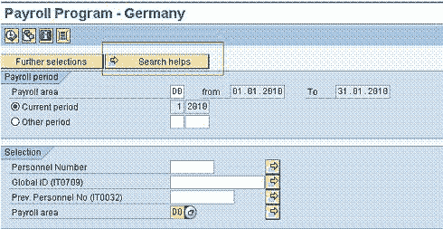
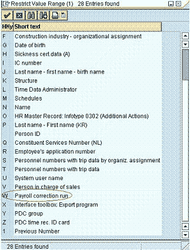
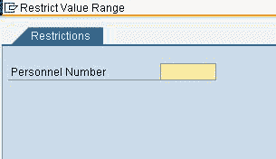

# SAP HR 中的 Matchcode W 是什么？

> 原文： [https://www.guru99.com/what-is-matchcode-w.html](https://www.guru99.com/what-is-matchcode-w.html)

***有关 SAP-HR 中 Matchcode W 概念的简要说明**：*

假设您已经针对所有月份在特定月份运行了[工资单](/sap-payroll.html) 给定薪资范围的员工（例如总共 1000 名员工）。 运行付款后，假设有 10 位员工的主数据（基本信息类型，如 14、15、8 ...）进行了一些更改。

现在必须重新运行这 10 名雇员的工资，但是使用常规工资机制，SAP 将处理工资区域中 1000 名雇员的数据，这非常耗时。

需要出路吗？ 答案在于 Matchcode W！ 当您选择 Matchcode W 并运行工资核算时，系统将仅处理 10 位 EE 的数据已更改的人，而其他人将第二次不处理数据，因为数据没有更改，它将根据更改的日期来选择员工 SAP 信息类型 03 中最早的 MD 更改

***运行匹配代码 W 的步骤--***

**步骤 1）**使用 PC00_MXX_CALC 转到任何国家/地区的薪资驱动程序-其中 XX 是该国家/地区的 Molga。

**步骤 2）**在右上角，您将具有搜索帮助按钮，单击该按钮

**步骤 3）**选择变体-W

 

**步骤 4）**显示一个附加屏幕，该屏幕可用于进一步限制具有主数据更改的员工的选择（上例为 10）。 该屏幕是可选的，可以绕开。

 

**步骤 5）**执行工资核算。