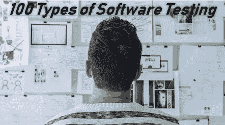

# 软件测试类型：100 种不同测试类型的示例

> 原文： [https://www.guru99.com/types-of-software-testing.html](https://www.guru99.com/types-of-software-testing.html)

### 什么是软件测试类型？

软件测试类型是将不同测试活动分类的类别，每个活动都有一个定义的测试目标，测试策略和测试可交付成果。 具有测试类型的目的是为定义的测试目标验证被测应用程序（AUT）。

例如，可访问性测试的目标是验证残疾人可以访问 AUT。 因此，如果您的软件解决方案必须友好禁用，请对照可访问性测试用例进行检查。

**100 种类型的软件测试类型**及其定义的列表。 任何质量检查专家都必须阅读。

1.  **验收测试：**进行正式测试以确定系统是否满足其验收标准，并使客户能够确定是否接受该系统。 它通常由客户执行。 阅读有关[验收测试](/user-acceptance-testing.html)的更多信息

2.  **可访问性测试：**测试类型，用于确定产品对残疾人（聋人，盲人，智障人士）的可用性。 评估过程由残疾人进行。 阅读有关[可访问性测试](/accessibility-testing.html)的更多信息

3.  **主动测试：**测试类型，包括引入测试数据和分析执行结果。 它通常由测试团队执行。

4.  **敏捷测试：**遵循敏捷宣言原则的软件测试实践，从将使用该系统的客户的角度强调测试。 通常由质量检查小组执行。 阅读有关[敏捷测试](/agile-scrum-extreme-testing.html)的更多信息

5.  **年龄测试：**测试类型，用于评估系统将来的性能。 评估过程由测试团队进行。

6.  **临时测试：**在没有计划和文档的情况下进行的测试-测试人员尝试通过随机尝试系统功能来“破坏”系统。 它由测试团队执行。 阅读有关[临时测试](/adhoc-testing.html)的更多信息

7.  **Alpha 测试：**在开发人员站点进行的软件产品或系统的测试类型。 通常，它是由最终用户执行的。 进一步了解 [Alpha 测试](/alpha-testing.html)

8.  **断言测试：**测试的类型，其中包括验证条件是否符合产品要求。 它由测试团队执行。

9.  **API 测试：**与单元测试类似的测试技术，它以代码级别为目标。 Api 测试与单元测试的不同之处在于，它通常是质量检查任务，而不是开发人员任务。 进一步了解 [API 测试](/api-testing.html)

10.  **所有对测试：**组合测试方法，用于测试输入参数的所有可能离散组合。 它由测试团队执行。

11.  **自动化测试：**测试技术，它使用自动化测试工具来控制环境设置，测试执行和结果报告。 它由计算机执行，并在测试团队内部使用。 阅读有关[自动化测试](/automation-testing.html)的更多信息

12.  **基础路径测试：**一种测试机制，可得出程序设计的逻辑复杂性度量，并将其用作定义基本执行路径集的指南。 测试团队在定义测试用例时使用它。 阅读有关[基础路径测试](/basis-path-testing.html)的更多信息

13.  **向后兼容性测试：**测试方法，用于验证较旧版本的测试环境所开发软件的行为。 它由测试团队执行。

14.  **Beta 测试：**发布用于商业目的的应用程序之前的最终测试。 它通常由最终用户或其他人完成。

15.  **基准测试：**测试技术，该技术使用代表性的程序和数据集来评估给定配置中计算机硬件和软件的性能。 它由测试团队执行。 阅读有关[基准测试](/benchmark-testing.html)的更多信息

16.  **Big Bang 集成测试：**仅在一切准备就绪时集成单个程序模块的测试技术。 它由测试团队执行。

17.  **二进制可移植性测试：**一种测试可执行应用程序在系统平台和环境中的可移植性的技术，通常是为了符合 ABI 规范。 它由测试团队执行。

18.  **边界值测试：**软件测试技术，其中的测试被设计为包括边界值的代表。 由质量检查测试小组执行。 阅读有关[边界值测试](/equivalence-partitioning-boundary-value-analysis.html)的更多信息

19.  **自下而上的集成测试：**在自下而上的集成测试中，首先开发了最低级别的模块，然后一次集成并测试了通往“主”程序的其他模块。 它通常由测试团队执行。

20.  **分支测试：**一种测试技术，其中至少对程序源代码中的所有分支进行一次测试。 这是由开发人员完成的。

21.  **广度测试：**一个测试套件，可行使产品的全部功能，但不详细测试功能。 它由测试团队执行。

22.  **黑盒测试：**一种软件测试方法，可在不具有特定应用程序代码/内部结构知识的情况下验证应用程序的功能。 测试基于需求和功能。 由质量检查小组执行。 进一步了解[黑盒测试](/black-box-testing.html)

23.  **代码驱动的测试：**使用测试框架（例如 xUnit）的测试技术，该测试框架允许执行单元测试来确定代码的各个部分在各种情况下是否按预期运行。 它由开发团队执行。

24.  **兼容性测试：**测试技术，用于验证软件在特定硬件/软件/操作系统/网络环境中的性能。 它由测试团队执行。 阅读有关[兼容性测试](/compatibility-testing.html)的更多信息

25.  **比较测试：**测试技术，用于比较产品与以前版本或其他类似产品的优缺点。 可以由测试人员，开发人员，产品经理或产品所有者执行。 阅读有关[组件测试](/component-testing.html)的更多信息

26.  **组件测试：**与单元测试类似的测试技术，但具有更高的集成度-测试是在应用程序的上下文中完成的，而不仅仅是直接测试特定的方法。 可以由测试或开发团队执行。

27.  **配置测试：**测试技术，它确定硬件和软件的最小和最佳配置，以及确定添加或修改内存，磁盘驱动器和 CPU 等资源的效果。 通常由性能测试工程师执行。 阅读有关[配置测试](/configuration-testing.html)的更多信息

28.  **条件覆盖率测试：**一种软件测试，其中通过以每种方式至少使一次为真和为假来执行每个条件来执行。 它通常由自动化测试团队制作。

29.  **一致性测试：**测试类型，用于检查系统是否根据标准，过程和准则进行开发。 通常由提供“符合 OGC 认证”品牌的外部公司执行。

30.  **并发测试：**多用户测试旨在确定访问相同应用程序代码，模块或数据库记录的影响。 它通常由性能工程师来完成。 阅读有关[并发测试](/concurrency-testing.html)的更多信息

31.  **一致性测试：**测试实现是否符合其所基于的规范的过程。 它通常由测试团队执行。 阅读有关[一致性测试](/conformance-testing.html)的更多信息

32.  **上下文驱动测试：**一种敏捷测试技术，根据发现的潜在信息以及该信息在特定时刻对组织的价值，提倡对测试机会进行连续和创造性的评估。 它通常由敏捷测试团队执行。

33.  **转换测试：**测试用于转换现有系统中的数据以供替换系统使用的程序或过程。 通常由质量检查小组执行。

34.  **决策覆盖测试：**软件测试的类型，其中通过将条件/决策设置为 true / false 来执行每个条件/决策。 它通常由自动化测试团队制作。

35.  **破坏性测试：**测试类型，其中对样品的破坏进行测试，以便了解样品在不同载荷下的结构性能或材料性能。 通常由质量检查小组执行。 阅读有关[破坏性测试](/destructive-testing.html)的更多信息

36.  **依赖性测试：**测试类型，用于检查应用程序对预先存在的软件的要求，初始状态和配置，以维护适当的功能。 它通常由测试团队执行。

37.  **动态测试：**在软件工程中用来描述代码动态行为测试的术语。 它通常由测试团队执行。 阅读有关[动态测试](/dynamic-testing.html)的更多信息

38.  **域测试：**白盒测试技术，其中包含检查程序是否仅接受有效输入。 通常由软件开发团队完成，有时由自动化测试团队完成。

39.  **错误处理测试：**软件测试类型，它确定系统正确处理错误事务的能力。 它通常由测试团队执行。

42.  **端到端测试：**与系统测试类似，涉及在模拟实际使用的情况下（例如与数据库交互，使用网络通信或与其他对象交互）对完整的应用程序环境进行测试。 硬件，应用程序或系统（如果适用）。 由质量检查小组执行。 阅读有关[端到端测试](/end-to-end-testing.html)的更多信息

43.  **耐久性测试：**一种测试类型，用于检查内存泄漏或长时间执行可能引起的其他问题。 它通常由性能工程师执行。 阅读有关[耐力测试](/endurance-testing.html)的更多信息

44.  **探索性测试：**黑匣子测试技术，无需计划和文档编制。 通常由手动测试人员执行。 阅读有关[探索性测试](/exploratory-testing.html)的更多信息

45.  **等效分区测试：**软件测试技术，用于将软件单元的输入数据划分为数据分区，从中可以得出测试用例。 通常由质量检查小组执行。 阅读有关[等价分区测试](/equivalence-partitioning-boundary-value-analysis.html)的更多信息

46.  **故障注入测试：**全面测试策略的元素，使测试人员能够专注于被测应用程序能够处理异常的方式。 由质量检查小组执行。

47.  **形式验证测试：**使用形式化的数学方法来证明或反证某个系统的预期算法相对于某种形式规范或特性的正确性。 通常由质量检查小组执行。

48.  **功能测试：**黑盒测试的类型，其测试用例基于被测软件组件的规格。 它由测试团队执行。 阅读有关[功能测试](/functional-testing.html)的更多信息

49.  **模糊测试：**软件测试技术，可向程序的输入提供无效，意外或随机的数据-突变测试的一个特殊区域。 模糊测试由测试团队执行。 阅读有关[模糊测试](/fuzz-testing.html)的更多信息

50.  **大猩猩测试：**软件测试技术，专注于对一个特定模块进行大量测试。 它通常由质量保证团队执行，通常在运行完整测试时执行。

51.  **灰盒测试：**黑盒和白盒测试方法的组合：根据其规格测试软件，但要使用一些内部工作知识。 它可以由开发或测试团队执行。

52.  **玻璃箱测试：**与白箱测试类似，基于对应用程序代码的内部逻辑的了解。 它由开发团队执行。

53.  **GUI 软件测试：**测试使用图形用户界面的产品以确保其符合其书面规格的过程。 这通常是由测试团队完成的。 阅读有关 [GUI 软件测试](/gui-testing.html)的更多信息

54.  **全球化测试：**使用任何可能的国际输入类型，使用任何区域性/区域设置检查产品正常功能的测试方法。 它由测试团队执行。 阅读有关[全球化测试](/globalization-vs-localization-testing.html)的更多信息

55.  **混合集成测试：**测试技术，该技术结合了自上而下和自下而上的集成技术，以便利用此类测试的好处。 它通常由测试团队执行。

56.  **集成测试：**在软件测试中，将各个软件模块组合在一起并作为一组进行测试。 它通常由测试团队进行。 阅读有关[集成测试](/integration-testing.html)的更多信息

57.  **接口测试：**进行该测试以评估系统或组件是否相互正确传递数据和控制。 它通常由测试和开发团队执行。 阅读有关[接口测试](/interface-testing.html)的更多信息

58.  **安装/卸载测试：**质量保证工作着重于客户成功安装和设置新软件所需执行的操作。 它可能涉及完整，部分或升级的安装/卸载过程，通常由软件测试工程师与配置管理器一起完成。

59.  **国际化测试：**该流程可确保在使用不同语言和区域设置时，不会破坏产品的功能并且正确地将所有消息外部化。 它通常由测试团队执行。

60.  **系统间测试：**测试技术，专注于测试应用程序以确保应用程序之间的互连正确运行。 通常由测试团队完成。

61.  **关键字驱动的测试：**也称为表驱动的测试或操作词测试，是一种用于自动测试的软件测试方法，它将测试创建过程分为两个不同的阶段：计划阶段和实施阶段 。 手动或自动化测试团队都可以使用它。 进一步了解[关键字驱动的测试](/keyword-driven-testing.html)

62.  **负载测试：**对系统或设备提出需求并衡量其响应的测试技术。 它通常由性能工程师执行。 阅读有关[负载测试](/load-testing-tutorial.html)的更多信息

63.  **本地化测试：**软件测试过程的一部分，致力于使全球化的应用程序适应特定的文化/地区。 通常由测试团队完成。 阅读有关[本地化测试](/localization-testing.html)的更多信息

64.  **循环测试：**一种执行程序循环的白盒测试技术。 它由开发团队执行。 进一步了解[回路测试](/loop-testing.html)

65.  **手动脚本测试：**一种测试方法，在该方法中，测试用例在执行之前由团队设计和审查。 它由手动测试团队完成。

66.  **手动支持测试：**测试技术，涉及在准备数据并使用自动化系统中的数据时测试人员执行的所有功能。 它是由测试团队进行的。

67.  **基于模型的测试：**基于模型的设计在设计和执行必要的工件以执行软件测试中的应用。 它通常由测试团队执行。 阅读有关[基于模型的测试](/model-based-testing-tutorial.html)的更多信息

68.  **突变测试：**软件测试的方法，包括以较小的方式修改程序的源代码或字节代码，以便测试在正常测试执行过程中很少或从未访问过的代码段。 它通常由测试人员执行。 阅读有关[突变测试](/mutation-testing.html)的更多信息

69.  **模块化驱动的测试：**软件测试技术，要求创建小的独立脚本，这些脚本代表被测应用程序的模块，部分和功能。 它通常由测试团队执行。

70.  **非功能测试：**测试技术，重点在于针对软件应用程序的非功能需求进行测试。 可以由性能工程师或手动测试团队进行。 阅读有关[非功能测试](/non-functional-testing.html)的更多信息

71.  **负面测试：**也称为“失败测试”-一种测试方法，其中测试的目的是表明组件或系统不起作用。 它由手动或自动测试仪执行。 进一步了解[负面测试](/negative-testing.html)

72.  **操作测试：**用来评估系统或组件在其操作环境中的测试技术。 通常由测试团队执行。 阅读有关[操作测试](/operational-testing.html)的更多信息

73.  **正交阵列测试：**系统的统计测试方法，可应用于用户界面测试，系统测试，回归测试，配置测试和性能测试。 它由测试团队执行。 阅读有关[正交阵列测试](/orthogonal-array-testing.html)的更多信息

74.  **配对测试：**软件开发技术，其中两个团队成员使用一个键盘一起工作以测试软件应用程序。 一个进行测试，另一个进行分析或检查测试。 这可以在一个测试人员和开发人员或业务分析师之间，或者在两个测试人员之间，两个参与者轮流驱动键盘来完成。

75.  **被动测试：**一种测试技术，该技术包括监视正在运行的系统的结果而不引入任何特殊的测试数据。 它由测试团队执行。

76.  **并行测试：**测试技术，其目的是确保已安装已替换旧版本的新应用程序并正常运行。 它由测试团队进行。 阅读有关[并行测试](/parallel-testing.html)的更多信息

77.  **路径测试：**典型的白盒测试，其目标是满足程序中每个逻辑路径的覆盖标准。 它通常由开发团队执行。 阅读有关[路径测试](/basis-path-testing.html)的更多信息

78.  **渗透测试：**一种测试方法，通过模拟来自恶意源的攻击来评估计算机系统或网络的安全性。 通常，它们是由专门的渗透测试公司进行的。 阅读有关[渗透测试](/learn-penetration-testing.html)的更多信息

79.  **性能测试：**进行功能测试，以评估系统或组件是否符合指定的性能要求。 它通常由性能工程师执行。 阅读有关[性能测试](/performance-testing.html)的更多信息

80.  **资格测试：**针对先前版本的规范进行的测试，通常由开发人员为消费者进行，以证明该软件满足其指定要求。

81.  **斜坡测试：**测试的类型，包括不断提高输入信号直到系统崩溃。 它可以由测试团队或性能工程师执行。

82.  **回归测试：**一种软件测试，旨在通过重新测试程序来对程序进行更改（例如，错误修复或新功能）后发现软件错误。 它由测试团队执行。 阅读有关[回归测试](/regression-testing.html)的更多信息

83.  **恢复测试：**测试技术，用于评估系统从崩溃，硬件故障或其他灾难性问题中恢复的情况。 它由测试团队执行。 阅读有关[恢复测试](/recovery-testing.html)的更多信息

84.  **需求测试：**测试技术，用于验证需求是否正确，完整，明确且在逻辑上是一致的，并允许根据这些需求设计必要和足够的测试用例集。 由质量检查小组执行。

85.  **安全测试：**一种确定信息系统是否按预期保护数据并维护功能的过程。 它可以由测试团队或专业的安全测试公司来执行。 阅读有关[安全测试](/what-is-security-testing.html)的更多信息

86.  **健全性测试：**测试技术，用于确定新软件版本的性能是否足以接受主要测试工作。 它由测试团队执行。 阅读有关[健全性测试](/smoke-sanity-testing.html)的更多信息

87.  **场景测试：**使用基于假设故事的场景进行测试的活动，以帮助人们针对测试环境思考复杂的问题或系统。 它由测试团队执行。 阅读有关[方案测试](/test-scenario.html)的更多信息

88.  **可伸缩性测试：**非功能测试的一部分，测试软件应用程序以衡量其扩展能力-是支持的用户负载，事务数量，数据量等。 由性能工程师进行。 阅读有关[可伸缩性测试](/scalability-testing.html)的更多信息

89.  **语句测试：**白盒测试，它满足以下条件：在程序测试期间，程序中的每个语句至少执行一次。 它通常由开发团队执行。

90.  **静态测试：**一种不实际使用软件的软件测试形式，主要检查代码，算法或文档的完整性。 由编写代码的开发人员使用。 阅读有关[静态测试](/static-dynamic-testing.html)的更多信息

91.  **稳定性测试：**测试技术，用于尝试确定应用程序是否崩溃。 它通常由性能工程师执行。 阅读有关[稳定性测试](/stability-testing.html)的更多信息

92.  **冒烟测试：**测试技术，它检查软件系统的所有基本组件，以确保它们正常工作。 通常，烟雾测试是在软件构建完成后立即由测试团队进行的。 进一步了解[烟雾测试](/smoke-sanity-testing.html)

93.  **存储测试：**测试类型，用于验证被测程序是否将数据文件存储在正确的目录中，并保留足够的空间以防止由于空间不足而导致意外终止。 它通常由测试团队执行。 阅读有关[存储测试](/storage-testing.html)的更多信息

94.  **压力测试：**测试技术，用于评估系统或组件达到或超过其指定要求的限制。 它通常由性能工程师执行。 阅读有关[压力测试](/stress-testing-tutorial.html)的更多信息

95.  **结构测试：**白盒测试技术，该技术考虑了系统或组件的内部结构并确保每个程序语句执行其预期功能。 它通常由软件开发人员执行。

96.  **系统测试：**测试集成硬件和软件系统以验证系统满足其指定要求的过程。 它由测试团队在开发和目标环境中进行。 阅读有关[系统测试](/system-testing.html)的更多信息

97.  **系统集成测试：**测试过程，行使软件系统与其他系统的共存性。 它通常由测试团队执行。 阅读有关[系统集成测试](/system-integration-testing.html)的更多信息

98.  **自上而下的集成测试：**测试技术涉及从用户界面的系统层次结构的顶部开始，并使用存根从上至下进行测试，直到实现整个​​系统。 它由测试团队进行。

97.  **线程测试：**自顶向下测试技术的一种变体，其中组件的逐步集成遵循需求子集的实现。 它通常由测试团队执行。 阅读有关[线程测试](/thread-testing.html)的更多信息

98.  **升级测试：**测试技术，用于验证是否可以正确使用由较早版本创建的资产，并且不影响用户的学习。 它由测试团队执行。

99.  **单元测试：**软件验证和确认方法，程序员在其中测试是否适合使用单个源代码单元。 它通常由开发团队进行。 阅读有关[单元测试](/unit-testing-guide.html)的更多信息

100.  **用户界面测试：**执行的测试类型，以检查应用程序对用户的友好程度。 它由测试团队执行。 阅读有关[用户界面测试](/interface-testing.html)的更多信息

**奖金!!! 总是知道一些额外的**

101.  **可用性测试：**测试技术，用于验证用户可以轻松学习如何操作，准备系统或组件的输入以及解释其输出。 它通常由最终用户执行。 阅读有关[可用性测试](/usability-testing-tutorial.html)的更多信息

102.  **容量测试：**该测试可确认程序可以容纳任何随时间变大的值（例如累积的计数，日志和数据文件），不会导致程序停止运行或 以任何方式降级其运行。 它通常由性能工程师执行。 阅读有关[体积测试](/volume-testing.html)的更多信息

103.  **漏洞测试：**考虑到应用程序安全性并旨在防止可能影响应用程序完整性和稳定性的问题的测试类型。 它可以由内部测试团队执行，也可以外包给专业公司。 阅读有关[漏洞测试](/vulnerability-assessment-testing-analysis.html)的更多信息

104.  **白盒测试：**基于对应用程序代码的内部逻辑知识的测试技术，包括诸如代码语句，分支，路径，条件的覆盖率之类的测试。 它由软件开发人员执行。 阅读有关[白盒测试](/white-box-testing.html)的更多信息

105.  **工作流程测试：**脚本化的端到端测试技术，该技术复制了最终用户期望使用的特定工作流程。 它通常由测试团队进行。 阅读有关[工作流程测试](/workflow-testing.html)的更多信息

列表到此结束。 希望您喜欢阅读。