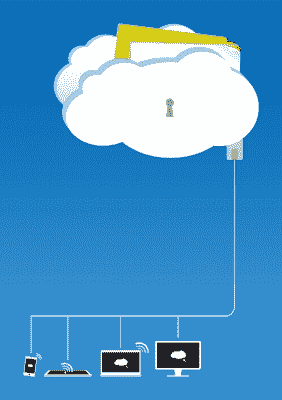

# 什么是云测试？ SaaS 测试教程

> 原文： [https://www.guru99.com/cloud-testing-tutorial-with-saas-testing-primer.html](https://www.guru99.com/cloud-testing-tutorial-with-saas-testing-primer.html)

## 什么是云测试？

**云测试**是用于检查云计算服务的软件测试类型。 云计算是基于互联网的平台，可远程提供各种计算服务，例如硬件，软件和其他与计算机相关的服务。 [云计算](/cloud-computing-for-beginners.html)有三种模型。

*   **SaaS** -软件即服务
*   **PaaS** -平台即服务
*   **IaaS** -基础架构即服务

在本教程中，我们将学习-

*   [云中的测试类型](#1)
*   [如何进行云测试](#2)
*   [云测试](#3)的测试用例示例
*   [云测试中的挑战](#4)
*   [云测试与常规测试](#5)

## 云中的测试类型

整个云测试分为四个主要类别

*   **整个云的测试**：将云视为一个整体，并根据其功能进行测试。 云和 SaaS 供应商以及最终用户对进行此类测试很感兴趣
*   **在云中进行测试**：通过检查其每个内部功能，可以进行测试。 只有云供应商可以执行此类测试
*   **跨云测试**：测试是在不同类型的私有云，公共云和混合云上进行的
*   **在云中进行 SaaS 测试**：根据应用程序要求进行功能和非功能测试

云测试侧重于核心组件，例如

1.  **应用程序：**它涵盖功能测试，端到端业务工作流程，数据安全性，浏览器兼容性等。
2.  **网络**：它包括测试各种网络带宽，协议以及通过网络成功传输数据。
3.  **基础结构**：它涵盖灾难恢复测试，备份，安全连接和存储策略。 需要验证基础架构是否符合法规要求

云中的其他测试类型包括

*   性能
*   可用性
*   合规
*   安全
*   可扩展性
*   多租户
*   实时升级测试

## 如何进行云测试

| **云测试的类型** | 

执行的任务

 |
| 

*   **SaaS 或面向云的测试：**

 | 这种测试通常由云或 SaaS 供应商执行。 主要目标是确保云或 SaaS 程序中提供的服务功能的质量。 在此环境中执行的测试是集成，功能，安全性，单元，系统功能验证和[回归测试](/regression-testing.html)以及性能和可伸缩性评估。 |
| 

*   **在云上基于在线的应用程序测试** ：

 | 在线应用程序供应商执行此测试，以检查基于云的服务的性能和[功能测试](/functional-testing.html)。 当应用程序与遗留系统连接时，将验证遗留系统与云中被测应用程序之间的连接质量。 |
| 

*   **基于云的基于云的应用程序测试** ：

 | 为了检查不同云之间基于云的应用程序的质量，执行了这种类型的测试。 |

## 用于云测试的示例测试用例

| 

测试场景

 | 

测试案例

 |
| [性能测试](/performance-testing.html) | 

*   由于一个用户在云上进行操作而导致的故障不应影响其他用户的性能。
*   手动或自动扩展不应导致任何中断。
*   在所有类型的设备上，性能
*   供应商端的超额预订不应影响应用程序的性能

 |
| 安全测试 | 

*   只有授权的客户才能访问数据
*   数据必须正确加密
*   如果客户端不使用数据，则必须将其完全删除
*   数据应使用不足的加密访问
*   供应商端的管理部门不应访问客户的数据
*   检查防火墙，VPN，防病毒等各种安全设置。

 |
| 功能测试 | 

*   有效输入应能提供预期的结果
*   服务应与其他应用程序正确集成
*   当成功登录云时，系统应显示客户帐户类型
*   当客户选择切换到其他服务时，正在运行的服务应自动关闭

 |
| 互操作性&兼容性测试 | 

*   验证测试系统下应用程序的兼容性要求
*   在云环境中检查浏览器的兼容性
*   识别在连接至时可能出现的 [缺陷](/defect-management-process.html) 云
*   不应传输云上任何不完整的数据
*   验证应用程序是否跨云平台运行
*   在内部环境中测试应用程序，然后 将其部署在云环境中

 |
| 网络测试 | 

*   负责云连接的测试协议
*   在传输数据时检查数据完整性
*   检查网络连接是否正确
*   检查数据包是否被丢弃 两侧的防火墙

 |
| 负载和压力测试 | 

*   当多个用户访问云服务时检查服务
*   识别造成硬件或环境故障的缺陷
*   检查系统在特定负载增加下是否发生故障
*   检查系统在特定负载下如何随时间变化

 |

## 云测试中的挑战

**挑战 1：数据安全和隐私**

云应用程序本质上是一个多租户，因此始终存在数据被盗的风险。 作为云测试策略，供应商应向用户保证其数据安全性。

**挑战 2：通知期短**

云提供商会在短时间内（1-2 周）通知现有客户有关升级的信息。 手动验证对 SaaS 应用程序的更改时，这是一个大问题。

**挑战＃3：验证接口兼容性**

随着 Cloud 服务提供商的升级，有时外部接口也将升级，对于习惯了旧接口的某些订户来说，这是一个挑战。 云（SaaS）订户需要确保用户可以选择他们想要工作的接口版本

**挑战 4：数据迁移**

从一个云提供商到另一个提供商的数据迁移是一个巨大的挑战，因为两个提供商可能具有不同的数据库架构，并且需要大量的工作来理解数据字段，关系以及它们如何在 SaaS 应用程序中进行映射

**挑战 5：**：**企业应用集成**

企业应用程序集成需要对从客户端网络到 SaaS 应用程序的出站和入站数据进行数据集成验证，反之亦然。 数据隐私要求进行彻底的验证，以确保 SaaS 订户了解数据的安全性和隐私性。

**挑战＃6** ：**模拟实时升级测试**

云测试的最大挑战是确保实时升级不会影响现有的连接 SaaS 用户

## 云测试与常规测试

| **测试参数** | **常规测试** | **云测试** |
| 主要测试目标 | 

*   检查互操作性，兼容性，可用性。
*   根据给定的规范

验证系统功能和性能的质量 | 

*   通过利用云环境

验证 SaaS，云和应用程序的性能和功能的质量 |
| 测试费用 | 

*   由于硬件和软件要求，成本仍然很高

 | 

*   只需支付运营费用。 仅支付您使用的费用。

 |
| 测试模拟 | 

*   模拟的在线流量数据
*   模拟的在线用户访问

 | 

*   在线交通数据模拟
*   在线用户访问模拟

 |
| 功能测试 | 

*   验证功能（单元和系统）及其功能

 | 

*   在 SaaS 或云上测试端到端应用程序功能

 |
| 测试环境 | 

*   在测试实验室中预先配置的测试环境

 | 

*   具有各种计算资源的开放式公共测试环境

 |
| [集成测试](/integration-testing.html) | 

*   基于组件，体系结构和功能的测试

 | 

*   基于 SaaS 的集成测试

 |
| 安全测试 | 

*   根据流程，服务器和隐私测试安全性功能

 | 

*   在供应商云中测试基于云，SaaS 和实时测试的安全功能

 |
| 性能和可伸缩性测试 | 

*   执行了固定测试环境

 | 

*   同时应用实时和虚拟在线测试数据

 |