# SoapUI：如何创建测试套件&测试用例

> 原文： [https://www.guru99.com/soapui-tutorial-project-testsuite-testcase.html](https://www.guru99.com/soapui-tutorial-project-testsuite-testcase.html)

### 了解 SOAP 协议

在创建 SOAPUI 测试用例之前，让我们了解有关 SOAP 协议的基础知识。 这将帮助您使用 SOAP UI 来有效地测试 SOAP 请求和响应。

SOAP 代表 **S** 简单 **O** 对象 **A** 进程 **P** 协议。 以下是 SOAP 协议的属性。

*   它是用于两个不同系统之间通信的基于 XML 的协议。
*   它是独立于平台和语言的。 因此，使用 [Java](https://www.guru99.com/java-tutorial.html) 开发的系统可以与.NET 开发的系统进行通信。
*   SOAP 请求/响应是通过 HTTP 传输的。

在此测试教程中，您将学习：

*   [了解 SOAP 消息格式](#1)
*   [创建一个项目](#2)
*   [创建测试套件](#3)
*   [创建测试用例](#4)
*   [测试步骤插入](#5)
*   [了解肥皂响应&日志面板](#6)
*   [手动发送请求&阅读响应](#7)

## 了解 SOAP 消息格式

SOAP 消息是包含以下元素的普通 XML 文档。 消息可以是请求消息或响应消息。

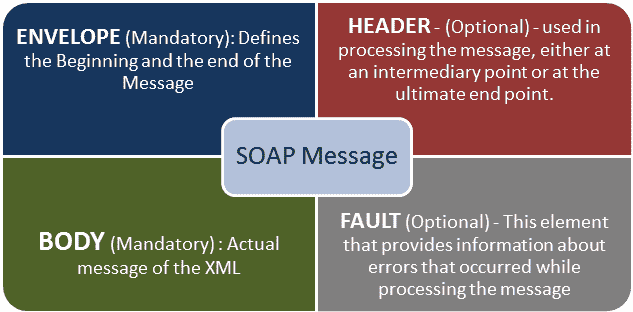

在设置了上一个教程中执行的工作区之后，我们必须创建项目，测试套件，测试用例，以测试给定的 Web 服务。 让我们了解执行此操作所涉及的步骤。

## 创建一个项目

**步骤 1：**现在，根据项目，我们需要导入 SOAP / REST 协议。 我们将创建一个新的 SOAP 项目。

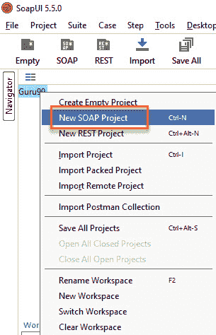

**步骤 2：**我们将使用以下 SOAP 请求 [http://www.dneonline.com/calculator.asmx?wsdl](http://www.dneonline.com/calculator.asmx?wsdl)

1.  输入项目名称
2.  输入 WSDL 请求的路径。 在这种情况下，http://www.dneonline.com/calculator.asmx?wsdl
3.  点击确定

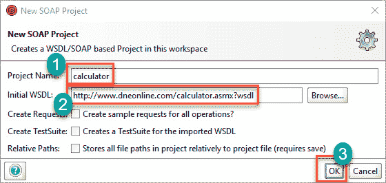

**注意：**

*   **是否为所有操作创建示例请求？** 它为给定 WSDL 中的所有可用操作创建一个示例请求。 输入 WSDL 地址后，将自动选中此选项。 您可以取消选中它。
*   **为导入的 WSDL 创建测试套件：**在项目内为导入的 WSDL 创建测试套件。
*   **相对路径**：它使用户可以保存所有与项目文件相关的文件。

**步骤 3：**在使用上述 WSDL 创建 SOAP 项目后，我们将看到有两个操作将被导入到项目中。

**步骤 4）**

展开第一个请求，然后右键单击“添加”。 然后点击“新请求”。

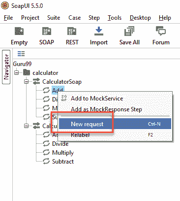

然后点击“确定”。 它将以 XML 格式显示 SOAP 请求

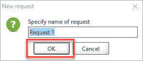

1.  输入“ intA”和“ intB”
2.  点击提交按钮
3.  响应 XML 将显示在右侧窗格中。

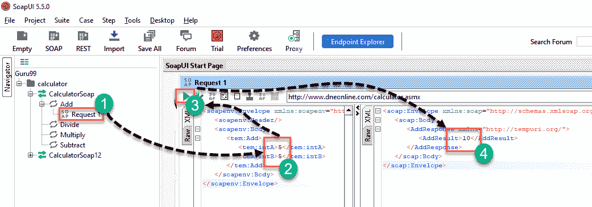

您可能想知道为什么创建测试用例？ 当您可以在此处直接测试 Webservice 时...

好了，您可以发送一项操作请求。 那别人呢 **使用此操作**可以为加法输入多少组合？ 您必须为每个组合编辑请求。

例如：如果要从 4 和 4 而不是 5 和 5 加...，则需要再次编辑操作。 因此，必须创建一个测试套件/案例以测试所有可能的场景，而不必直接编辑操作本身。

## 创建测试套件

**步骤 1：**在项目内，测试人员可以通过右键单击项目的根目录来创建测试套件。

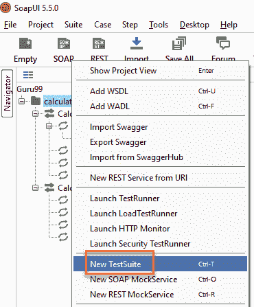

**步骤 2：**我们需要输入测试套件的名称，然后按 OK。

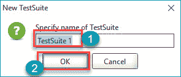

**步骤 3：**创建的测试套件将显示在导航器窗格中，如下所示。

**步骤 4：**“测试套件”窗口在右侧窗格中打开。 正如我们刚刚创建的，没有测试用例。 因此，所有选项均被禁用。

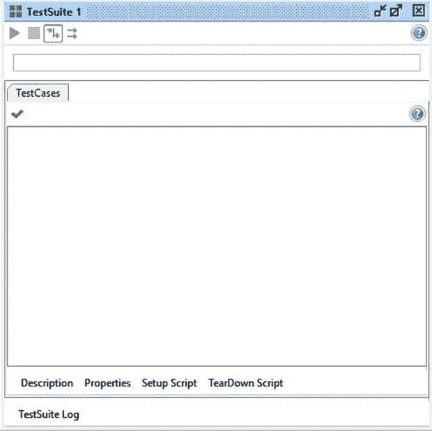

## 创建测试用例

**步骤 1：**在测试套件中，我们可以通过右键单击“测试套件”并选择“新建 TestCase”来创建多个测试。

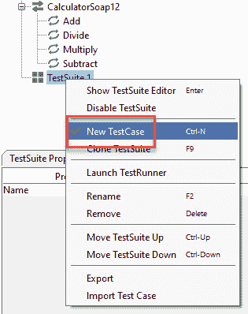

**步骤 2：**指定[测试用例](https://www.guru99.com/test-case.html)的名称，然后单击“确定”。

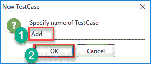

**步骤 3：**创建的测试用例具有零个步骤，如下所示。

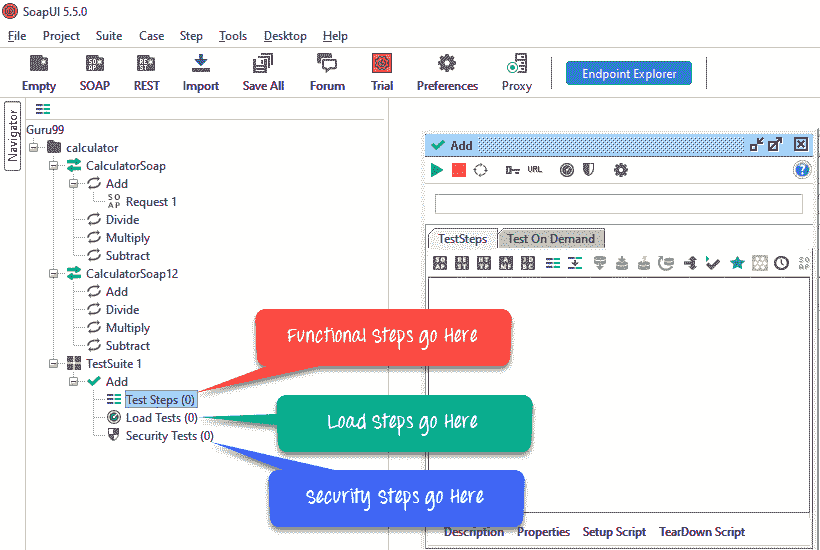

**注意**：我们可以看到该测试用例添加了针对所有可用测试的零测试步骤。 添加测试步骤后，括号中的数字将自动更改。

功能测试步骤应该进入“测试步骤”，而性能测试步骤应该进入“负载测试”，安全测试步骤应该进入“安全测试”。

**步骤 4：**我们可以通过右键单击测试步骤并选择适当的测试步骤来插入各种测试步骤，如下所示。 因此，如果要测试 REST Web 服务，则应选择 REST 测试请求。

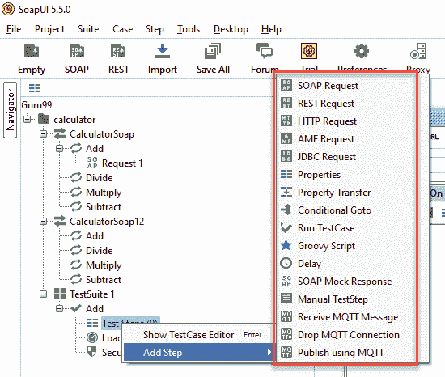

## 测试步骤插入

现在让我们添加一个测试步骤来验证导入的 SOAP 请求。

**步骤 1：**如下所示添加新步骤“ SOAP Request”。

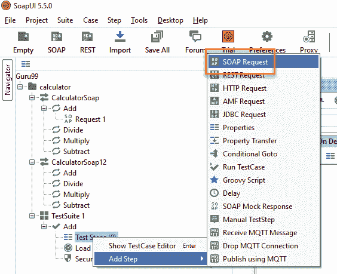

**步骤 2：**输入步骤名称，然后单击确定。

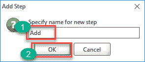

**步骤 3：**单击“确定”后，将弹出一个对话框，以选择要调用的操作。 列出了所有操作，用户可以选择要调用的操作。

*   There are many operations that will be listed. The Operations are the same except the SOAP version used.

    CalculatorSoap –使用 SOAP 版本 1.1，而

    CalculatorSoap12 –使用 SOAP 版本 1.2

*   The Version does not matter for us in this context. Hence you can select the one of your choice.

    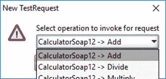

*   Upon Selecting the operation, click 'Ok'

    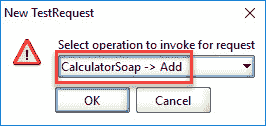

**步骤 4：**在添加一个测试用例的同时，我们可以添加标准断言。 断言也称为检查点/验证点，我们将在下一个教程[中详细处理。](https://www.guru99.com/assertions-soapui-complete-tutorial.html)

我们可以在创建测试用例时添加以下检查点/断言。 让我们使用选项创建测试用例，这意味着无需以下任何验证点即可创建测试步骤

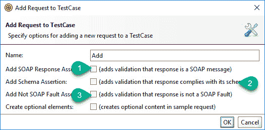

1.  执行测试时，验证响应消息是否为 SOAP。
2.  验证响应架构是否有效。
3.  验证 SOAP 响应是否包含 FAULT。

**步骤 5：**创建测试用例后，请求 XML 如下所示。 在下面的快照中解释了 XML 的结构。

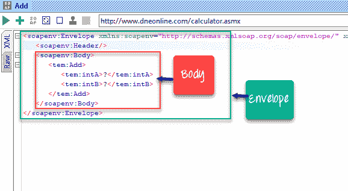

**步骤 6：**现在，由于我们刚刚添加了一个测试步骤，因此测试步骤计数增加到 1。 同样，在添加负载和安全性测试步骤后，相应的数字将根据添加的步骤数自动增加。

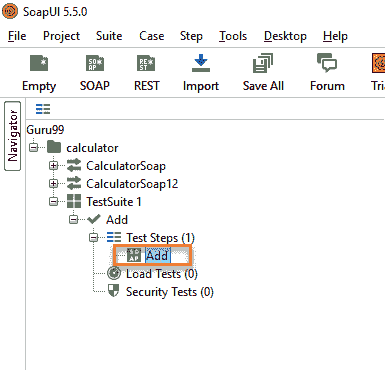

## 手动发送请求&读取响应

**步骤 1：**我们想添加两个 Integer Number。

*   国际-5
*   整数 B-5

下一个，

1.  我们需要输入这些输入来代替问号，问号将作为请求 XML 发送。
2.  将这些值输入相应的 XML 标记后，单击“提交请求”按钮以检查响应。

**步骤 2：**提交请求后，Web 服务器将处理 Web 服务请求，并发送回如下所示的响应。

通过阅读回复，我们可以得出 5 加 5 等于 10 的结论。

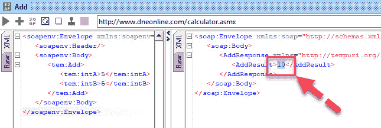

## 了解肥皂响应&日志面板

如本教程开头所述，SOAP 消息是通过 HTTP 协议传输的。 让我们看一下 RAW 消息。 这将帮助我们了解 HTTP 如何传输 SOAP 请求和响应。

**步骤 1：**在两个 SOAP-UI 请求窗口中单击“原始”选项卡。

1.  该请求已发布到 Web 服务器。 因此，使用了 Http 的 POST 方法。
2.  SOAP 请求在 Http 消息的主体中传输。

[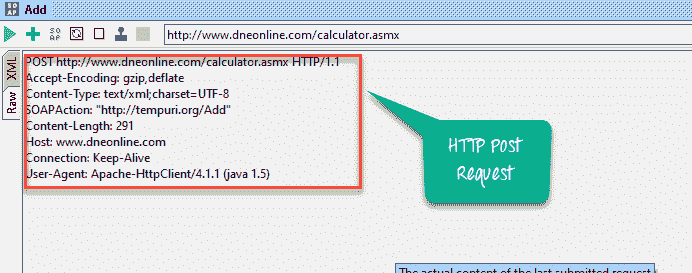 ](/images/1/090919_0519_SoapUITutor25.png) 

**步骤 2：**现在在 SOAP-UI 响应窗口中单击“原始”选项卡，以了解如何通过 HTTP 发送响应。

1.  处理完请求后，将显示 Http 响应代码（200），这意味着成功。 Web 服务器已成功处理它。
2.  SOAP 响应作为 HTTP 消息主体的一部分发送回客户端。

 

Http Response 代码的快速快照，以方便理解和调试。 下表将帮助您根据从 Web 服务器收到的 HTTP 代码进行故障排除。

| **Http 代码** | **说明** |
| **1xx：** | **信息性-**这表示已收到请求并正在继续处理。 |
| **2xx：** | **成功-**该动作已成功接收，理解并接受。 |
| **3xx：** | **重定向**-这意味着必须采取进一步的措施才能完成请求。 |
| **4xx：** | **客户端错误-**这表示请求包含错误的语法或无法满足 |
| **5xx：** | **服务器错误-**服务器无法满足看似有效的请求 |

**步骤 3：**让我们了解测试用例窗口中显示的其他信息。

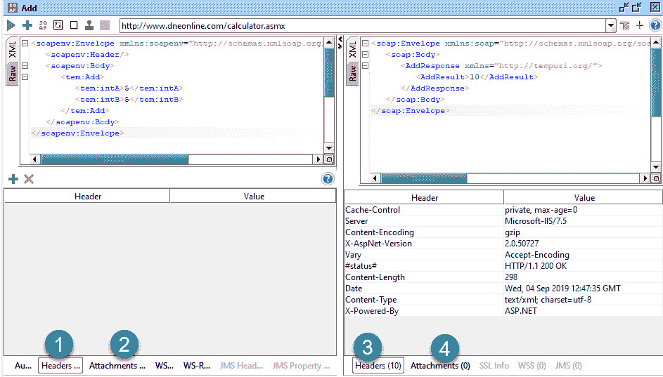

1.  代表正在发送的请求中的 NO 标头
2.  表示发送到 Web 服务器的请求中没有附件。
3.  代表 10 个标头信息，并且在单击时显示相同的标头信息。
4.  表示响应消息中没有附件。

**日志记录窗格：**

“日志”窗格包含有关客户端和服务器之间的事务的完整信息。 用户将能够看到“日志”窗格的选项卡，如下所示。 我们将讨论使用 SOAP-UI 时最常用的日志窗格。

**SoapUI 日志** –显示来自 Web 服务器的响应信息。 相同的信息存储在“ bin”目录下的 SOAP-UI 安装文件夹的 soapui.log 文件中。

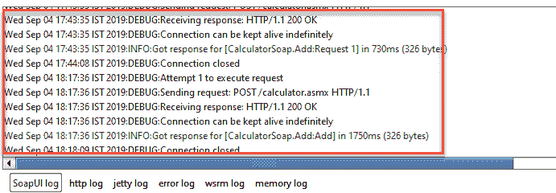

**Http 日志–** 显示所有 HTTP 数据包传输。 HTTP 日志中显示“ RAW”中的所有信息。

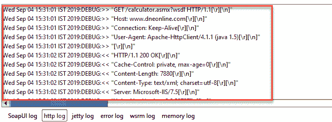

**错误日志–** 错误日志显示我们在整个项目会话期间遇到的所有错误。 SOAP UI 安装位置的“ bin”目录中的“ soapui-errors.log”中提供了相同的信息。

**内存日志–** 此选项卡监视内存消耗，并以图表形式显示，如下所示。 当执行内存密集型操作时，这确实很有帮助。

现在我们已经创建了一个测试套件，测试用例，测试步骤并获得了响应，下一步是验证响应。 在下一个教程中，我们将处理断言的类型。