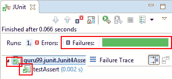

# Junit 断言&断言与示例

> 原文： [https://www.guru99.com/junit-assert.html](https://www.guru99.com/junit-assert.html)

## 什么是 Junit Assert？

断言是一种用于确定测试用例的通过或失败状态的方法。assert 方法由类 org.junit.Assert 提供，该类扩展了 java.lang.Object 类。

有各种类型的断言，例如布尔，空，相同等。

Junit 提供了一个名为 Assert 的类，该类提供了一些断言方法，这些方法可用于编写测试用例和检测测试失败

断言方法由类 **org.junit.Assert** 提供，该类扩展了 **java.lang.Object** 类。

在本教程中，您将学习-

*   [JUnit 声明方法](#1)
*   [布尔值](#2)
*   [空对象](#3)
*   [相同](#4)
*   [等于](#5)
*   [声明数组等于](#6)
*   [失败消息](#7)
*   [JUnit assertEquals](#8)
*   [浮点断言](#9)
*   [JUnit 断言示例](#10)

## JUnit 声明方法

### 布尔值

如果要测试布尔条件（对或错），则可以使用以下断言方法

1.  **assertTrue（condition）**
2.  **assertFalse（condition）**

这里的条件是一个布尔值。

### 空对象

如果要检查对象/变量的初始值，则可以使用以下方法：

1.  **assertNull（object）**
2.  **assertNotNull（object）**

这里的对象是 [Java](/java-tutorial.html) 对象**，例如** assertNull（actualN）；

### 相同

如果要检查对象是否相同（即，将两个引用与同一个 Java 对象进行比较）还是不同。

1.  **assertSame（预期的，实际的），**如果预期的 **==实际的**，它将返回 true
2.  **assertNotSame（预期的，实际的）**

### 等于

如果要测试两个对象的相等性，则可以使用以下方法

*   **assertEquals（预期的，实际的）**

如果满足以下条件，它将返回 true： **Expected.equals（actual）**返回 true。

### 声明数组等于

如果要测试数组的相等性，则可以使用以下方法，如下所示：

*   **assertArrayEquals（预期的，实际的）**

如果数组具有相同的长度，则必须使用上述方法，对于 **i** 的每个有效值，您可以按如下所示进行检查：

*   **assertEquals（expected [i]，actual [i]）**
*   **assertArrayEquals（expected [i]，actual [i]）**

### 失败消息

如果要抛出任何断言错误，则可以使用 **fail（）**，它总是会导致失败判定。

*   **失败（消息）；**

您可以使用带有附加**字符串**参数作为第一个参数的断言方法。 如果断言失败，此字符串将附加在失败消息中。 例如。 **fail（message）**可以写为

*   **assertEquals（消息，预期的，实际的）**

## JUnit assertEquals

您有 **assertEquals（a，b）**，它依赖于 Object 类的 **equals（）**方法。

*   在这里，它将被评估为 **a.equals（b）。**
*   在这里，被测类用于确定合适的相等关系。
*   如果一个类未覆盖**对象**类的 **equals（）**方法，则将获得 **equals（）**方法的默认行为。 ，即对象身份。

如果 **a** 和 **b** 是原语，例如**字节**， **int** ，**布尔值**等，则以下内容将 为 assertEquals（a，b）完成：

**a** 和 **b** 将转换为它们的等效包装对象类型（**字节，整数**，**布尔值**等），然后[ 将评估 **a.equals（b）**。

例如：考虑下面提到的具有相同值的字符串，让我们使用 assertTrue 对其进行测试

```
String obj1="Junit";
String obj2="Junit";
assertEquals(obj1,obj2);
```

上面的 assert 语句将返回 true，因为 obj1.equals（obj2）返回 true。

## 浮点声明

当您想比较浮点类型（例如 **double** 或 **float** ）时，您需要一个附加的必需参数 **delta** ，以避免在执行时出现舍入错误的问题 浮点比较。

断言评估如下：

*   **Math.abs（预期–实际）< =增量**

例如：

**assertEquals（aDoubleValue，anotherDoubleValue，0.001）**

## JUnit 声明示例

下面的示例演示如何使用 JUnit 断言方法断言条件。

让我们创建一个名为 **Junit4AssertionTest.java** 的简单测试类，以及一个测试运行器类 **TestRunner.java** 的测试类。

您将在 JUnit 中创建一些变量和重要的 assert 语句。

在此示例中，您将使用 TestRunner.java 执行我们的测试类。

**步骤 1）**让我们创建一个涵盖 junit 中所有重要的 assert 语句方法的类：

**Junit4AssertionTest.java**

```
package guru99.junit;		

import static org.junit.Assert.*;				
import org.junit.Test;		

public class Junit4AssertionTest {				

    @Test		
    public void testAssert(){					

        //Variable declaration		
        String string1="Junit";					
        String string2="Junit";					
        String string3="test";					
        String string4="test";					
        String string5=null;					
        int variable1=1;					
        int	variable2=2;					
        int[] airethematicArrary1 = { 1, 2, 3 };					
        int[] airethematicArrary2 = { 1, 2, 3 };					

        //Assert statements		
        assertEquals(string1,string2);					
        assertSame(string3, string4);					
        assertNotSame(string1, string3);					
        assertNotNull(string1);			
        assertNull(string5);			
        assertTrue(variable1<variable2);					
        assertArrayEquals(airethematicArrary1, airethematicArrary2);					
    }		
}		

```

**步骤 2）**您需要创建一个测试运行器类才能执行上述类：

**TestRunner.java**

```
package guru99.junit;		

import org.junit.runner.JUnitCore;		
import org.junit.runner.Result;		
import org.junit.runner.notification.Failure;		

public class TestRunner {				
			public static void main(String[] args) {									
      Result result = JUnitCore.runClasses(Junit4AssertionTest.class);					
			for (Failure failure : result.getFailures()) {							
         System.out.println(failure.toString());					
      }		
      System.out.println("Result=="+result.wasSuccessful());							
   }		
}      

```

**步骤 3）**让我们逐步分析预期的输出：

一一考虑所有断言语句：

1.  **assertEquals（string1，string2）;**

现在，使用对象类的 equals 方法比较 string1 =“ Junit”与 string2 =“ Junit”。 从 java.lang.Object.equals（）方法替换 assertEquals 方法：

string1.equals（string2）= >返回 true

因此 assertEquals（string1，string2）将返回 **true** 。

2.  **assertSame（string3，string4）;**

“ assertSame（）”功能是检查两个对象是否引用相同的对象。

由于 string3 =“ test”和 string4 =“ test”表示 string3 和 string4 属于同一类型，因此 assertSame（string3，string4）将返回 **true** 。

3.  **assertNotSame（string1，string3）;**

“ assertNotSame（）”功能是检查两个对象没有引用相同的对象。

由于 string1 =“ Junit”和 string3 =“ test”表示 string1 和 string3 属于不同类型，因此 assertNotSame（string1，string3）将返回 **true** 。

4.  **assertNotNull（string1）;**

“ assertNotNull（）”功能是检查对象是否不为空。

由于 string1 =“ Junit”是一个非 null 值，因此 assertNotNull（string1）将返回 **true** 。

5.  **assertNull（string5）;**

“ assertNull（）”功能是检查对象是否为空。

由于 string5 = null（它是空值），因此 assertNull（string5）将返回 **true** 。

6.  **assertTrue（variable1 < variable2）;**

“ assertTrue（）”功能用于检查条件是否为真。

由于 variable1 = 1 和 variable2 = 2，这表明 variable1 < variable2 条件为 true，因此 assertTrue（variable1 < variable2）将返回 **true** 。

7.  **assertArrayEquals（airethematicArrary1，airethematicArrary2）;**

“ assertArrayEquals（）”功能是检查期望的数组和结果的数组是否相等。 Array 的类型可以是 int，long，short，char，byte 或 java.lang.Object。

由于 airethematicArrary1 = {1，2，3}和 airethematicArrary2 = {1，2，3}（这两个数组都相等），因此 assertArrayEquals（airethematicArrary1，airethematicArrary2）将返回 **true**

由于 **Junit4AssertionTest.java** 类的所有七个断言语句都返回 true，因此，当您执行测试断言类时，它将返回成功的测试。 （请参见下面的输出）

**步骤 4）**右键单击 Junit4AssertionTest.java，然后单击 runAs- > JUnit。 您将看到如下输出：



上面的输出显示了预期的成功测试结果。

**摘要：**

在本教程中，您学习了 JUnit 提供的所有重要的断言方法类型。 此外，您还看到了 assert 语句的示例。 这表明如果所有 assert 语句都返回 true，则测试 GUI 将返回 true 结果，如果单个测试失败，则它将返回失败结果。