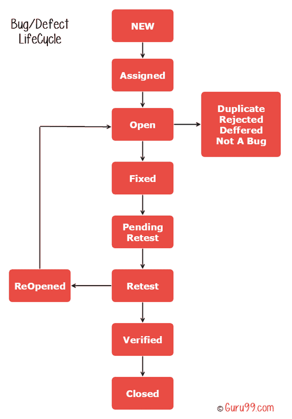
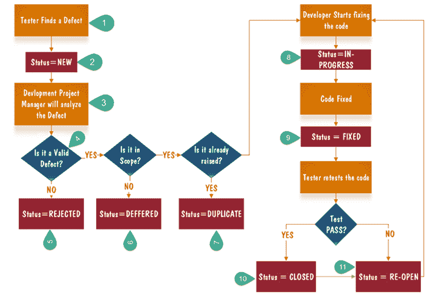

# 软件测试中的缺陷/缺陷生命周期

> 原文： [https://www.guru99.com/defect-life-cycle.html](https://www.guru99.com/defect-life-cycle.html)

## 什么是缺陷生命周期？

**缺省生命周期**或 Bug 生命周期是 Bug 整个生命周期所经历的特定状态集。 缺陷生命周期的目的是轻松协调各个受让人的错误状态更改，并使错误修复过程系统化。

### 错误生命周期状态

缺陷所经历的状态数因项目而异。 生命周期图下方，涵盖了所有可能的状态

*   **新增功能：**首次记录并发布新缺陷时。 它被分配为新状态。
*   **已分配：**测试人员发布错误后，测试人员的负责人会批准该错误并将错误分配给开发团队
*   **打开**：开发人员开始分析并致力于缺陷修复
*   **固定的**：开发人员进行必要的代码更改并验证更改后，他或她可以将错误状态设置为“已修复”。
*   **待重新测试**：一旦修复了缺陷，开发人员就会向测试人员提供用于重新测试代码的特定代码。 由于软件测试在测试人员端仍处于待处理状态，因此分配的状态为“待测试中”。
*   **重新测试**：测试人员在此阶段对代码进行重新测试，以检查缺陷是否由开发人员修复，并将状态更改为“重新测试”。

*   **已验证**：测试人员在开发人员修复此错误之后，对其进行重新测试。 如果在软件中未检测到错误，则该错误已修复，并且分配的状态为“已验证”。
*   **重新打开**：如果即使在开发人员已修复错误之后该错误仍然存​​在，则测试仪会将状态更改为“重新打开”。 该错误再次贯穿生命周期。
*   **已关闭**：如果该错误不再存在，则测试人员将状态设置为“已关闭”。
*   **重复**：如果缺陷重复两次或缺陷对应于错误的相同概念，则状态更改为“重复”。
*   **已拒绝**：如果开发人员认为缺陷不是真正的缺陷，则将缺陷更改为“已拒绝”。
*   **延迟的**：如果当前错误不是主要优先级，并且如果期望在下一发行版中予以修复，则将状态“ Deferred”分配给此类错误
*   **不是错误**：如果它不影响应用程序的功能，则分配给错误的状态为“不是错误”。

## 缺陷生命周期说明

1.  测试员发现缺陷
2.  状态分配给缺陷-新建
3.  缺陷将转发给项目经理进行分析
4.  项目经理确定缺陷是否有效
5.  此处的缺陷无效-状态为“已拒绝”。
6.  因此，项目经理将状态**拒绝**。 如果没有拒绝缺陷，则下一步是检查缺陷是否在范围内。 假设我们为同一应用程序提供了另一个功能，即电子邮件功能，那么您会发现一个问题。 但是，当此类缺陷被指定为**推迟或推迟的**状态时，则不是当前版本的一部分。
7.  接下来，管理者将验证是否较早提出了类似缺陷。 如果是，则为缺陷分配状态**复制**。
8.  如果没有，则将缺陷分配给开始修复代码的开发人员。 在此阶段中，将为缺陷分配状态**进行中。**
9.  一旦代码固定。 为缺陷分配了状态**已修复**
10.  接下来，测试人员将重新测试代码。 如果[测试用例](/test-case.html)通过了缺陷，则**被关闭。** 如果测试用例再次失败，则将**的缺陷重新打开**并分配给开发人员。
11.  考虑一种情况，在第一版的“航班预订”中，发现传真订单中有一个已修复并指定为“关闭”状态的缺陷。 在第二次升级版本中，相同的缺陷再次浮出水面。 在这种情况下，闭合的缺陷将被重新打开。

这就是 Bug 生命周期的全部

该培训视频通过一个示例描述了缺陷（也称为缺陷）生命周期的各个阶段及其重要性。