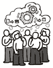
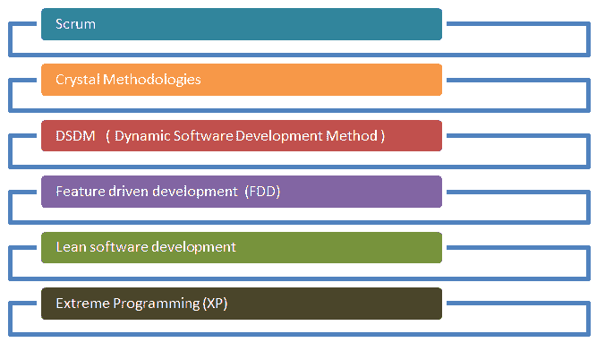
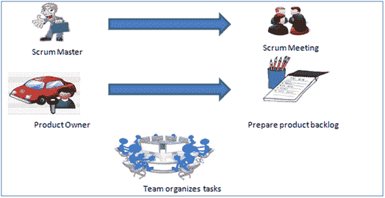
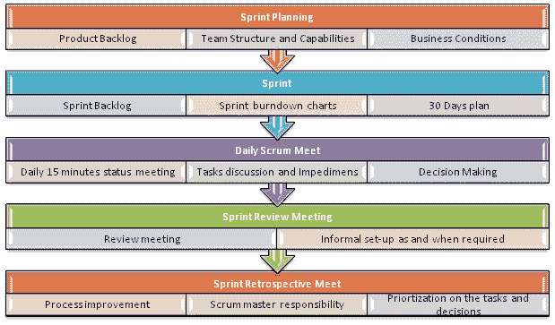
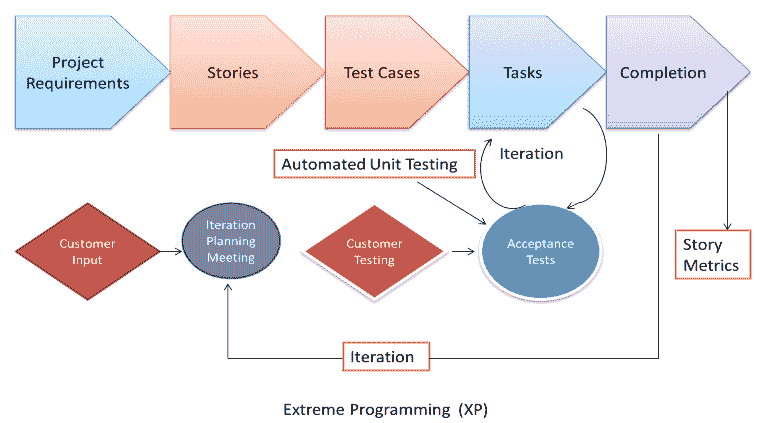

# 敏捷方法论&模型：软件开发指南&测试

> 原文： [https://www.guru99.com/agile-scrum-extreme-testing.html](https://www.guru99.com/agile-scrum-extreme-testing.html)

## 什么是敏捷方法论？

AGILE 方法论是在项目的整个软件开发生命周期中促进开发和测试的**连续迭代**的实践。 与瀑布模型不同，开发和测试活动是同时进行的

敏捷软件开发强调四个核心价值。

1.  个人和团队在流程和工具上的互动
2.  通过全面的文档工作软件
3.  客户合作而非合同谈判
4.  响应计划变更

在本软件工程教程中，您将学习

*   [什么是敏捷方法论？](#1)
*   [敏捷与瀑布法](#2)
*   [Scrum](#3)
*   [产品待办事项列表](#4)
*   [Scrum 实践](#5)
*   [Scrum 方法论的流程：](#6)
*   [极限编程（XP）](#7)
*   [eXtreme 编程的阶段：](#8)
*   [晶体方法](#9)
*   [动态软件开发方法（DSDM）](#10)
*   [功能驱动开发（FDD）](#11)
*   [精益软件开发](#12)
*   [看板](#13)
*   [敏捷指标](#14)

## 敏捷与瀑布法

敏捷模型和瀑布模型是软件开发过程中的两种不同方法。 尽管它们的方法不同，但这两种方法有时还是有用的，具体取决于项目的要求和类型。

<colgroup><col style="width: 300px;"><col style="width: 301px;"></colgroup>
| 

**敏捷模型**

 | 

**瀑布模型**

 |
| 

*   敏捷方法提出了软件设计的增量和迭代方法

 | 

*   软件的开发从起点到终点依次进行。

 |
| 

*   **敏捷过程** 分为设计人员在

上使用的各个模型。 | 

*   设计过程未分解为单个模型

 |
| 

*   客户有早期和频繁的机会来查看产品并为项目做出决策和更改

 | 

*   客户只能在项目结束时看到产品

 |
| 与瀑布模型 相比，

*   敏捷模型被认为是非结构化的

 | 

*   瀑布模型更安全，因为它们是如此面向计划的

 |
| 

*   小型项目可以很快实施。 对于大型项目，很难估计开发时间。

 | 

*   可以估算并完成各种项目。

 |
| 

*   错误可以在项目中间修复。

 | 

*   仅在最后测试整个产品。 如果发现需求错误或必须进行任何更改，则该项目必须从头开始

 |
| 

*   开发过程是迭代的，并且项目在短（2-4）周的迭代中执行。 计划非常少。

 | 

*   开发过程是分阶段的，并且该阶段比迭代大得多。 每个阶段都以下一阶段的详细说明结束。

 |
| 

*   文档的优先级不及软件开发

 | 

*   文档是头等大事，甚至可以用于培训人员并与另一个团队一起升级软件

 |
| 

*   每个迭代都有其自己的测试阶段。 它允许在每次发布新功能或逻辑时实施回归测试。

 | 

*   仅在开发阶段之后，才执行测试阶段，因为单独的部分未完全发挥功能。

 |
| 

*   在迭代结束时的敏捷测试中，产品的可交付功能交付给客户。 发货后立即可以使用新功能。 与客户保持良好联系时，此功能很有用。

 | 

*   在长期的实施阶段之后，立即交付了所有开发的功能。

 |
| 

*   测试人员和开发人员一起工作

 | 

*   测试人员与开发人员

分开工作 |
| 

*   在每次冲刺结束时，都会执行用户接受操作

 | 

*   用户接受是在项目结束时执行的 **。**

 |
| 

*   它需要与开发人员紧密沟通，并共同分析需求和计划

 | 

*   开发人员没有参与需求和计划过程。 通常，测试和编码

之间的时间延迟 |

### 敏捷方法论

敏捷测试中存在多种**方法**，以下列出了这些方法：

## Scrum

SCRUM 是一种敏捷开发方法，专门集中于如何在基于团队的开发环境中管理任务。 基本上，Scrum 源自橄榄球比赛期间发生的活动。 Scrum 相信能够增强开发团队的能力，并提倡在小型团队中工作（例如 7 至 9 名成员）。 它由三个角色组成，其职责解释如下：

*   Scrum Master
    *   大师负责组建团队，进行冲刺会议并消除前进的障碍
*   产品所有者
    *   产品负责人创建产品待办事项列表，确定待办事项的优先级，并负责在每次迭代时交付功能
*   Scrum 小组
    *   团队管理自己的工作并组织工作以完成冲刺或周期

## 产品待办事项列表

这是一个跟踪需求的仓库，其中包含每个版本要完成的需求（用户故事）的详细信息。 它应该由产品负责人维护并确定优先级，并应分发给 Scrum 团队。 团队还可以请求添加，修改或删除新需求

## Scrum 实践

具体做法如下：

## Scrum 方法论的流程：

Scrum 测试的流程如下：

*   一个 scrum 的每次迭代都称为 Sprint
*   产品待办事项列表是输入所有详细信息以获取最终产品的列表
*   在每个 Sprint 期间，都会选择产品积压的顶级用户案例并将其转换为 Sprint 积压
*   小组致力于定义的 sprint 待办事项
*   小组检查日常工作
*   在冲刺结束时，团队交付了产品功能

## 极限编程（XP）

当客户的需求或需求不断变化或不确定系统的功能时，极限编程技术将非常有用。 它提倡在较短的开发周期中频繁地“发布”产品，这从本质上提高了系统的生产率，并引入了一个检查点，可以轻松地实现任何客户要求。 XP 开发的软件使客户始终处于目标位置。

根据故事收集业务需求。 所有这些故事都存储在一个称为停车场的地方。

在这种方法中，发布是基于较短的周期（称为迭代），周期为 14 天。 每个迭代都包括编码，单元测试和系统测试等阶段，在每个阶段中，应用程序都将构建一些次要或主要功能。

## eXtreme 编程的阶段：

Agile XP 方法共有 6 个阶段，其解释如下：

### *规划*

*   识别利益相关者和发起人
*   基础结构要求
*   [安全性](/ethical-hacking-tutorials.html)相关信息并收集
*   服务水平协议及其条件

### *分析*

*   捕获停车场中的故事
*   优先考虑停车场中的故事
*   整理故事以进行估算
*   定义迭代 SPAN（时间）
*   开发和质量检查团队的资源规划

### *设计*

*   细分任务
*   每个任务的测试场景准备
*   回归自动化框架

### *执行*

*   编码
*   单元测试
*   执行手动测试场景
*   缺陷报告生成
*   手动到自动化回归测试用例的转换
*   中期迭代审核
*   迭代结束审查

### *包装*

*   小版本
*   回归测试
*   演示和评论
*   根据需要开发新故事
*   基于迭代结束审阅注释的流程改进

### *关闭*

*   试运行
*   培训
*   生产启动
*   SLA 保证保证
*   审查 SOA 策略
*   生产支持

每天有两个故事板可用来跟踪工作，下面列出了这些故事板以供参考。

*   Story Cardboard
    *   This is a traditional way of collecting all the stories in a board in the form of stick notes to track daily XP activities. As this manual activity involves more effort and time, it is better to switch to an online form.
*   在线情节提要
    *   在线工具 Storyboard 可用于存储故事。 **几个团队可以将其**用于不同的目的。

## 晶体方法

水晶方法论基于三个概念

1.  **宪章：**此阶段涉及的各种活动正在创建开发团队，进行初步可行性分析，制定初步计划并微调开发方法
2.  **周期性投放：**主要开发阶段包括两个或多个投放周期，在此期间，
    1.  团队更新并完善发布计划
    2.  通过一个或多个程序测试集成迭代来实现需求的子集
    3.  集成产品交付给真实用户
    4.  审查项目计划和采用的开发方法
3.  **总结：**在此阶段中执行的活动是部署到用户环境中，进行部署后审查和反思。

## 动态软件开发方法（DSDM）

DSDM 是一种用于软件开发的快速应用程序开发（RAD）方法，并提供了一个敏捷的项目交付框架。 DSDM 的重要方面是要求用户积极参与，并且团队有权制定决策。 产品的频繁交付成为 DSDM 的关注重点。 DSDM 中使用的技术是

1.  时间拳击
2.  MoSCoW 规则
3.  原型制作

DSDM 项目包含 7 个阶段

1.  前期项目
2.  可行性研究
3.  商业研究
4.  功能模型迭代
5.  设计和构建迭代
6.  实作
7.  项目后

## 功能驱动开发（FDD）

此方法集中于“设计&建筑物”功能。 与其他敏捷方法不同，FDD 描述了非常具体且短暂的工作阶段，每个阶段必须分别完成。 它包括域演练，设计检查，升级，代码检查和设计。 FDD 开发产品，始终遵循目标

1.  领域对象建模
2.  按功能开发
3.  组件/类所有权
4.  功能团队
5.  视察
6.  配置管理
7.  常规构建
8.  可见进度和结果

## 精益软件开发

精益软件开发方法基于“准时生产”原则。 它旨在提高软件开发速度和降低成本。 精益开发可以归纳为七个步骤。

1.  消除浪费
2.  加强学习
3.  推迟承诺（尽早决定）
4.  提早交货
5.  赋予团队权力
6.  建筑诚信
7.  优化整体

## 看板

看板最初是从日语单词中出现的，意思是一张卡片，其中包含在完成产品的每个阶段都需要在产品上完成的所有信息。 该框架或方法在软件测试方法中尤其是在敏捷测试中已被广泛采用。

### Scrum 与看板

<colgroup><col style="width: 263px;"><col style="width: 276px;"></colgroup>
| **Scrum** | **看板** |
| 

*   在 Scrum 技术中，必须分解测试，以便可以在一次冲刺中完成测试。

 | 

*   没有规定特殊的物品尺寸

 |
| 

*   规定了优先产品积压

 | 

*   优先级是可选的

 |
| 

*   Scrum 团队致力于迭代的特定工作量

 | 

*   承诺是可选的

 |
| 规定了

*   燃尽图

 | 

*   没有规定特殊的物品尺寸

 |
| 

*   在每个冲刺之间，重置一个 Scrum 板

 | 

*   看板板是永久性的。 它限制了工作流程状态

中的项目数 |
| 

*   无法向正在进行的迭代添加项目

 | 

*   只要有可用容量，便可以添加项目。

 |
| 

*   WIP 间接限制

 | 

*   在制品直接限制

 |
| 

*   指定了时间框的迭代

 | 

*   时间盒式迭代可选

 |

## 敏捷指标：

可以收集的有效使用敏捷的指标是：

*   阻力因子
    *   数小时内的努力对冲刺目标没有帮助
    *   可以通过减少共享资源的数量，减少非贡献工作量来提高拖动因子。
    *   新的估算值可以通过阻力系数的百分比增加-新的估算值=（旧估算值+阻力系数）
*   速度
    *   积压的（用户故事）数量转换为 sprint 的可交付功能
*   未添加任何单元测试
*   完成每日构建所需的时间间隔
*   在一次迭代或之前的迭代中检测到的错误
*   生产缺陷泄漏