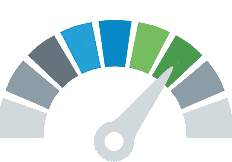

# 软件测试中的稳定性测试

> 原文： [https://www.guru99.com/stability-testing.html](https://www.guru99.com/stability-testing.html)

## 什么是稳定性测试？

**稳定性测试**衡量软件产品在很长一段时间内继续发挥其全部使用范围而不会失败或引起故障的能力。 稳定性测试的目的是检查应用程序是否会在任何时间崩溃。

进行稳定性测试是为了检查已开发产品的效率（通常超过断点），超出正常运行能力。 **在重负载下产品的错误处理，软件可靠性，鲁棒性和可伸缩性方面具有更大的意义，而不是在正常情况下检查系统行为。**

稳定性测试评估稳定性问题。 该测试主要旨在最大程度地提高软件组件的压力。 这是一种非功能性技术。

稳定性测试也称为负载或耐久性测试。

在本教程中，您将学习-

*   [什么是稳定性测试？](#1)
*   [如果被测系统未经过稳定性测试](#2)，则会出现问题
*   [为什么要进行稳定性测试](#3)
*   [如何进行稳定性测试](#4)
*   [用于 CPU 性能稳定性测试的测试用例](#5)
*   [用于稳定性测试的测试报告](#6)

## 如果被测系统未经过稳定性测试，则会出现问题

对于引入大量用户的被测应用程序，并且必须运行数月而不重启的应用程序，可能会出现许多问题：

可能会遇到错误，

*   系统变慢
*   系统遇到功能问题
*   系统显示有线行为
*   系统完全崩溃

在软件工程中，**稳定性测试**通常包括在具有大量用户（虚拟）的情况下对系统进行测试并测量性能参数以验证系统是否可以支持预期的负载。

## 为什么要进行稳定性测试

这种测试可帮助用户了解系统在现实生活中的工作方式。

因此，稳定性测试可让您检查，

*   对被测系统的稳定性有信心。
*   确保您的系统可以处理大型程序。
*   监视系统的有效性。
*   在压力下测试系统稳定性。

它在产品开发中起着重要作用，因为它用于在发布产品之前确定被测软件产品的局限性，或者在产品上线或投入生产之前确定需要改进的地方。

稳定性测试技术的一个非常常见的例子是

**O** nline **S** 跳变 **P** 总计：稳定性测试将检查网站在以下情况下的行为-

*   在高峰时间输入大量数据
*   在特定时间的点击次数
*   同时出现页面加载问题
*   系统行为
*   该系统的响应能力以及更多其他功能都在**稳定性测试**下进行

**另一个示例**

在[性能测试](/performance-testing.html)技术下， **CPU** 测试是稳定性测试的一种流行形式。 此测试检查处理器的稳定性，并随着处理器工作负载的增加监视其性能。

## 如何进行稳定性测试

*   为了确定测试的范围和目标，我们必须确保在负载测试执行期间 Application Server 不崩溃。
*   要确定业务问题，请根据最终用户的观点验证系统性能和负载。
*   分配不同的职责和角色，例如-创建测试计划，[测试用例](/test-case.html)设计，测试用例复审，测试执行等。
*   确保在指定时间内交付测试成果
*   为确保正确的[负载测试](/load-testing-tutorial.html)工具和经验丰富的团队，均设有相同的工具。
*   测量风险和成本涉及测试。 这将根据 CPU 利用率和内存确定每次执行的成本。
*   确定[缺陷](/defect-management-process.html)跟踪和报告，并在其中正确映射要求。

## 用于 CPU 性能稳定性测试的测试用例

*   验证系统上限。
*   系统崩溃或如何恢复。
*   每个请求完成的交易总数。
*   事务响应是否保持稳定或随时间增加。
*   系统在重负载下的行为。
*   重负载下的响应和行为。

## 用于稳定性测试的测试报告

在测试执行期间收集并测量了一些统计信息； 分析这些数字以生成报告并确定可能的性能问题。

测试中收集的统计数据示例如下：

*   **Transaction Response Times**: The average time is taken to perform transactions during the test. This statistic will evaluate whether the performance of the server is within the acceptable minimum and maximum transaction performance time periods defined for the system.

    此信息将评估 Web 服务器处理请求并将其发送到应用程序服务器所花费的时间，在大多数情况下，应用程序服务器将向数据库服务器发出请求。

*   **每秒点击数：**用户在服务器上的点击数。 该统计信息有助于确定用户相对于点击次数产生的负载数量。
*   **吞吐量：**测试期间 Web 服务器上的吞吐量量，以字节为单位。 吞吐量是指用户在任何给定时间从服务器接收的数据量。 该统计信息有助于评估用户产生的负载量。
*   每秒**事务：**这些是测试期间执行的已完成事务（成功和失败）的总数。 该统计信息有助于检查系统上的实际事务负载。
*   **CPU：**测试期间花费的 CPU 利用率。
*   **内存：**测试期间的内存使用情况。
*   **磁盘：**测试期间所用磁盘空间的利用率。

到那时，您现在可以轻松地识别出–

**稳定性测试**属于性能测试–一种用于检查软件的某些质量属性（如稳定性，可靠性和可用性）的技术。

该测试用于确定系统或子系统在特定工作负载下的执行速度。

性能测试有很多类型，稳定性测试就是其中之一。

*   [**压力测试**](/stress-testing-tutorial.html) **：**这是一种测试类型，用于检查超出系统容量的系统稳定性。
*   **峰值测试：**用于通过立即增加系统负载来检查系统的行为。 目的是检查系统将在哪个点出现性能问题，或者它将通过。
*   **可伸缩性测试：**用于检查系统的功能。 系统将如何有效地应对不断增长的需求，规模变化和数量变化。
*   **容量测试：**这是一种非功能性测试技术，其中，被测软件要处理大量数据，并相应地检查和验证系统的行为。
*   **负载或稳定性测试** ：（上面已经讨论过）

用于性能测试的一些工具如下：

*   Web 加载
*   [LoadRunner](/loadrunner-v12-tutorials.html)
*   Apache [JMeter](/jmeter-tutorials.html)
*   NeoLoad
*   云端测试
*   暴风雨
*   LoadUI
*   XXXV
*   负载影响
*   装载机
*   Httperf
*   OpenSTA 的
*   性能测试仪
*   随处测试

**结论：**

稳定性测试是通过施加最大负载来测试应用程序行为的非功能性过程。 执行该操作以找出给定环境中系统的可伸缩性。

***本文由 Vaibhav Chitransh*** 提供